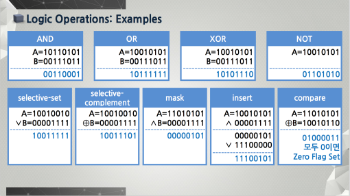
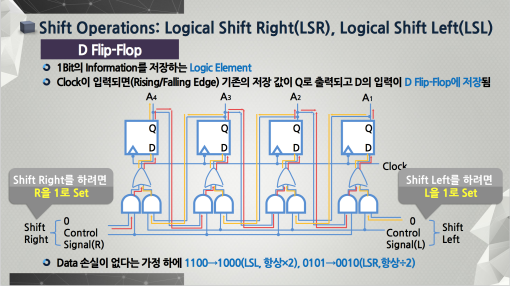

## Integer Representation

- 1의 보수 : 0은 1로, 1은 0으로
- 2의 보수 : 1의 보수 + 1

## Logic Operations

**OR**
- 한 쪽을 1로 놓으면 어떤 값이 들어오든 출력이 1로 고정된다.
- 한 쪽을 0으로 놓으면 어떤 값이 들어오든 그 값을 그대로 전송한다.

**AND**
- 한 쪽을 1로 놓으면 다른 값에 따라 그 값을 전송한다.
- 한 쪽을 0으로 놓으면 어떤 값이든 차단된다.

**XOR**
- 두 값이 같은 지를 검사할 수 있다.
- 보수를 취할 수 있다.

- Selective-Set : 선택적으로 원하는 비트만 1로 바꿔 준다. (OR 사용 - 1로 바꿀 부분만 1로)
- Selective-Complement : 선택적으로 원하는 비트만 반대로 바꿔 준다. (XOR 사용 - 바꿀 비트 부분만 1로)
- Mask : 원하는 부분만 선택한다. (AND 사용 - 원하는 부분만 1로)
- Insert : 특정한 부분에 원하는 비트만 삽입 (AND로 Mask 후 OR로 Selective-Set)
- Compare : 비교 (XOR)

Circular Shift는 값을 회전 시켜 주면 된다.

## Integer Arithmetic

- C_in : 아래 자리에서 올라 온 올림 수
- C_out : 현재 자리에서 올릴 올림 수

상태 저장
- V : 오버 플로우
- Z : Zero 여부
- S : 부호
- C : 캐리

**부호 비트가 바뀌면 오버 플로우가 난다.**
