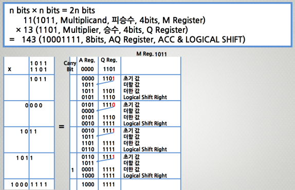
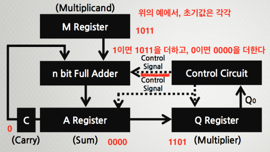
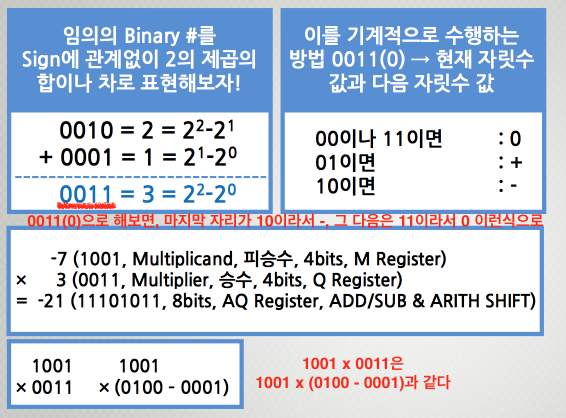
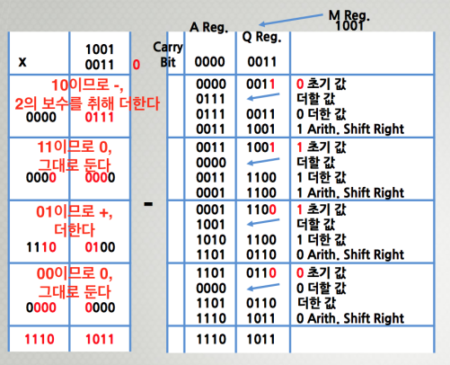
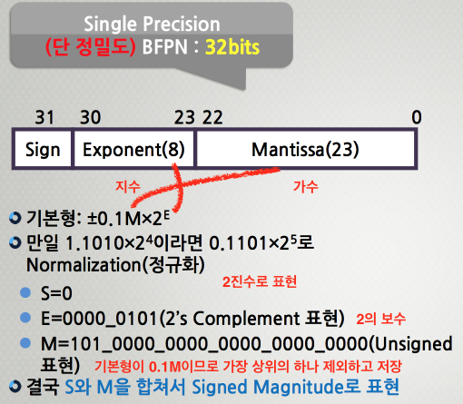
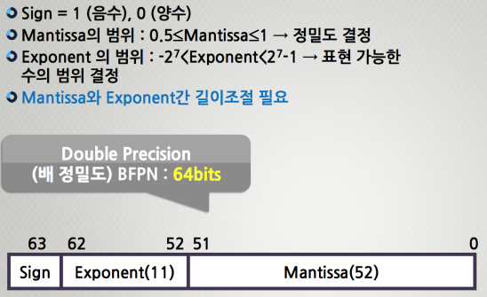
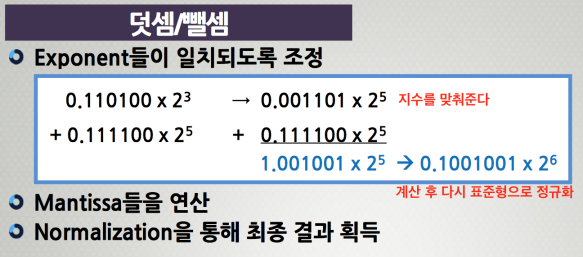
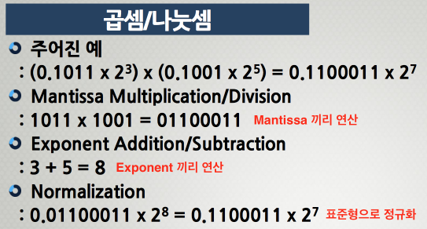

## Integer Arithmetic

부호가 없는 곱

인간이 하는 곱셉은 자리수가 올라갈 때마다 왼쪽으로 자리수를 하나씩 올리지만, 기계가 하는 곱셈은 처음부터 자리수를 만들어 놓고 오른쪽으로 한 자리씩 내리면서 더해간다.

부호가 있는 곱 (Booth’s Algorithm)

## BFPN Representation

실수를 표현하는 방법

현재 가장 많이 쓰이는 표현은 IEEE 754

## BFPN Arithmetic

