## CPU의 기본구조 및 구성요소

CPU의 기본구조 및 구성요소
- 산술논리연산장치(Arithmetic and Logic Unit : ALU) : 산술 및 논리 데이터에 대한 실질적으로 연산을 위한 하드웨어 모듈
- 레지스터 세트(Register Set)
  - CPU 내부의 다양한 레지스터들의 집합
  - 액세스 속도가 가장 빠르다. 제한적이다.
  - 특수기능레지스터(SPR) : Program Counter(PC, 메모리 주소 정보를 가지고 있다. 자동적으로 증가), Accumulator(AC, 메모리에서 정보를 가져왔을 때 저장 위치 결정), Instruction Register(IR, intsruction을 가져왔을 때 위치 결정), Memory Address Register(MAR, 메모리와 연겨로 될 때, 주소 정보를 가지고 있는 버퍼),
Memory Data Register(MDR, 메모리와 연결될 때 데이터를 가지고 있는 버퍼)
  - 범용레지스터(GPR, 메모리에서 CPU로 내용을 가져올 때 저장 위치 관리)
- 제어 유니트(Control Unit): CPU의 두뇌. 이곳의 메모리는 ROM
  - 명령어의 연산코드를 해독하는 명령어해독기
  - 해독에 따른 실행을 위한 제어신호(Control Signals)들을 순차적으로 발생시키는 하드웨어 모듈
  - 마이크로명령어들로 이루어진 마이크로프로그램을 저장하는 제어기억장치 등으로 구성
- CPU 내부 버스(CPU Internal Bus)
- ALU와 레지스터들 간의 데이터 이동을 위한 데이터 선들과 제어 유니트로부터 발생되는 제어 신호 선들로 구성된 내부 버스
- 외부의 시스템 버스들과는 직접적 연결되지 않고, 반드시 버퍼 레지스터들(MAR, MDR) 혹은 시스템 버스 인터페이스 회로를 통하여 시스템 버스와 연결

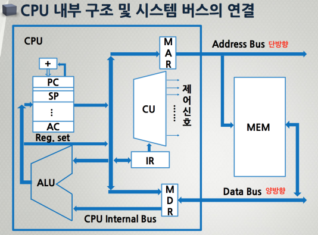

CPU 내부 레지스터
- Program Counter(PC)
  - **다음에 인출할 명령어 주소 값**을 가지고 있는 레지스터
  - 각 명령어가 인출된 후에는 자동적으로 일정 크기(명령어 길이 : 워드)만큼 증가한다.
  - 분기(Branch) 또는 조건(Conditional) 명령어가 실행되는 경우에는 해당 명령어가 있는 목적지 주소 값으로 갱신된다.
- Accumulator(AC)
  - **처리할 데이터를 일시적으로 저장**하는 레지스터
  - 레지스터의 크기 : CPU가 한 번에 처리할 수 있는 데이터 비트수(워드의 길이)
- Instruction Register(IR)
  - 가장 최근에 지정된 주소 번지의 **주기억장치로부터 CPU로 인출된 명령어 코드가 저장**되는 레지스터 (메모리에 있는 명령어가 IR로 간다)
- Stackpointer Register(SP)
  - 이미 메모리에 설정된 스택(stack)의 시작 번지의 주소값을 가지고 있으며, **스택에 정보가 쌓이거나 줄어드는 것에 따라 그의 값이 증가 또는 감소**하는 레지스터
- Memory Address Register(MAR): 단방향
  - 다음 번에 인출될 명령어의 주소정보는 PC(Program Counter)에 있고, 현재 **CPU 내부로 불러올 명령어의 주소 값을 메모리로 전달되기 전에 그것을 일시적으로 저장**하는 레지스터
- Memory Data Register(MDR): 양방향
  - 주기억장치로부터 **읽혀질(Read) 혹은 쓰여질(Write) 데이터를 일시적으로 저장**하는 레지스터

## 명령어 세트

명령어 세트(Instruction Set): **CPU 기능을 위해서 정의된 명령어들의 집합**
- CPU의 기능은 이들에 의해 결정된다.
- 그들의 수와 종류는 CPU에 따라 많이 다르다.

명령어 세트 정의를 위해 결정되어야 할 항목

- 오퍼랜드의 CPU 기억장소
  - 스택(Stack)
  - 범용 레지스터(GPR)
  - 누산기(Accumulator)
- 연산 명령어
  - CPU 명령어가 수행할 연산들의 수와 종류
- 오퍼랜드/명령어
  - 일반적인 명령어가 처리 가능한 오퍼랜드의 수
- 오퍼랜드의 위치
  - CPU 의 외부 혹은 내부
  - Reg-to-Reg, Mem-to-Reg, Mem-to-Mem
- 오퍼랜드
  - 오퍼랜드의 크기와 형태
  - 정의 방법

Stack Architecture(예전 모델. 현재는 사용하지 않는다.)    
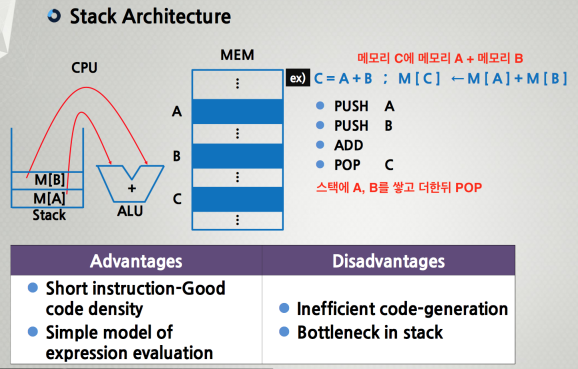

Accumulator Architecture    
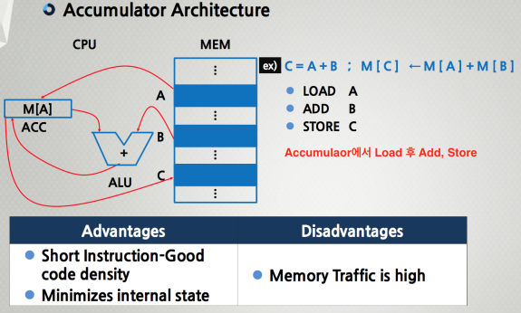

General-purpose register Architecture(가장 많이 사용되는 모델)     
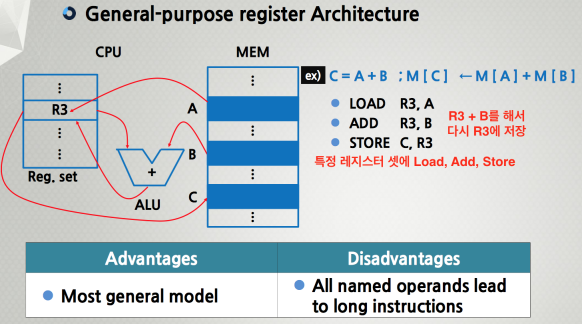

명령어의 종류
- 데이터 전송명령: 가장 자주 쓰인다.
  - 레지스터와 레지스터, 레지스터와 기억장치, 기억장치와 기억장치 간에 데이터를 이동시키는 명령
- 산술 연산명령(ALU)
  - 2의 보수 및 부동소수점 수에 관한 덧셈, 뺄셈, 곱셈 및 나눗셈과 같은 기본적인 산술 연산 명령
- 논리 연산명령(ALU)
  - 데이터의 각 비트들 간에 대한 AND, OR, NOT 및 Exclusive-OR 와 같은 논리 연산 명령
- 입출력(I/O) 명령
  - CPU와 외부 I/O 장치들 간의 데이터를 이동시키는 명령
- 프로그램 제어명령
  - 각 명령어의 실행 순서를 변경하는 분기(Branch)명령과 서브루틴 호출(Subroutine Call)및 리턴 명령

명령어의 형식
- 명령어는 CPU가 한번에 처리할 수 있는 비트 수의 크기(단어; Word)로 정의된다.
- 명령어를 구성하는 비트는 용도에 따라 몇 개의 필드(Field)로 나누어진다.
- 기본적으로는 Op-code 필드와 Operand 필드로 구성된다.
- Operand 필드는 컴퓨터의 처리 능력에 따라 여러 개의 Operand 필드로 구성된다.

명령어의 기본구성 요소
- 오퍼레이션 코드 (Op-code)
  - CPU에서 실행될 연산 지정한다.
  - LOAD/STORE, ADD, JUMP, .......
- 오퍼랜드 (Operand)
  - 연산을 실행하는 데 필요한 데이터 혹은 주소 값을 포함한다.

명령어의 형식    
Op-code 및 오퍼랜드 필드의 비트 수 결정    
- Op-code 필드의 비트 수
  - CPU에서 수행될 연산 종류의 수에 따라 비트의 수가 결정된다.
  - 4비트 → 2^4=16가지의 연산 정의
  - 5비트 → 2^5=32가지의 연산 정의
  - 비트의 수가 증가할 수록 많은 연산의 정의가 가능하지만, 반면에 오퍼랜드 필드의 비트 수가 감소한다.
- Operand 필드의 비트 수
  - 오퍼랜드의 종류에 따라 결정된다.
  - Immediate Value → 표현 가능한 수의 범위가 결정된다.
  - Memory Address → CPU가 직접 주소를 지정할 경우 기억장치 영역의 범위가 결정된다.
  - Register No. → 범용 레지스터의 수를 결정한다.

## 명령어 주소지정 방식

- 정해진 명령어의 비트들은 그 **수에 있어서 매우 제한적**이다.
그 안에 오퍼랜드들 만으로 메모리를 지정하는 것은 매우 제한적이다.
- 더 큰 용량의 메모리에 접근하기 위해서는 **직접 또는 간접으로 다양한 방법이 요구**된다.
- 이미 설계된 CPU의 종류마다 그 수가 매우 다양하고 다르게 제안되어 있다.

명령어 주소지정(Addressing Mode) 방식
- 즉치(immediate addressing mode)
  - 프로그램에서 상수 값으로 사용된다.
  - 명령어 내의 오퍼랜드가 실제 데이터가 되는 것을 의미한다.
  - CPU는 메모리로 부터 데이터를 인출하는 과정이 필요 없다. ( ea가 필요 없음 )
  - 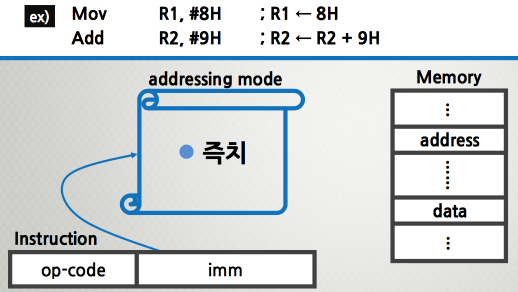
- 묵시적(implied addressing mode)
  - 명령어 내에 필요한 데이터의 위치를 지정하지 않는다.
  - 쉬프트 연산이나 스택에 관련된 연산 사용된다.
  - Sp가 유효주소(ea)가 된다.
  - 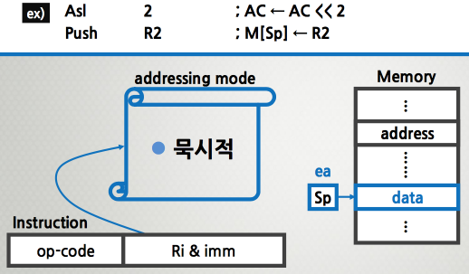
- 직접(direct addressing mode)
  - 절대 주소지정(absolute addressing mode)이 라고도 한다.
  - 명령어 내에 오퍼랜드가 주소 정보로 사용되어 메모리 내에 필요한 데이터의 위치를 지정한다.
  - 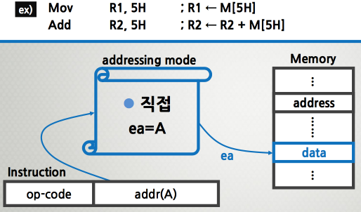
- 간접(indirect addressing mode)
  - 직접주소지정 방식의 단점(주소 범위가 짧다)을 해결한다.
  - 메모리 내의 데이터를 또 다른 주소 정보를 사용함으로써 더 큰 영역의 메모리 접근을 확보할 수 있다.
  - 단점으로는 메모리접근의 지연시간이 발생한다는 것이다.
  - 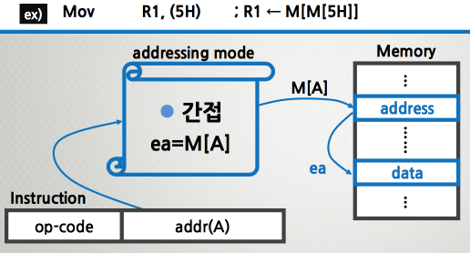
- 레지스터(register addressing mode)
  - 연산에 사용될 데이터가 레지스터에 저장되어 있다.
  - 오퍼랜드의 내용은 레지스터 번호로 사용된다.
  - 메모리 내의 데이터에 접근할 필요가 없다.
  - 메모리 접근의 지연시간이 없다.
  - 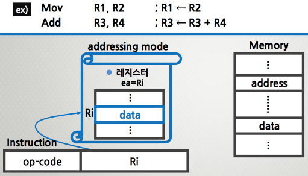
- 레지스터 간접(register indirect addressing mode)
  - 오퍼랜드의 내용은 레지스터 번호로 사용된다.
  - 오퍼랜드에서 지정한 레지스터의 내용이 메모리의 주소정보이다.
  - 레지스터의 비트 수에 따라 지정할 수 있는 메모리 영역 결정된다.
  - 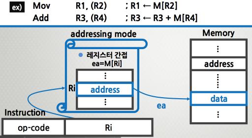
- 변위(displacement addressing mode)
  - 두 개의 오퍼랜드로 구성되고, 하나는 레지스터이고 다른 하나는 변위(D)로 사용된다.
  - 유효주소는 지정된 레지스터의 내용에 변위를 합한 것이다. ea=Ri (pc, ix, br) + D
  - 레지스터의 종류에 따라 상대(pc), 인덱스(index), 베이스(base) 레지스터 주소지정 방식이라고 한다.
  - 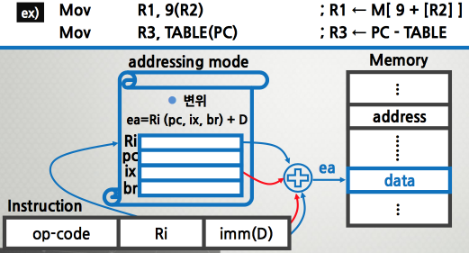
