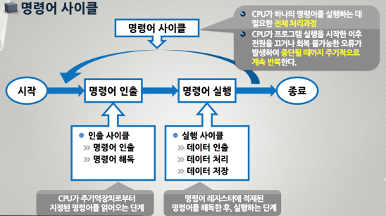

## 명령어 사이클 및 인출 사이클

- 명령어 인출(Instruction Fetch)
  - 주기억장치로부터 지정된 주소에 있는 명령어를 IR로 가져온다.
- 명령어 해독(Instruction Decode)
  - 실행해야 할 동작을 결정하기 위하여 인출된 명령어를 해독한다.
- 데이터 인출(Data Fetch)
  - 명령어 실행을 위하여 데이터가 필요한 경우에는 주기억장치 또는 입출력장치로부터 데이터를 가져온다.
- 데이터 처리(Data Process)
  - 데이터에 대한 산술 혹은 논리적 연산을 수행한다.(ALU)
- 데이터 저장(Data Store)
  - 수행한 결과를 저장장치에 저장한다.

명령어 사이클    

명령어 인출 사이클(Instruction Fetch Cycle)    

인출 사이클의 마이크로 연산(Micro-operation) : 모든 명령어가 공통적으로 수행된다
- 클럭 t0 : 현재의 PC의 주소 값을 CPU 내부 버스를 통하여 MAR로 전송한다.
- 클럭 t1 : 그 주소 값이 지정하는 기억장치 주소로부터 읽혀진 명령어를 데이터 버스를 통하여 MDR에 저장하고, PC의 값에 워드의 길이 만큼을 더한다.
- 클럭 t2 : MDR에 있는 명령어가 명령어 레지스터인 IR로 전송된다.
- ex) CPU 클럭이 2GHz(1초 당 클럭의 반복 수 2G) 인 경우 클럭 주기 및 인출 사이클 시간
  - 클럭 주기 = 1 sec ÷ 2×10^9(2G) = 0.5ns
  - 인출 사이클 시간 = 0.5ns × 3(t0, t1, t2) = 1.5ns (메모리 지연 시간이 없을 경우)

## 명령어 종류 및 실행 사이클

명령어 종류
- IR에 보내진 명령어 코드를 제어 유니트에서 해독(Decoding)한 후, 그 결과에 따라 필요한 연산들을 수행한다.
- 이 과정에서 실행되는 마이크로 오퍼레이션들은 명령어의 종류에 따라 다른 과정으로 수행된다.

실행 사이클에서 수행되는 명령어들의 종류
- 데이터 전송명령
  - 레지스터와 레지스터, 레지스터와 기억장치, 기억장치와 기억장치 간에 데이터를 이동시키는 명령
- 산술 연산명령
  - 2의 보수 및 부동소수점 수에 관한 덧셈, 뺄셈, 곱셈 및 나눗셈과 같은 기본적인 산술 연산 명령
- 논리 연산명령
  - 데이터의 각 비트들 간에 대한 AND, OR, NOT 및 Exclusive-OR 와 같은 논리 연산 명령
- 입출력(I/O) 명령
  - CPU와 외부 I/O 장치들 간의 데이터를 이동시키는 명령
- 프로그램 제어명령
  - 각 명령어의 실행 순서를 변경하는 분기(Branch)명령과 서브루틴 호출(Subroutine Call)및 리턴 명령

명령어 필드
- 연산코드(Op-code)
  - CPU가 실행할 연산종류를 지정하는 필드
- 오퍼랜드(Operand)
  - 명령어 실행에 필요한 즉치 데이터(Immediate Value) 혹은 필요한 데이터가 저장되어 있는 주소 값(Address Value)이 존재하는 필드

명령어 실행 사이클(Instruction Execution Cycle)

LOAD 명령어 사이클에서 클럭주기(t3, t4, t5)에 따른 흐름도    

LOAD 명령어의 마이크로 연산(Micro-operation) : 주기억장치에 저장되어 있는 데이터를 CPU 내부 레지스 AC로 이동하는 명령어
- 클럭 t3 : 명령어 레지스터인 IR에 있는 명령어의 오퍼랜드 (addr) 값을 MAR로 전송한다.
- 클럭 t4 : 그 주소 값이 지정하는 기억장치 주소로부터 읽혀진 데이터를 데이터 버스를 통하여 MDR에 저장한다.
- 클럭 t5 : MDR에 있는 데이터는 AC로 저장된다.
- ex) CPU 클럭이 2GHz 인 경우 클럭 주기 및 LOAD 명령어 수행시간
  - 클럭 주기 = 1 sec ÷ 2×10^9 = 0.5ns
  - 인출 및 실행사이클 시간 = 0.5ns × ( 3+3 ) = 3.0ns

STORE 명령어 사이클에서 클럭주기(t3, t4, t5)에 따른 흐름도    

STORE 명령어의 마이크로 연산(Micro-operation) : AC 레지스터의 내용을 주기억장치에 저장하는 명령어
- 클럭 t3 : 데이터를 저장할 장소를 지정하는 IR에 있는 명령어의 오퍼랜드(addr) 값을 MAR로 전송한다.
- 클럭 t4 : 처리된 후, 저장할 데이터 저장된 AC로부터 버퍼 레지스터인 MDR로 전송한다.
- 클럭 t5 : MDR의 내용을 MAR이 지정하는 주기억장치의 주소에 저장한다.
- ex) CPU 클럭이 2GHz 인 경우 클럭 주기 및 STORE 명령어 수행시간
  - 클럭 주기 = 1 sec ÷ 2×10^9 = 0.5ns
  - 인출 및 실행 사이클 시간 = 0.5ns × ( 3+3 ) = 3.0ns

ADD 명령어 사이클에서 클럭주기(t3, t4, t5)에 따른 흐름도    

ADD 명령어의 마이크로 연산(Micro-operation) : 주기억장치로부터 가져온 데이터를 AC의 내용과 덧셈 연산 후, 그 결과를 다시 AC에 저장하는 명령어
- 클럭 t3 : 명령어 레지스터인 IR에 있는 명령어의 오퍼랜드 (addr) 값을 MAR로 전송한다.
- 클럭 t4 : 그 주소 값이 지정하는 기억장치 주소로부터 읽혀진 데이터를 데이터 버스를 통하여 MDR에 저장한다.
- 클럭 t5 : 전송된 MDR의 데이터와 AC의 내용을 덧셈 연산 후, 그 결과값을 다시 AC로 저장한다.
- ex) CPU 클럭이 2GHz 인 경우 클럭 주기 및 ADD 명령어 수행시간
 클럭 주기 = 1 sec ÷ 2×10^9 = 0.5ns
 인출 및 실행사이클 시간 = 0.5ns × ( 3+3 ) = 3.0ns

JUMP 명령어 사이클에서 클럭주기( t3 )에 따른 프로그램 제어의 흐름도    

JUMP 명령어의 마이크로 연산(Micro-operation) : IR의 오퍼랜드(addr)가 지시하는 주소의 명령어로 프로그램 실행 순서를 변경하는 분기(Branch) 명령어
- 클럭 t3 : 명령어의 오퍼랜드(분기할 목적지 주소)가 PC에 저장됨으로써 다음 명령어를 인출하는 사이클에서 변경된 주소의 명령어가 인출되므로 결과적으로 프로그램 실행 순서를 변경(분기)하는 것이다.
- ex) CPU 클럭이 2GHz 인 경우 클럭 주기 및 JUMP 명령어 수행시간
  - 클럭 주기 = 1 sec ÷ 2×10^9 = 0.5ns
  - 인출 및 실행사이클 시간 = 0.5ns × ( 3+1 ) = 2.0ns

## 간접 사이클 및 종합실행 예제

간접 사이클(Indirect Cycle)    
간접 사이클에서 클럭주기(t3, t4, t5)에 따른 읽혀올 유효주소의 흐름도    

간접 사이클의 마이크로 연산(Micro-operation) : 명령어에 포함되어 있는 주소정보를 이용하여, 실제 명령어 실행에 필요한 데이터를 인출하는 사이클로서 간접 주소지정 방식에서 사용되며, 이것은 인출 사이클과 실행 사이클 중간에 실행된다.
- 클럭 t3 : 명령어 레지스터인 IR에 있는 명령어의 오퍼랜드 (addr) 값을 MAR로 전송한다.
- 클럭 t4 : 그 주소 값이 지정하는 기억장치 주소로부터 읽혀진 데이터를 데이터 버스를 통하여 MDR에 저장한다.
- 클럭 t5 : 전송된 MDR의 데이터는 유효주소 정보이기에 그 값을 다시 IR의 어드레스 필드로 전송한다.
- ex) CPU 클럭이 2GHz 인 경우 클럭 주기 및 ADD 명령어 내에 간접 사이클이 포함된 수행시간
  - 클럭 주기 = 1 sec ÷ 2×10^9 = 0.5ns
  - 인출 및 실행사이클 시간 = 0.5ns × ( 3+3+3 ) = 4.5ns
