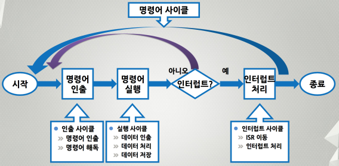
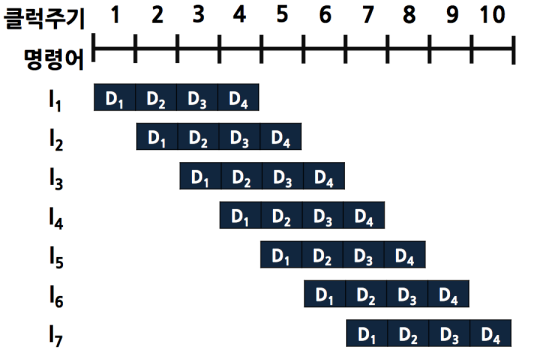

## 인터럽트

인터럽트 신호처리의 기본적 개념    

명령어 인터럽트 사이클    

인터럽트(Interrupt) : CPU가 정상적인 프로그램 실행 중에 또 다른 프로그램의 실행요구로 현재 실행 중인 프로그램을 중단시키고 요구된 프로그램을 실행하는 것을 인터럽트라고 한다.
- CPU가 프로그램 실행 중에 인터럽트 신호 처리를 요청
  - CPU는 원래의 프로그램 수행을 중단한다.
  - 요구된 인터럽트를 위한 서비스 프로그램을 먼저
수행한다.
    - 어떤 장치가 인터럽트를 요구했는지 확인한다.
    - 해당 인터럽트 서비스 루틴(ISR)을 호출한다.
  - 인터럽트 처리가 끝나면 본 프로그램으로 복귀한다.

인터럽트 벡터 테이블 (Interrupt Vector Table) : 다양한 인터럽트 신호를 처리하는 인터럽트 서비스 루틴의 시작 주소를 포함    
인터럽트 서비스 루틴 (Interrupt Service Routine) : 인터럽트를 처리하기 위하여 수행하는 프로그램 루틴

CPU의 인터럽트 처리 동작
- 현재 실행중인 명령어 실행을 끝낸 즉시, 다음에 실행할 명령어의 주소(PC의 내용)를 스택(Stack)에 저장한다.
- 일반적으로 스택은 주기억장치의 특정 부분을 지정하여 사용한다.
- 인터럽트 서비스 루틴을 호출하기 위하여 그 루틴의 시작 주소를 PC에 저장한다.
  - 시작 주소는 인터럽트를 요구한 장치로부터 전송되거나 미리 결정된 주소 값으로 결정한다.

인터럽트 사이클에서 클럭주기(t0, t1, t2) 에 따른 주소값 및 명령어의 흐름도    

인터럽트 사이클의 마이크로 연산(Micro-operation)    
- 클럭 t0 : 현재 PC의 주소정보를 MDR로 전송한다.
- 클럭 t1 : SP의 내용이 MAR로 전송되고, PC의 내용은 인터럽트 서비스 루틴의 시작 주소로 변경된다.
- 클럭 t2 : MDR에 저장되어 있던 원래 PC의 내용이 스택에 저장된다.
- ex) CPU 클럭이 2GHz 인 경우 클럭 주기 및 인터럽트 사이클 수행시간
  - 클럭 주기 = 1 sec ÷ 2×10^9 = 0.5ns
  - 실행사이클 시간 = 0.5ns × 3 = 1.5ns

다중 인터럽트(Multiple Interrupt) : 인터럽트 서비스 루틴을 수행하는 동안에 또 다른 인터럽트가 발생하는 것을 말한다.
- 인터럽트 플래그 (Interrupt Flag) 를 이용하는 방식
  - CPU가 인터럽트 요청을 처리하는 도중에는 새로운 인터럽트 요청이 발생하더라도 이를 수행하지 않도록 하는 방식이다.
  - 이 때 새로운 인터럽트 요청은 플래그를 불가능(Disabled) 상태로 설정하고, 대기 상태로 설정한다.
  - 이것은 가능(Enable) 상태로 변경되면 그 때 인식된다.
  - 시스템 운영상 중요한 프로그램 수행이나, 도중에 중단할 수 없는 데이터 입출력 동작 등을 위한 인터럽트를 처리하는데 주로 사용한다.
- 우선순위(priority)를 정하는 방식
  - 우선순위가 낮은 인터럽트 요청을 처리하는 동안에 우선순위가 더 높은 인터럽트 요청이 들어오면, 현재 진행되는 낮은 순위의 요청은 중단되고 높은 순위의 요청이 처리되도록 하는 방식이다.

## 서브루틴

인터럽트는 사용자가 호출하는 것이 아니라, 시스템에서 신호가 들어와서 처리하는 방식이다. 반면 서브루틴은 사용자가 원해서 메인에서 진행하다가 다른 블록(서브 루틴)에 가서 처리하고 결과만을 원할 때 사용하는 방식이다.

서브루틴 호출 명령어(Subroutine Call) : 한 블록으로 구성된 명령어 실행 중에 또 다른 블록으로 구성된 명령어를 삽입하여 실행하기를 원하는 형태로 프로그램을 구성할 때 사용하는 명령어로서, 호출과 복귀 명령어가 함께 사용된다.
- 호출 명령어 (CALL 명령어)
  - 현재의 PC 내용을 스텍에 저장하고, 그 PC에는 호출될 서브루틴의 시작 주소를 저장함으로써 원하는 서브루틴의 주소로 분기하는 명령어 이다.
- 복귀 명령어 (RET 명령어)
  - CPU가 분기하기 전 실행하던 프로그램으로 되돌아가도록 하는 명령어 이다.
  - 즉 스텍에 저장되어 있던 주소 값을 PC로 복원하여 저장함으로써 CALL 명령어의 바로 다음 주소로 되돌아가게 하는 명령어 이다.

Note: 단순히 실행 순서만을 변경할 때는 분기 명령어라고 한다.

## 파이프라이닝

명령어 파이프라이닝(Instruction Pipelining) : CPU의 성능향상을 위하여 명령어를 실행하는데 사용되는 하드웨어를 여러 개의 독립적인 단계로 분할하여 동시에 처리하는 기술을 말한다.

파이프라인에 의한 전체 명령어 실행 시간

**따라서, K-단계의 파이프라이닝 기법을 적용하였을 때,
이론적인 성능향상은 실행시간에 있어서 단계 수와 동일한 K배 만큼 빠르다.** (실제로는 이론적 시간보다는 느리다.)

4-단계의 명령어 파이프라이닝 구성

- D1 : 명령어 인출(IF)
  - 다음에 실행될 명령어를 기억장치로부터 인출하는 단계
- D2 : 명령어 해독(ID)
  - 제어 유니트에서 해독기(Decoder)를 이용하여 명령어의 op-code 를 해석하는 단계
- D3 : 오퍼랜드 인출(OF)
  - 연산에 필요한 오퍼랜드의 데이터를 기억장치로부터 인출하는 단계
- D4 : 실행(EX)
  - 해독기에서 정해진 연산을 수행하는 단계

단계 분할 조건
- 각 단계의 실행 시간은 동일해야 한다.
- 분할된 단계의 가장 많이 소요되는 시간과 동일하게 설정되어야 한다.
- 비효율적이다. (예를 들어 4단계가 각각 1, 2, 1, 2인 경우 모든 단계를 2로 맞춰줘야 하기 때문에 비효율적이다.)

명령어 파이프라이닝 실행 장애(Hazard)
- 구조적 장애(Structural Hazards) : 계속되는 명령어 수행에 있어서 한 명령어는 메모리부터 명령어를 가져오는 단계에 있고 또 다른 명령어는 메모리로부터 필요한 데이터를 가져오는 단계에 있다면, 메모리가 하나인 경우에 두 개의 서로 다른 명령어의 메모리 접근 충돌 때문에 동시에 처리할 수 없는 구조적 해저드가 발생한다.    
  
- 데이터 장애(Data Hazards) : 한 명령어 수행 결과가 다른 명령어의 연산에 사용될 때 파이프라이닝의 단계가 지연되어야만 하는 경우에 발생하는 것을 의미하는데, 이는 명령어 처리 결과 사이에 데이터의 종속성이 존재할 때 데이터 해저드가 발생한다.    
  
- 제어 장애(Control Hazards) : 다른 명령어들이 실행들이 앞선 명령어의 결과값에 따라 필요하지 않을 때 발생한다. 주로 분기 명령어에서 이러한 경우가 발생한다.    
  
