## 제어 유니트의 제어방식과 기능 및 구조

컨트롤 유니트 제어방식
- 하드와이어 제어(Hardwired Control)
  - 복잡한 Datapath → 복잡한 제어 설계 → 복잡한 프로세서 설계
  - 명령어 세트 설계의 단순화 → 제어 과정을 단순화
  - 제어 유닛은 모든 명령어를 수행함에 있어서 매 클럭 주기마다 Datapath가 해야 할 일을 정한다.
  - 이 과정을 특정화하여 표현한 것이 Finite-state diagram이다.
  - 각 state마다 1 클럭 소요되므로 명령어 수행은 다수의 state로 완료된다.
  - Complexity of Control = State × Control inputs × Control output
  - 입력: IR(function) + Datapath(condition) + state의 수
  - 출력: X bit 패턴 구성    
  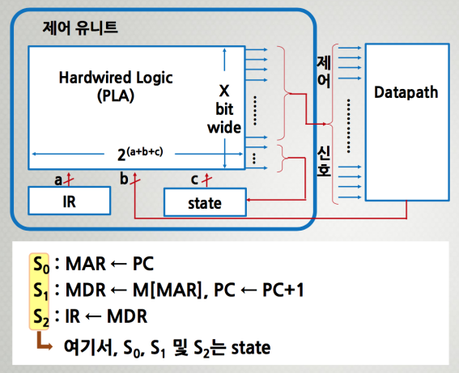
- 마이크로프로그램 제어(Microprogrammed Control)
  - 제어 유니트 → datapath 제어용 축소된 컴퓨터 (miniature computer)
  - 프로그램 내장형 컴퓨터(stored-program computer)
  - microprogramming → microinstruction, microcode, microprogram
  - 제어신호 그룹 → 필드(비트 패턴) → microinstruction format
  - 프로그래밍 → 주소체계 유지, 조건점프 등등
  - 명령어에 해당되는 각각의 마이크로-연산을 제어 메모리(ROM)의 할당된 주소에 한 개씩 microcode(비트패턴)로 작성된다.    
  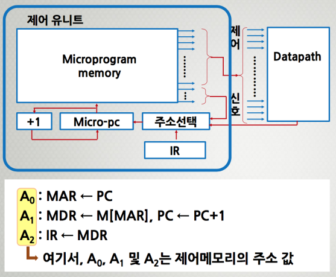

제어 유니트(마이크로프로그램 제어)의 기능
- 명령어 코드의 해독
- 해독 후 명령어 실행에 필요한 각종 제어 신호들을 발생
  - 마이크로명령어 (microinstruction)
    - 명령어 사이클의 각 주기에서 실행되는 마이크로-연산에 대응되는 비트들로 이루어진 단어
    - 이들은 모든 Datapath의 제어신호를 나타냄
    - 다음에 수행될 또 다른 마이크로명령어를 결정한다.
    - 제어 단어(control word)라고도 함
  - 마이크로코드 (microcode)
    - 마이크로 명령어 형식에 따라 각 필드에 2진수로 이루어진 비트패턴
  - 마이크로프로그램 (microprogram)
    - 마이크로 명령어의 집합
    - 명령어 해석기
    - 이것은 하드웨어 변경 없이 컴퓨터 시스템 제어의 수정 가능
  - 마이크로서브루틴 (Microsubroutine)
    - 공통 루틴 (common routine)
    - 마이크로명령어의 그룹 → 인출, 실행, ....
    - 하드웨어 비용 감소 (하드 와이어로 제어한다면 굉장히 복잡하지만, 프로그램으로 해서 비용이 감소할 수 있다.)

제어 유니트(마이크로프로그램 제어)의 구조    
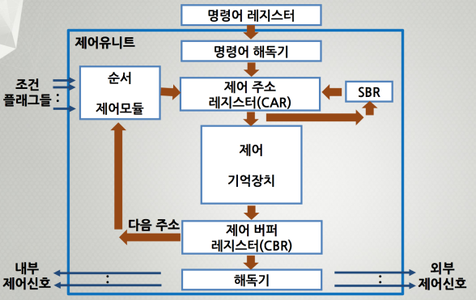

제어 유니트(마이크로프로그램 제어)의 기능
- 명령어 해독기 (Instruction Decoder)
  - 명령어 레지스터(IR)로부터 읽혀진 op- code를 해독한다.
  - 해독된 연산을 실행하기 위한 마이크로서브루틴의 시작 주소를 결정한다.
- 제어 주소 레지스터(Control Address Register)
  - 다음 번에 실행할 마이크로명령어의 주소 정보가 저장되는 레지스터이다.
  - 주소는 제어 기억장치의 위치를 말한다.
- 제어 기억장치 (Control Memory) : ROM으로 되어 있는 칩
  - 마이크로명령어들로 이루어진 마이크로프로그램을 저장하는 내부 기억장치이다.
- 제어 버퍼 레지스터(Control Buffer Register)
  - 제어 기억장치로부터 읽혀진 마이크로 명령어를 일시적으로 저장하는 레지스터이다.
- 서브루틴 레지스터(Subroutine Register) : Stack같은 역할(돌아올 주소 정보를 가직고 있는다.)
  - 마이크로프로그램에서 서브루틴이 호출되는 경우에 현재의 제어 주소 레지스터(CAR) 내용을 일시적으로 저장하는 레지스터이다.
- 순서제어 모듈(Sequencing Module)
  - 마이크로명령어의 실행 순서를 결정하는 회로들의 집합이다.

## 마이크로프로그램

CPU의 명령어 세트 설계 과정에서
- 명령어들의 종류와 비트 패턴을 정의하고,
- 명령어들의 실행에 필요한 하드웨어를 설계하고,
- 각 명령어 실행을 위한 다양한 마이크로서브루틴을 작성한 후,
- 마이크로프로그램 코드들을 제어 기억장치에 저장한다.

제어기억장치
- CPU 마다 종류가 매우 다양하다.
- ROM으로 구성된다.
- ROM의 사이즈는 마이크로명령어 형식에 따라 마이크로프로그램 크기로 결정된다.

ex) 명령어 길이 : 16 bits ; op-code(4), 간접(1), 즉치 혹은 주소(11)     
제어기억장치(ROM) : 2^7*17 bits    
마이크로명령어 길이 : 17 bits ; 연산1(3), 연산2(3), 조건(2), 분기(2), ADF(7)

1) 마이크로명령어 형식    
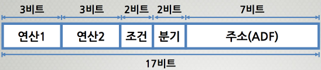    
- 연산1 필드 , 연산2 필드 : 이 필드들은 두 개의 마이크로 명령어들이 동시에 실행될 수 있다는 것을 의미한다.      
- 조건 필드 : 분기 필드에서 사용될 조건을 명시한다.    
- 분기 필드 : 분기의 종류를 명시하고, 조건에 따라 다음에 실행될 마이크로 명령어의 주소 결정방법을 명시한다.    
- 주소 필드 : 조건에 따라 분기가 발생하는 경우에 분기의 목적지 주소로 사용된다.    
(조건, 분기, 주소는 셋을 동시에 보는 것이 편하다)

2) 마이크로명령어의 2진 코드와 기호
- 연산1 필드에 위치할 마이크로-연산    
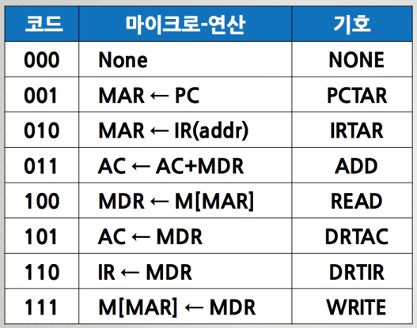    
- 연산2 필드에 위치할 마이크로-연산    
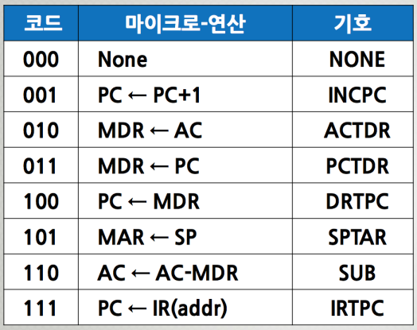    
- 조건 필드에 위치할 마이크로-연산    
  - U : 무조건 분기
  - I : ‘I=1’이면 간접 사이클 루틴을 호출
  - S : 누산기에 저장된 데이터의 부호가 ‘1’이면 분기
  - Z : 누산기에 저장된 데이터가 ‘0’이면 분기     
  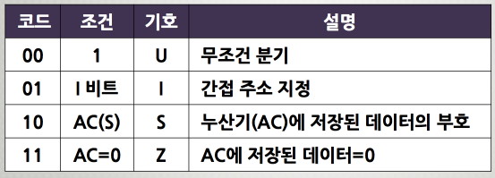      
- 분기 필드에 위치할 마이크로-연산(CAR 값 결정)    
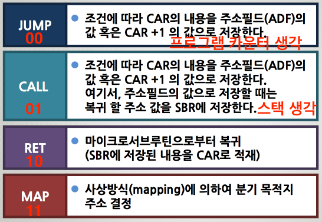     
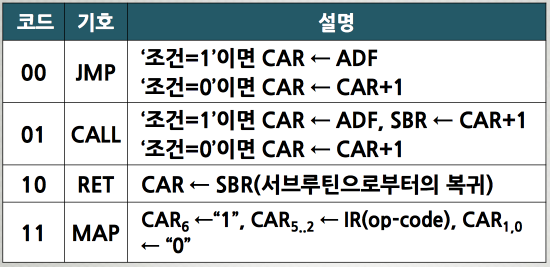     

3) 마이크로프로그램    
인출 사이클의 마이크로서브루틴    
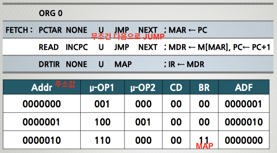     

간접 사이클의 마이크로서브루틴    
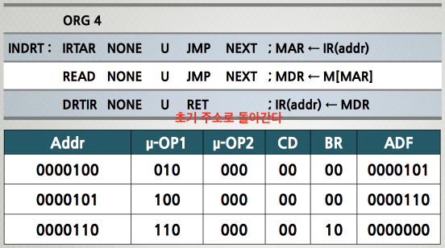   

실행 사이클의 마이크로서브루틴을 찾기 위한 사상(Mapping)방법    
- 명령어 내의 op-code 가 지정하는 연산을 실행하기 위하여 제어기억장치 내에 실행 사이클의 마이크로서브루틴이 프로그램 되어있는 시작 주소를 찾아가는 방법이다.
- 명령어 op-code의 비트를 사상함수의 특정 비트 패턴과 조합하는 방법이다.  
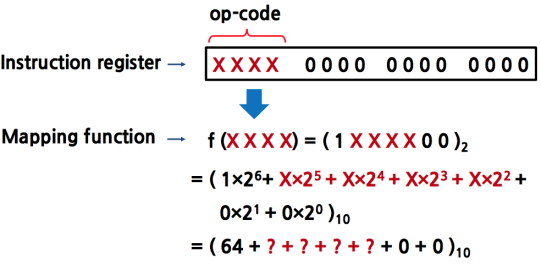   

사상(Mapping)방법에 따른 실행 사이클의 마이크로서브루틴 주소
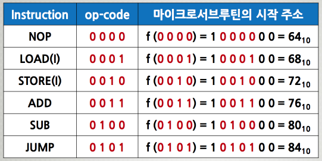     

명령어 실행 사이클의 마이크로서브루틴
- NOP 명령어 - 실행 사이클의 마이크로서브루틴      
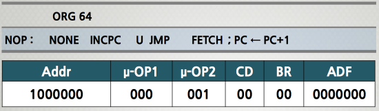     
- LOAD 명령어 - 실행 사이클의 마이크로서브루틴    
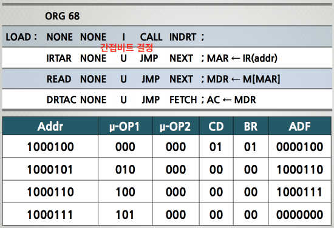     
- STORE 명령어 - 실행 사이클의 마이크로서브루틴   
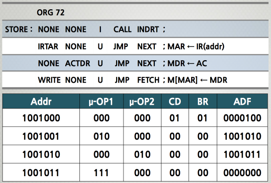     
- ADD 명령어 - 실행 사이클의 마이크로서브루틴    
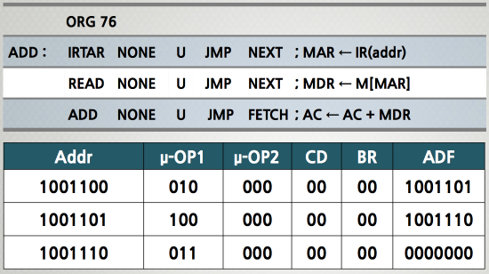     
- SUB 명령어 - 실행 사이클의 마이크로서브루틴    
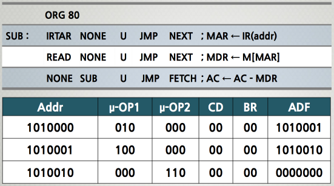     
- JUMP 명령어 - 실행 사이클의 마이크로서브루틴    
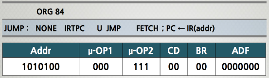     

## 마이크로프로그램 실행 순서 제어

마이크로프로그램의 실행 순서제어(Sequencing Control)
- 제어 유니트가 마이크로명령어의 실행을 제어한다.
- 제어 기억장치에 저장된 마이크로명령어들을 작성된 마이크로프로그램에 따라 순서대로 인출하는 과정을 말한다.
- CAR의 초기값으로 시작해서 다음 차례에 실행할 마이크로 명령어의 주소 값을 결정하는 것을 말한다.
- CAR의 초기 값은 “0”으로 설정한다.
- MUX1 에서는 다음 차례에 실행될 마이크로명령어의 주소를 4종류 중에서 마이크로명령어의 조건에 따라 1종류를 선택한다.
- MUX2 에서는 분기할 조건을 선택하여 주소 선택 회로로 그 값을 전송한다.

1) 마이크로프로그램의 실행순서제어 과정    
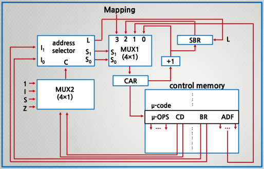     
2) 제어 기억장치의 마이크로명령어의 주소 선택 방법   
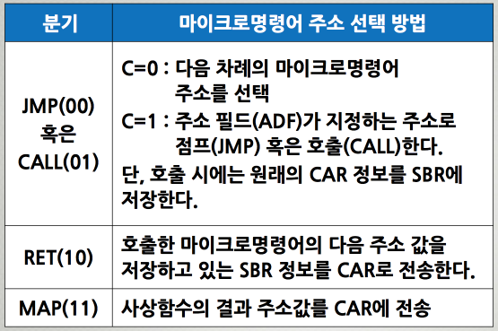     
3) 제어 장치의 마이크로명령어의 주소 선택 회로의 입력 및 출력 신호    
제어 기억장치로부터 읽혀진 마이크로 명령어의 연산 필드의 비트들은 모두 각종 CPU 동작을 위한 제어 신호가 된다.    
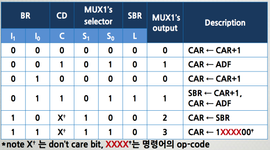     

마이크로명령어의 제어형식     
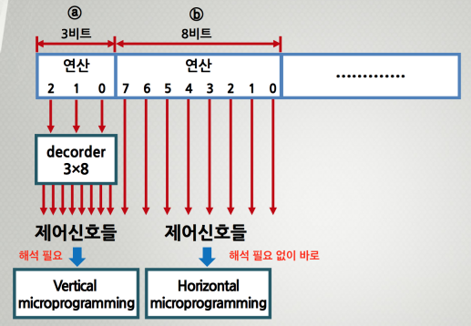     
- 수직적(vertical) 마이크로명령어 제어형식
  - 마이크로명령어의 연산 필드에 적은 비트 수의 코드화된(Encoded) 비트들로 표현하여 제어 기억장치의 용량을 줄이고, 해독기를 이용하여 원래의 필요한 수 만큼의 제어 신호들로 확장하는 방식이다.
  - 장점 : 마이크로 명령어의 비트 수가 감소한다.
  - 단점 : 해독 시간만큼의 지연 시간이 발생한다. 동시 신호를 보내기가 힘들다.
- 수평적(horizontal) 마이크로명령어 제어형식
  - 연산 필드의 각 비트 별로 제어 신호를 1:1 로 대응시켜 발생하도록 하는 일종의 on/off 스위치 역할을 하는 제어하는 방식이다.
  - 장점 : 하드웨어가 간단하고, 해독에 따른 지연 시간이 없다.
  - 단점 : 마이크로 명령어 비트 수가 길어지기 때문에 큰 용량의 제어 기억장치가 필요하다.
