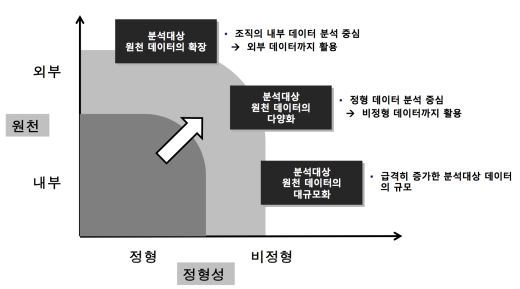

## 빅데이터란?

빅데이터의 주요요소
- 데이터
  - 정형 데이터 : 고객 데이터, 거래 데이터 등 (엑셀 등으로 표현 가능)
  - 비정형 데이터 : 텍스트, 동영상, 음성, 센서, GPS, SNS 등
- 데이터 수집, 처리, 저장기술 : 비정형적인 데이터를 저장할 수 있는 새로운 형태의 스토리지 필요 ex)NoSQL, Hadoop 등 비정형 데이터베이스 프레임워크
- 데이터 분석 및 지식추출 기술 : 데이터를 분석하여 가치있는 정보 또는 지식을 도출해 내는 기술
- 인재, 조직 : 빅데이터에서 의미있는 정보를 도출하여 이를 전략적으로 활용할 수 있는 인재나 조직 ex)Data Scientist

## 빅데이터의 주요 특징

4V + 1V = 5V
- Volume(규모)
  - 축적되는 데이터의 크기가 수직 확장의 물리적 한계를 초과할 정도로 거대함
  - 페타(Peta), 제타바이트(Zettabytes) 등 새로운 단위로 빠르게 증가
  - 해마다 디지털 정보량이 기하급수적으로 폭증하는 추세
- Variety(다양성)
  - 기존 : 데이터베이스나 데이터 웨어하우스 등 정제되어 저장되어 있는 정형 데이터 분석 위주
  - 빅데이터 : 로그기록, 소셜, 위치, 소비, 현실데이터 등 분석대상 데이터의 종류가 다양하고, 문자, 사진, 오디오, 비디오 등 형태 또한 매우 다양함
- Velocity(속도)
  - 과거 : 순차적 데이터 처리
  - 현재 : 데이터 처리 및 분석이 실시간
  - 대규모 데이터 처리 및 가치 있는 실시간 활용을 위해 데이터 처리 및 분석 속도가 빨라질 필요
  - 사물정보(센서, 모니터링), 스트리밍 정보 등 실시간성 정보의 증가로 인한 데이터 생성, 이동(유통) 속도가 증가
- Veracity(정확성)
  - 데이터의 품질 또는 데이터의 정확도가 성과에 중대한 영향을 끼침
  - 노이즈(noise)를 제거하고 시그날(signal)을 확보함으로써 데이터의 신뢰성을 제고
- Value(가치)
  - 빅데이터가 조직에 제공하는 가치는 데이터의 정확성과 시간성과 관련이 있음

**데이터 단위**     
1 PetaByte[PB] = 1024 TB    
1 ExaByte[EB] = 1024 PB    
1 ZettaByte[ZB] = 1024 EB   

비즈니스 인텔리전스(Business Intelligence) : 90년대부터 데이터 웨어하우스(Data Warehouse) 구축하여 데이터를 분석, 의사 결정에 활용

- 분석대상 원천 데이터의 확장
  - 데이터 확인, 수집이 중요해 짐
- 분석 대상 원천 데이터의 다양화
  - 텍스트, 이미지 등 비정형 데이터 분석 기법 필요
  - 비정형 데이터를 저장할 수 있는 데이터 베이스 필요
- 분석대상 원천 데이터의 대규모화
  - 대용량의 자료를 저장할 수 있는 데이터 베이스 및 하드웨어 구조 필요

## 빅데이터 분석과정

데이터 -> 수집 -> 저장 -> 처리 -> 분석 -> 표현 순서대로 진행된다.

- 데이터 
  - 분석을 전제로 가용한 데이터를 확인하는 단계
  - 내부 데이터 : 해당 조직이 자체적으로 보유한 각종 데이터. 예시) 현재 및 과거의 매출정보, 고객정보, 제품정보 등
  - 외부 데이터 : 인터넷 등으로 연결되어 조직 외부에 존재하는
각종 비정형 데이터. 예시) 소셜미디어데이터등
- 수집
  - 조직 내부와 외부의 여러 데이터 소스로부터, 필요로 하는 데이터를 검색하여, 수동 또는 자동으로 수집하는 단계
  - 검색·수집·변환을 통해 정제된 데이터를 확보
  - ETL(Extraction, Transformation, Loading),
웹 크롤링 (Web Crawling) 등
- 저장
  - 대용량의 정형·비정형 데이터를 저장, 관리하여 데이터 분석 및 활용을 지원
  - 빅데이터를 위한 데이터 베이스 : Hadoop, NoSQL 등 비정형 데이터 베이스
- 처리
  - 엄청난 데이터 양과 데이터 생성 속도, 다양한 형태의 데이터를 통합적으로 다루는 기술
  - 어떤 상태의 데이터를 처리하는가에 따라 다음과 같이 구분
    - 일괄 처리(Batch Processing) : 쌓인 데이터를 여러 서버로 분산해 각 서버에 나눠서 처리하고, 이를 다시 모아서 결과를 정리하는 분산·병렬기술방식
    - 실시간 처리(Real-time processing) : 데이터가 들어오는 대로 일련의 처리 업무들을 수행하여 그 결과를 연속적으로 제공
- 분석
  - 대량의 데이터로부터 사실, 추세, 관계, 패턴 등 알려지지 않 은 정보, 또는 지식을 찾아내는 과정
  - 주요 방법론들
    - 통계 분석(Statistical Analysis)
    - 데이터 마이닝(Data Mining)
    - 텍스트 마이닝(Text Mining)
    - 소셜 네트워크 분석(Social Network Analysis) 등
- 표현
  - 데이터 분석 결과를 쉽게 이해할 수 있도록 시각적인 수단으로 정보를 전달하는 과정
    - 정보편집기술 : 시각적 매핑, 스토리텔링 등
    - 정보 시각화 기술 : 시간 시각화, 분포 시각화 , 관계 시각화, 비교 시각화, 공간 시각화, 인포그래픽 등
