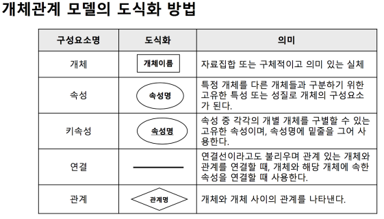
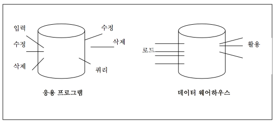
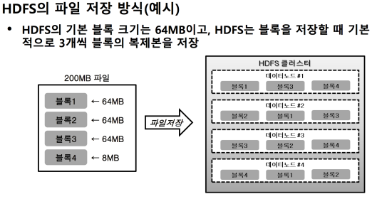
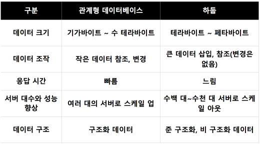

## 데이터의 수집

데이터 종류
- 정형데이터 : 고정된 필드에 저장된 데이터
  - 데이터베이스를 설계한 사람에 의해 수집되는 정보의 형태가 정해짐 (관계형 데이터 베이스의 테이블들, 스프레드시트 등)
- 비정형데이터 : 미리 정해져서 고정되어 있는 필드에 저장되어 있지 않은 데이터 (문서, 그림, 영상 등)

데이터 수집
- 조직 내외부에 분산된 여러 데이터 소스로부터 필요로 하는 데이터를 검색하여 수동 또는 자동으로 수집하는 단계
- 수집한 데이터를 저장하거나 분석하기 위해 데이터를 변환하거나 통합하는 작업도 포함

**GIGO: Garbage In Garbage Out**

데이터 수집 방법
- ETL
  - 추출(Extraction) : 원천 시스템으로부터 필요한 데이터를 추출
  - 변환(Transform) : 조회 또는 분석을 목적으로 적절한 포맷이나 구조로 데이터를 저장하기 위해 데이터를 변환
  - 적재(Loading) : 목표 시스템(예를 들면 데이터 웨어하우스)으로 변환된 데이터를 전송 및 적재
  
- 크롤링
  - 웹 페이지의 내용 전체를 수집(scrapping)
  - 웹 페이지 내에서 저장하고자 하는 수집 대상을 추출(crawling) 하여 데이터화

## 데이터 저장

데이터베이스(Database) : 여러 가지 업무에 공동으로 필요한 데이터를 유기적으로 결합하여 저장한 집합체
  - 데이터를 효율적, 효과적으로 처리하기 위하여 개발
  - 데이터의 중복성, 종속성 문제를 해결

Database Management Systems 이전에는 파일 시스템(File system: 응용 프로그램마다 필요한 데이터를 별도의 파일로 관리)으로 데이터를 저장했다. 파일 시스템의 문제점은:
- 종속성
  - 데이터 파일은 해당 응용프로그램에서만 사용가능
  - 저장된 데이터의 접근 방법을 변경할 때는 응용 프로그램도 같이 변경 필요
- 중복성
  - 일관성: 중복된 데이터 간에 내용이 일치하지 않는 상황
  - 보안성: 중복되어 있는 모든 데이터에 동등한 보안 수준 유지의 어려움
  - 경제성: 저장공간의 낭비, 동일한 데이터의 반복 작업으로 인한 비용 증가
  - 무결성: 제어의 분산으로 인한 데이터의 정확성 유지가 어려움

DBMS : 응용프로그램들과 물리적 데이터 파일들 간의 인터페이스를 제공
- 독립성 :응용프로그램과 데이터간의 독립성 확보
- 데이터 중복의 제거
  - 일관성 확보
  - 보안 수준 제고
  - 경제성 제고
  - 데이터 무결성 제고

스키마(Schema)
- 데이터베이스의 구조와 제약조건에 관한 전반적인 명세를 기술
- 데이터베이스를 구성하는 데이터 개체(Entity), 속성(Attribute), 관계(Relationship) 및 데이터 조작 시 데이터 값들이 갖는 제약 조건 등에 관해 전반적으로 정의
- 스키마는 데이터 사전에 저장되며, 다른 이름으로 메타 데이터 (Meta-Data)라고도 함
  - 데이터 사전: 데이터 베이스에 저장되는 각 데이터 항목들에 관한 정보를 모아놓은 것

SQL(Structured Query Language)
- 데이터베이스를 구축하고 활용하기 위하여 사용하는 언어
- 보통 관계형 데이터베이스를 조작하기 위한 표준 언어
- 데이터 정의언어(DDL : Data Definition Language)와 데이터 조작 언어(DML : Data Manipulation Language)로 구분
- DDL은 관계 생성, 관계 삭제, 관계 변경 등에 사용
- DML은 검색, 삽입, 삭제, 갱신 등에 사용

## 데이터베이스 모델링

개체-관계(Entity-Relationship) 모델
- 개념적 데이터 모델의 가장 대표적인 모델
- 개체 타입(Entity Type)과 이들 간의 관계 타입(Relationship Type)을 이 용해 현실 세계를 개념적으로 표현
- 데이터를 개체(Entity), 관계(Relationship), 속성(Attribute)으로 묘사
  - 개체(Entity)
    - 데이터베이스에 표현하려는 것으로, 사람이 생각하는 개념이나 정보 단위같은 현실 세계의 대상체 **(속성을 가지고 또 다른 테이블이 될 수 있는 대상)**
    - 유형, 무형의 정보로서 서로 연관된 몇 개의 속성으로 구성
  - 속성(Attribute)
    - 데이터의 가장 작은 논리적 단위, 파일 구조의 데이터 항목 또는 필드에 해당

**관계형 모델(Relational Model)**

## 빅데이터의 수집, 저장 및 처리

데이터 웨어하우스(Data Warehouse)
- 기업 내에 있는 각종 데이터를 적절히 뽑아내고 조합해 다양한 사업목적에 맞는 정보, 또는 지식으로 바꾸어 주는 기술
- 기존의 데이터베이스처럼 거래처리를 위한 데이터가 아니고, 의사결정 지원을 위한 데이터 베이스 (응용 프로그램 구동을 위한 데이터가 아니다)
- 빅데이터와 개념 자체는 비슷하다.

데이터 베이스
- 거래처리 중심
- 응용프로그램 지원    

데이터 웨어하우스
- 지식분석 중심
- 의사결정지원시스템의 데이터베이스

데이터 웨어하우스 특징
- 주제 중심적이다.
  - 기존의 데이터베이스가 응용프로그램 중심적이었다면 데이터웨어하우스는 재고관리, 영업관리, 회계관리 등 기업 운영에 필요한 업무 프로세스 처리를 지원하기 위해 설계
  - 데이터 웨어하우스는 기업의 의사결정을 위한 주요 주제 및 그와 관 련된 데이터들이 중심
- 비휘발성
 - 각 부서 단위로 운영하고 있는 데이터베이스에서는 추가/삭제/변경과 같은 갱신 작업이 레코드 단위로 지속적으로 발생
 - 데이터 웨어하우스에서는 데이터 로드와 활용만이 존재하며, 기존 운영 시스템에서와 같은 갱신은 발생하지 않음.
- 시간성 혹은 역사성을 갖는다.
 - 기존 데이터베이스에서는 매 순간마다 발생되는 사건들을 즉시 처리 하도록 되어 있어 데이터를 접근하는 순간에만 의미가 있으나, 데이터 웨어하우스는 시간이라는 관점을 갖음.
 - 데이터 포인트가 시간 상의 한 포인트와 연결되어 있어 데이터 포인 트들을 시간 축을 따라 비교, 분석 가능
 

데이터 마트(Data Mart)
- 데이터 웨어하우스와 사용자 사이의 중간층에 위치
- 하나의 주제 또는 하나의 부서 중심의 데이터 웨어하우스
- 데이터 웨어하우스가 도매상이라면 데이터 마트는 소매상
- 데이터 마트의 데이터는 대부분 데이터 웨어하우스로부터 복제

데이터 웨어하우스의 구성 요소
- 데이터웨어하우스에는 단순히 자료가 저장되어 있을 뿐만 아 니라, 이러한 자료를 추출, 저장, 분류하는 일련의 과정을 포 함
- 메타 데이터
  - 데이터의 데이터
  - 데이터웨어하우스의 생성과 유지보수에 관련된 정보를 담고있는 자료
- 데이터 마트
  - 데이터 웨어하우스에 저장된 자료 중에서 일정한 주제나 특정 부서의 자료를 별도의 장소에 중복 저장하여 사용자들이 사용하도록 하게 한 것

## OLAP

OLAP(On-Line Analytical Processing: 온라인 분석처리) - 다차원 쿼리
- 다차원 데이터 구조를 이용하여 다차원의 복잡한 질의를 고속 으로 처리하는 데이터 분석 기술
- 차원(dimensions)과 측정 항목(measure)을 설정하여 관심주 제에 대한 분석을 수행
  - 예: “지역별/분기별/상품별(차원들)” “판매액(측정항목)” 현황분석
- 일반적으로 최종 사용자가 필요한 정보를 자료원으로부터 직
접 가공하여 분석
- 사용자가 분석도중 대화식으로 여러 차원 또는 분석 기법간에 심층분석(Drill-down), 또는 축약분석(Drill-up) 가능

- 드릴 다운 (Drill down)
  - 데이터를 어떤 하나의 차원을 기준으로 분석할 때 계층구조상의 가장 상위 수준에 해당하는 집계 데이터부터 먼저 보고, 다음 세부 수준으로 들어가며 데이터를 분석하는 것
  - 년도별 분석 -> 반기별 분석 -> 분기별 분석 -> 월별 분석 과 같이 점점 상세 수준으로 데이터를 분석
- 드릴 업 (Drill up)
  - 드릴다운의 반대 과정으로, 상세 수준의 데이터로부터 차츰 상위 단계의 데이터를 분석해 가는 것
  - 월별 분석 -> 분기별 분석 -> 반기별 분석 -> 년도별 분석으로 분석의 범위를 넓혀 나가면서 데이터를 분석
- 피벗(pivot)
  - 임의의 다차원 뷰(view)를 만들고 검토 및 분석한 후, 차원들의 다양하게 변경하여 새로운 뷰를 만들어 데이터를 분석하는 것
  - 다양한 뷰를 만들기 위해 축과 축을 바꾸는 작업

## 빅데이터와 비정형 데이터베이스

기존의 RDB나 DW와 같은 정형 데이터 베이스만으로는 해결이 어려워 분산환경(작업이나 데이터를 여러 대의 컴퓨터에 나누어서 처리, 저장하여 그 내용이나 결과가 통신망을 통해 상호교환 되도록 연결되어 있는 시스템) 하에서 대용량의 데이터를 신속하게 처리할 비정형 데이터베이스가 등장했다. ex) NoSQL, Hadoop 등

CAP이론
   
CAP정리(CAP Theorem), 혹은 브루어 정리(Brewer’s theorem) 등으로 불린다. 분산 컴퓨터 시스템에서, CAP라고 하는 세 가지 특성을 동시에 충족시키는 것은 불가능하다는 이론. 2002년에 증명 되었다.
- Consistency(일관성) : 분산 환경에서 모든 노드가 같은 시점에 같은 데이터를 보여줘야 함. 즉, 한쪽이 업데이트 되면 즉시 같은 정보가 보여져야 한다.
- Availability(가용성) : 일부 노드가 다운되어도 다른 노드에 영향을 주지 않아야 함. 특정 노드가 장애가 나도 서비스가 가능해야 한다.
- Partition Tolerance(지속성) : 일부 데이터를 손실하더라도 시스템은 정상 동작해야 함. 일부 데이터가 손실 되어도 사용자는 다른 최신 데이터에 접속하여 정상 작동할 수 있어야 한다.

3가지를 모두 만족시키는 것은 불가능하기 때문에 CAP중 두 개를 택하고 하나를 포기한다. **RBD에서는 C와 A를 택하고, 비정형 데이터 베이스에서는 P와 나머지 하나를 택한다.**

NoSQL
- Not-Only SQL 혹은 No SQL을 의미
- 전통적인 관계형 데이터베이스(RDBMS)와 다르게 설계된 비관계형 데이터베이스
- 스키마가 없는 데이터베이스
- 덜 제한적인 데이터 저장 및 검색 메커니즘 제공
- 용이한 데이터 규모 확장성, 즉 데이터를 다수의 하드웨어에 분산해서 저장
- 대용량의 구조적, 반구조적 데이터들을 저장/분석(웹, 소셜 미 디어, 그래픽 등)

NoSQL 분류
- 키-값: 다이나모, 리악, 레디스, 캐시, 프로젝트 볼드모트
- 컬럼: H베이스, 아큐물로
- 도큐먼트: 몽고DB, 카우치베이스
- 그래프: Neo4J, 알레그로그래프, 버투오소

NoSQL 특징
- 無 스키마
  - 고정된 스키마 없이 키(Key) 값을 이용하여 다양한 형태의 데이터 저장 및 접근 기능
  - 데이터 저장 방식은 크게 값(Value), 열(Column), 문서(Document), 그 래프(Graph) 등의 네 가지를 기반으로 구분
- 탄력성(Elasticity)
  - 시스템 일부에 장애가 발생해도 클라이언트가 시스템에 접근 가능
  - 응용 시스템의 다운 타임이 없도록 하는 동시에 대용량 데이터의 생성 및 갱신
  - 시스템 규모와 성능 확장이 용이하며, 입출력의 부하를 분산시키는 데 용이한 구조
- 쿼리(Query) 기능
  - 수십 대에서 수천 대 규모로 구성된 시스템에서도 데이터의 특성에 맞 게 효율적으로 데이터를 검색·처리 가능

RDBMS는 대용량 데이터 처리 및 다양한 유형의 데이터 처리를 하는데 어려움이 존재하였음. 강력한 수평적 확장성이 있는 NoSQL을 사용함으로써 데이터 분 산 처리 및 다양한 유형의 데이터 관리가 가능해짐.

  

Hadoop : 대용량 데이터의 분산 저장과 처리가 가능한 자바(Java)기반의 오픈소스 프레임워크이자 패키지들의 집합. (분산 데이터 처리 프레임워크) 하둡은 여러 개의 저렴한 컴퓨터를 마치 하나인 것처럼 묶어 대용량 데이터를 처리하는 기술

하둡의 구성
- 하둡 파일 시스템(HDFS) : 수천대의 분산된 장비에 대용량 파일을 저장할 수 있는 기능을 제공하는 분산파일 시스템.
  - 64MB~128MB 단위로 파일을 작은 블록으로 나누어 분산 저장
  - 각 블록의 유실, 고장 등의 위험으로 신뢰성 향상을 위해 복제물을 생성하여 저장
  
  - 범용 하드웨어로 구성된 클러스터로 대용량 데이터 저장
      - HDFS클러스터는 크게 하나의 마스터(Master)와 여러 개의 슬 레이브(Slave) 노드로 구성
        - 마스터 노드(네임 노드): 슬레이브 노드에 대한 메타데이터 관 리 및 모니터링 시스템. 파일 및 디렉터리 읽기(open), 닫기 (close), 이름 바꾸기(rename)의 기능 수행
        - 슬레이브 노드(데이터 노드): 데이터 블록을 분산 처리. 읽기 (read), 쓰기(write)의 기능 수행

    
- 맵리듀스 : 저장된 대용량 파일 데이터를 분산된 서버의 CPU와 메모리 자원을 이용해서 쉽고 빠르고 안전하게 분석할 수 있는 분산 컴퓨팅 프레임워크
  - 함수형 프로그래밍에서 일반적으로 사용하는 맵(Map)과 리듀스(Reduce) 함수 기반으로 구성되어 단계별로 데이터에 대란 분산 처리(계산) 수행
    - 맵(Map) : 입력파일을 한 줄씩 읽어 필터링(filtering)하거나 다 른 값으로 변환하는 데이터 변형 작업 수행
    - 리듀스(Reduce) : 맵 함수를 통해 출력된 결과 값을 새로운 키 기준으로 중복데이터 제거 후 그룹화 한 후 집계연산을 수행한 결과 추출

    

  

하둡의 특징
- 대용량의 데이터 처리에 최적화 : 분산컴퓨팅, 크라우드 환경
- 장애의 대비 : 데이터의 복제본을 저장하므로 데이터의 유실이나 장애가 발생했을 때에도 복구가 용이함
- 저렴한 구축비용 : 오픈소스 프로젝트이므로 소프트웨어 라이선스 비용에 대한 부담이 없음

비즈니스 인텔리전스 기반구조

 
