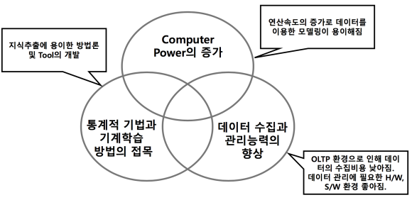

## 데이터 분석이란?

의사결정에 유용한 정보나 지식을 추출하기 위해 데이터로 부터 사실이나 관계, 트렌드나 패턴 등을 발견해내는 과정

- 연역 : 관련 이론, 문헌 전문가 노하우
- 귀납 : 과거 사례, 데이터 분석

데이터 분석 유형
- Descriptive : 현재 상황에 대한 이해, 사실파악
- Diagnostic : 현재 상황이 왜 이렇게 되었는지에 대해 세부적으로 분석
- Predictive : 미래, 또는 결과에 대한 예측
- Prescriptive : 해결 방안 도출

주요 기능
- 예측(Prediction) : 과거의 데이터를 바탕으로 관측되지 않은 변수의 미래의 값을 평가하는 것, 일반적으로 종속변수가 연속형
- 분류(Classification) : 서로 다른 그룹에 속하는 객체의 예가 주어지면 그 객체의 속성을 사용하여 모델링하고, 이를 통해 새로운 객체의 그룹을 예측하는 것, 일반적으로 종속변수가 범주형 변수
- 군집화(Clustering) : 유사한 속성들을 갖는 객체들을 묶어 전체의 객체들을 몇 개의 그룹 또는 군집(cluster)으로 나누는 것 ex) 동질적 특성을 가진 고객을 묶어 세분화된 마케팅을 제공
- 연관규칙 도출 (Association Rule) : 데이터에 숨어있는 항목간의 관계를 탐색하는 것, ‘A 물건을 산 사람은 B 물건을 산다’ 와 같이 비교적 간단한 규칙을 도출 ex) 편의점 - 라면을 사는 사람은 즉석밥도 산다.

예측 모델
- Predictive Estimation    
과거의 데이터를 바탕으로 관측되지 않는 미래 값을 평가     
과거-현재 데이터 패턴으로 현재-미래의 패턴을 예측    

- Predictive Classification    
서로 다른 객체의 속성에 따라 어떠한 객체가 어느 그룹에 속 할 것인지를 예측

데이터 분석을 위한 다양한 기법들
- 통계
  - 기술통계 분석
- 데이터 마이닝
  - 인공신경망
  - 의사결정 나무 분석
  - Association Rule
- 텍스트 마이닝
- 딥 러닝 기법
- Social Network 분석

## 데이터 마이닝이란?

대용량의 정형 데이터로부터, 데이터 내에 존재하는 관계, 패턴, 규칙 등을 탐색하여 모형화함으로써 유용한 지식을 추출 하는 일련의 과정 : 대용량 데이터에 대한 탐색적 데이터 분석(Exploratory Data Analysis)

도입배경

수행단계

- 샘플링 (Sampling/selecting) 단계
  - 방대한 양의 데이터(모집단)에서부터 모집단을 닮은 작은 양의 데이터 (샘플:표본)를 추출하는 단계
  - 적절한 샘플링 방법을 사용하는 것이 중요
  - 샘플링 에러에 주의할 필요
- 데이터 정제 및 전처리 (Data cleaning/Preprocessing)
단계
  - 데이터 베이스가 일관성이 없고 불안전하며 오류가 있을 경우 데이터의 무결성과 질을 보장하기 위해 데이터 정제 작업을 수행
  - 전처리(preprocessing)과정을 통해 특이치 등을 제거
- 탐색 및 변형 (Exploration/Transformation) 단계
  - 탐색
    - 보유하고 있는 수많은 변수들의 관계를 살펴보는 단계
    - 각 변수의 분포, 설정한 주제와의 관계 및 변수간의 선형, 비선형 관계 등을 관찰
    - 각종 그래프를 통한 시각적 관찰을 사용하기도 함.
  - 변형
    - 기존의 변수를 이용하여 새로운 변수를 도출
    - 예를 들어 “고객의 지난달 카드 사용 내역” 으로 부터 “고객의 지난달 1회 평균 카드 사용 금액”과 같은 정보를 도출
    - 차후 모형화 단계에서 중요한 정보로써 활용
- 모형화 (Modeling) 단계
  - 선정된 중요한 변수를 사용하여 다양한 모형(회귀분석, 인공 신경망, 의사결정나무 등)을 구축하는 단계
  - 적용할 모형구축기법의 선정, 수렴 및 일반화, 안정성의 점 검 등을 수행
- 보고 및 가시화(Reporting/ Visualization) 단계
  - 수행결과를 이해하기 쉬운 형태로 표현
  - 그래프 및 도표를 활용
- 적용단계(Implementation) 단계
  - 개발된 모형을 정보시스템의 모델 베이스에 반영

## 텍스트 마이닝이란?

- 자연어로 구성된 비정형 텍스트 데이터에서 패턴 또는 관계 를 추출하여 가치와 의미 있는 정보를 찾아내는 기법
- 사람이 말하는 언어를 이해할 수 있는 자연언어 처리(NLP; Natural Language Processing) 기술에 기반함
- 대용량 텍스트 데이터에 대한 탐색적 데이터 분석 (Exploratory Data Analysis)

도입 배경

수행단계

- 텍스트 문서 수집(Text Collection) 단계
  - 방대한 양의 텍스트 데이터를 수집하는 단계
  - 웹문서, 오피스 문서, 메일, 게시판, 블로그, SNS 등 텍스트 기반의 문서 수집
- 텍스트 전처리(Text Preprocessing) 단계
  - 문서 내에 표현되어 있는 단어/구/절에 해당하는 내용을 언 어분석 처리과정을 가공할 수 있는 데이터로 표현
  - 형태소 분리, 품사 부착 등과 같은 형태소 분석
  - 전처리(preprocessing)과정은 군집분석, 토픽분석, 감성분석 등 텍스트 분석에서 반드시 선행하여 수행되어야 하는 단계
- 의미정보 변환(Feature Generation) 단계
  - 전처리된 데이터 중 의미있는 정보를 선별하여 저장
  - 불용어(Stopword: 안 쓰는 단어 - . , ; ...) 처리, 어간 처리(Stemming: 같은 의미 단어 - 그래서, 그랬는데 ...) 등
  - 텍스트 데이터를 면밀히 둘러보아 정보화 할 수 있는 기반을 잡아가는 과정
- 의미정보 추출(Feature Selection) 단계
  - 복잡한 의미정보의 표현을 단순화하고, 도메인에 적합한 정보를 문서의 의미데이터(Feature 정보)로 저장
  - 차후 모델링(패턴 및 경향 분석) 단계에서 중요한 정보로써 활용
- 패턴 및 경향 분석(Pattern & Trend Discovery)
  - Feature 정보를 기반으로 문서를 군집화하거나, 분류하는 등의 정보 재생산
  - 분석 기법(텍스트 군집분석, 토픽 분석, 데이터 마이닝 등)의 선 정, 수렴 및 일반화, 안정성의 점검 등을 수행
- 정보표현 및 평가(Visualization & Evaluation)
  - 새롭게 생성된 정보를 사용자(End-User)에게 시각화 Tool로써 효과적으로 표현
  - 평가 과정을 통해 텍스트 마이닝 처리과정 중 문제가 되는 부 분을 수정 및 보완하여 품질 및 성능을 높이는데 활용
