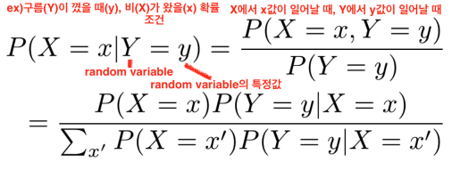
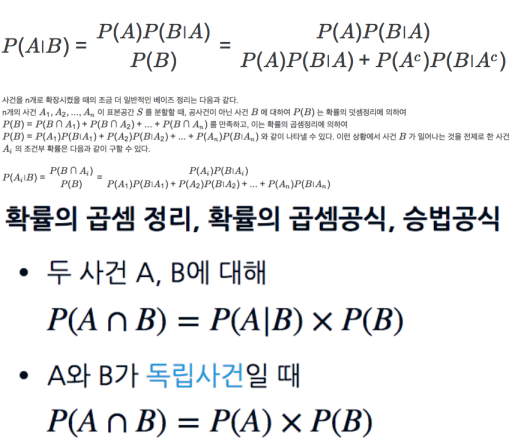
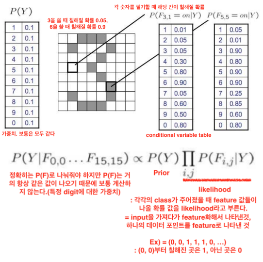

## 확률론(Probability)

Bayes rule
- Conditional probability
- 
  - x라는 random variable은 어떤 값을 조건으로 주어졌을 때 나머지 y라는 random variable의 확률을 알고 싶을 때 조건부 확률을 쓴다.

Bayes rule은 x가 조건으로 주어졌을 때, y의 확률에 대해서 궁금했던것을 반대로 y가 조건으로 주어졌을 때, x의 확률에 대해서 얘기하는 것으로 바꿔서 쓸 수 있다.     
P(X|Y)인 조건부 확률을 P(Y|X)인 반대 조건부 확률로 쓸 수 있다.

Ex) 확률 변수 X 는 오늘 구름이 끼었는지를 나타내고
(구름이 끼었으면 X=1, 구름이 끼지 않았으면 X=0),
확률 변수 Y 는 오늘 비가 올 것인지를 나타낸다
(비가 오면 Y=1, 오지 않으면 Y=0).

P(X=1|Y=1) = 0.8 : 비가 온 날 구름이 끼었던 확률    
P(X=1|Y=0) = 0.1 : 비가 오지 않은 날 구름이 끼었던 확률    
P(Y=1) = 0.2 :  비가 올 확률    

P(Y=0) = 0.8 : 비가 오지 않을 확률

P(X=1) = 구름이 낄 확률     
&nbsp;&nbsp;&nbsp;&nbsp;&nbsp;&nbsp;&nbsp;&nbsp;&nbsp;&nbsp;&nbsp; = P(Y=0 ∩ X=1) + P(Y=1 ∩ X=1)    
&nbsp;&nbsp;&nbsp;&nbsp;&nbsp;&nbsp;&nbsp;&nbsp;&nbsp;&nbsp;&nbsp; = P(Y=0)P(X=1|Y=0) + P(Y=1)P(X=1|Y=1)    
&nbsp;&nbsp;&nbsp;&nbsp;&nbsp;&nbsp;&nbsp;&nbsp;&nbsp;&nbsp;&nbsp; = 0.8 * 0.1 + 0.2 * 0.8     
&nbsp;&nbsp;&nbsp;&nbsp;&nbsp;&nbsp;&nbsp;&nbsp;&nbsp;&nbsp;&nbsp; = 0.24

P(Y=1|X=1) = P(Y=1)P(X=1|Y=1) / P(X=1)    
&nbsp;&nbsp;&nbsp;&nbsp;&nbsp;&nbsp;&nbsp;&nbsp;&nbsp;&nbsp;&nbsp;&nbsp;&nbsp;&nbsp;&nbsp;&nbsp;&nbsp;&nbsp;&nbsp; = 0.2 * 0.8 / 0.24    
&nbsp;&nbsp;&nbsp;&nbsp;&nbsp;&nbsp;&nbsp;&nbsp;&nbsp;&nbsp;&nbsp;&nbsp;&nbsp;&nbsp;&nbsp;&nbsp;&nbsp;&nbsp;&nbsp; = 2/3

## 의학 진단 예제(Example: Medical Diagnosis)

- 유방암에 걸렸을 때 (Y=Yes), 유방암 진단 (X=Positive)을 받을 확률 (Sensitivity of Mammogram)은 Pr(X=Positive|Y=Yes)=0.9,

- 유방암에 걸리지 않았을 때 (Y=No), 유방암 진단 (X=Positive)을 받을 확률 (False Positive of Mammogram)은 Pr(X=Positive|Y=No)=0.1,

- 아무런 조건 없이 유방암에 걸릴 확률 (Prior Probability) Pr(Y=Yes)=0.004이다.

이 때, 유방암 진단을 받은 여성이 실제로 유방암에 걸렸을 확률 Pr(Y=Yes|X=Positive)은 몇인가?

P(X=P|Y=Y) = 0.9    
P(X=P|Y=N) = 0.1    
P(Y=Y) = 0.004    

P(Y=N) = 0.996

P(X=P) = P(Y=Y ∩ X=P) + P(Y=N ∩ X=P)    
&nbsp;&nbsp;&nbsp;&nbsp;&nbsp;&nbsp;&nbsp;&nbsp;&nbsp;&nbsp;&nbsp;&nbsp; = P(Y=Y)P(X=P|Y=Y) + P(Y=N)P(X=P|Y=N)    
&nbsp;&nbsp;&nbsp;&nbsp;&nbsp;&nbsp;&nbsp;&nbsp;&nbsp;&nbsp;&nbsp;&nbsp; = 0.004 * 0.9 + 0.996 * 0.1    
&nbsp;&nbsp;&nbsp;&nbsp;&nbsp;&nbsp;&nbsp;&nbsp;&nbsp;&nbsp;&nbsp;&nbsp; = 0.1032

P(Y=Y|X=P) = P(Y=Y)P(X=P|Y=Y) / P(X=P)    
&nbsp;&nbsp;&nbsp;&nbsp;&nbsp;&nbsp;&nbsp;&nbsp;&nbsp;&nbsp;&nbsp;&nbsp;&nbsp;&nbsp;&nbsp;&nbsp;&nbsp;&nbsp;&nbsp;&nbsp; = 0.004 * 0.9 / 0.1032    
&nbsp;&nbsp;&nbsp;&nbsp;&nbsp;&nbsp;&nbsp;&nbsp;&nbsp;&nbsp;&nbsp;&nbsp;&nbsp;&nbsp;&nbsp;&nbsp;&nbsp;&nbsp;&nbsp;&nbsp; = 0.3488

## 나이브 베이즈(Naive Bayes)

Overfitting은 우리가 이제 데이터로부터 모델을 학습을 한다고 하는데, 그 모델이 데이터에 너무 잘 fitting이 되면 새로운 데이터에 대해서 일반화하기가 어려워질 수가 있다.

확률값이 0인 것은 절대로 있어서는 안된다.(연산시 곱을 하는데, 0이 있다면 다른 모든 값에 상관없이 확률이 0가 된다.)

Smoothing : 0을 없애는 기법    
- 라플러스 스무딩 : 실제 관찰값에 k를 일률적으로 더해준다.
