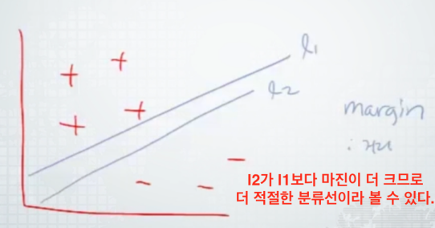
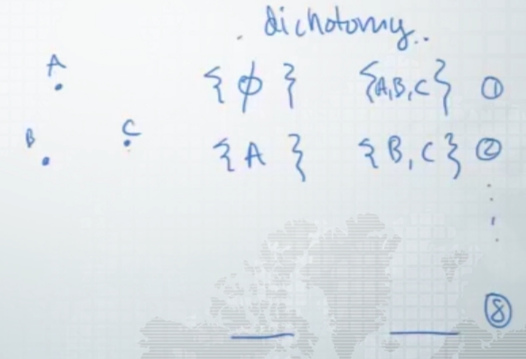
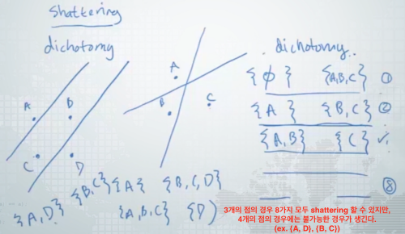
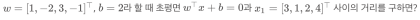
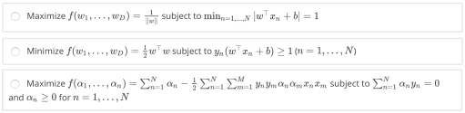
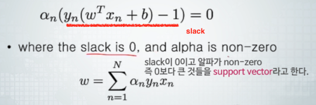

## 기본 개념: 마진과 VC Dimension (Basic Concepts: Margin and VC Dimension)

기본적으로 분류는 Linear Classifier에서 파생

- Margin : 분류하는 선을 그엇을 경우, 가장 가까운 데이터의 포인터와 선과의 거리를 margin이라 한다.
  - Maximizing Margin : margin이 최대가 되도록 선을 그어야 한다.(최대한 중간에 분류선이 위치하도록)    
      
  - VC Dimension : Shattering할 수 있는 maximum number of data points(Classifier가 얼마나 좋은지라기 보다 Classifier가 얼마나 복잡한 데이터를 분류를 할 수 있는지를 나타내는 metric). VC Dimension이 높을 수록 true error가 높아진다(높은 것이 좋지 않다). : SVM에서 maximize한다는 것은 VC Dimension을 줄이는 것 - d차원의 linear Classifier에서는 VC Dimension은 d+1이 된다.       
  ex) 2차원 linear Classifier에서 VC Dimension은 3.
    - dichotomy : 하나의 set을 두 개로 나눔    
        
    - shattering : Classifier가 dichotomy로 나누어진 모든 subset을 다 표현할 수 있는지 (위의 그림에서는 8개)    
         
- Support Vectors
- Kernels

SVM에서 Maximizing Margin을 높인다 = Shattering dataset을 줄인다 = VC Dimension을 줄인다 = true error를 줄인다.

## 최대 마진 분류기 (Maximum Margin Classifier)

hyperplane(초평면)을 찾는다는 것 = hyperplane을 나타내는 수식을 찾는다는 것.

가장 적절하게 초평면을 구분 짓는 것을 최대 마진 분류기라 한다.

y = wX + b (가중치, 편향)    
constraint를 이용해 최적화 문제를 편하게 풀기 위해 constraint를 준다. (표준화 한다.)

    
점과 직선 사이의 거리

https://cpuu.postype.com/post/599833

## 듀얼 문제와 서포트 벡터 (Lagrange Dual and Support Vector)

   

   

## M커널 서포트 벡터 머신 (Kernel SVM)

support Vector machine이 많이 쓰이는 이유는 linear classifier이지만 linear하게 seperation이 되지 않는 데이터들에 대해서도 kernel이라는 것을 사용해서 잘 분류를 할 수 있기 때문이다.

큰 space라고 해도 support vector의 숫자는 적을 수 있다.    
support vector들을 linear seperation이 가능한 dimension이 굉장히 큰 dimension이라고 하더라도 support vector 자체는 훨씬 더 dimension에 비해 적은 숫자가 나올 수 있다는 것이 kernel을 써서 SVM을 할 때의 실제 결과. 즉 low dimension에서 linear하게 seperation이 되지 않았는데 infinite까지 갈 수 있도록 하는 kernel trick을 써서 nonlinearity를 얻을 수 있다.
