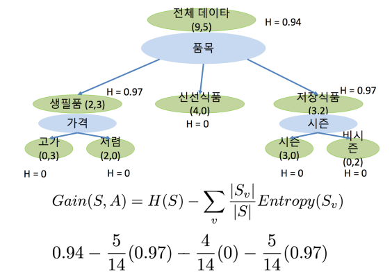

## 결정트리(Decision Trees)

    
Linear seperation보다 좀 더 complex한 function으로 데이터를 분류하고 싶을 때 Decision Tree를 많이 쓴다.     
여러 개의 Decision tree를 적절히 combine을 해서 combination 하는 방법, 여러가지의 classifier를 같이 쓰는 것을 Ensemble learning이라 하고 그 중 Random Forest를 가장 많이 쓴다.

Machine learning에서 가장 중요한 것은 predictive power

## ID3 알고리즘(ID3 Algorithm)

tree : recursive하게 root node에서 시작해서 children node들로 갈 때마다 계속해서 반복되는 것

Decision Tree를 만드는 알고리즘    
        
1. 현 Node를 나눌 “A: Best Attribute”을 찾는다
2. A를 현 Node의 decision attribute로 적용한다
3. A의 가능한 값들에 대해 현 Node의 child node들을 각각 하나씩 만든다
4. 현 Node에 들어있는 training example들을 A 값에 따라 childe node에 넣는다
5. 모든 Child node에 대해, 그 node가 “pure”하면 멈추고, 그렇지 않으면 그 child node에 대해 1부터 반복한다

best attribute를 정하는 데에는 엔트로피가 적용된다.   
       
entropy = 복잡도. entropy가 높다는 것은 복잡도가 높다는 것, entropy가 낮다는 것은 복잡도가 낮은, 복잡하지 않은 상황을 얘기하는 것.

   

best attribute를 구한다고 했을 때, decision 노드들에 대해서 attribute를 정하면 엔트로피가 감소하고 엔트로피를 가장 많이 감소하게 할 수 있을까라는 것을 염두에 두고 고르면 best attribute가 나온다. -> information gain으로 측정을 하고, 이에 따라 best attribute를 결정한다.

information gain    
   

     
위의 예에서는 품목이 가져다주는 information gain이 다른 attribute보다 높기 때문에 품목을 선택한다.   

## 랜덤 포레스트(Random Forest)

Overfitting
- Test data 에 대한 에러가 Training data에
대한 에러에 비해 많이 큰 경우
- Decision tree를 ID3 알고리즘으로 만들어서 pure 노드까지 가게 할 경우 node의 갯수가 많아지면서 overfitting이 일어날 수 있음

Overfitting을 방지하는 방법
- 차이가 많이 나지 않는 노드에 대해서는 나누지 않는다.
- pruning : 일단은 다 tree를 만들어 놓고 나서 거기에서 불필요한 node들을 없앤다
  - 데이터를 training과 test 두개로 나누면 되지 않고 train, validation, test 3가지로 데이터를 나눈다. 그리고 적절히 가지 치기 한 뒤 validation 데이터로 정확도를 측정하는 것을 반복하면서 모델을 찾아낸다.

decision tree 하나만 쓰면 prediction accuracy가 낮다. 따라서 bagging과 random attributes를 사용해 정확도를 높인 random forest classifier가 주로 쓰인다. (SVM과 더불어 가장 많이 쓰이는 classifier가)
- Bagging Trees
  - b =1 ... B, training data에서 random
sample X_b, Y_b를 고름
  - 이 random subset training data로 b번째
tree를 만듬 (ID3 알고리즘 사용)
  - Classification을 할때, B개의 모든 tree를
사용해서 분류한 후, majority vote로 결정
  - Decreases variance while bias stays same : variance bias tradeoff라는 개념. 랜덤하게 샘플을 골라서 training을 한 다음에 그 training된 classifier 여러 개를 평균을 내는 경우에는 variance가 줄어들고, fit이 더 좋아지지만 bias가 높아지지 않는다. (bias가 높아지면 보통 overfitting이 일어난다.) 결국, overfitting이 일어나지 않으면서 accuracy를 높일 수 있다. (batch)
  - 즉, 각 데이터를 무작위로 추출해 각각 ID3 decision tree를 만든 다음 만들어진 모든 decision tree에 test값을 넣어 가장 많이 분류된 쪽으로 결정하는 것. (예를 들어 b=1000, k=100, 데이터가 10000개라 하자. 100개씩 랜덤하게 데이터를 추출해 분류를 하는 것을 1000번 반복해 1000개의 트리를 만든다. 테스트 데이터를 1000개의 트리에 모두 넣어 가장 많이 분류된 쪽을 선택한다)
- Randomly choose attributes
  - Data subset에 대해 모든 attribute를 사용해서 tree를 만들 경우, 매우 strong attribute이 항상 포함되는 것을 막기 위한 방법 : 모든 attribute를 고려하는 것이 아니라, random하게 attribute를 골라서 그 attribute에 대해서만 tree를 만드는 것.

training이 얼마나 빠르다기 보다는 prediction을 얼마나 빠르게 할 수 있는지가 classifier의 성능에서 굉장히 중요한 요소
