## 인공 뉴런(Artificial Neuron)

뉴런 네트워크의 가장 작은 단위 = 뉴런, 퍼셉트론

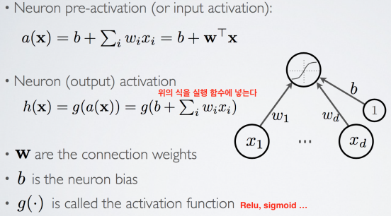    
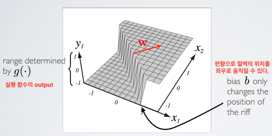    
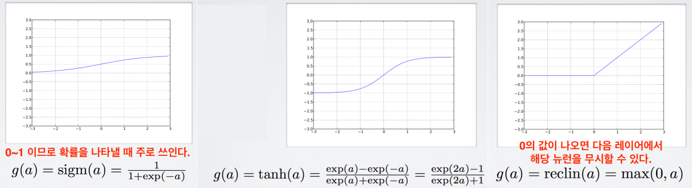    

## 다층 뉴럴 네트워크(Multilayer Neural Network)

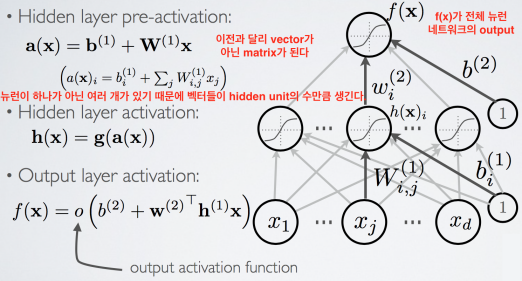    
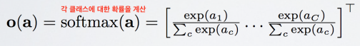    
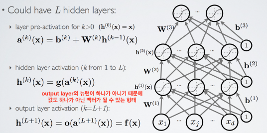    

## 경험적 위험 최소화(Empirical Risk Minimization)

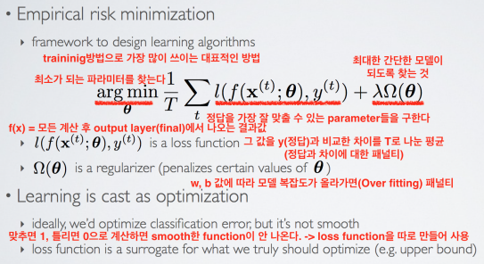    
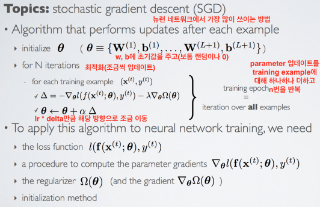    

## 손실 함수(Loss Function)

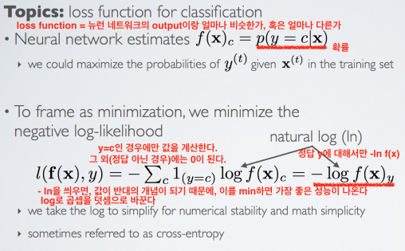    
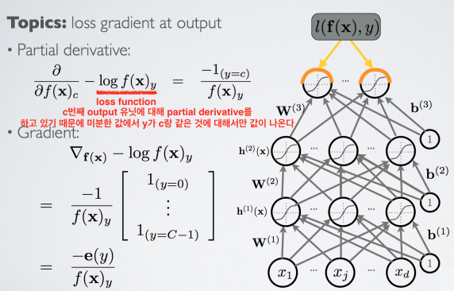    
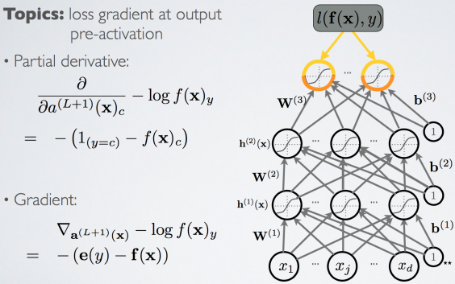   
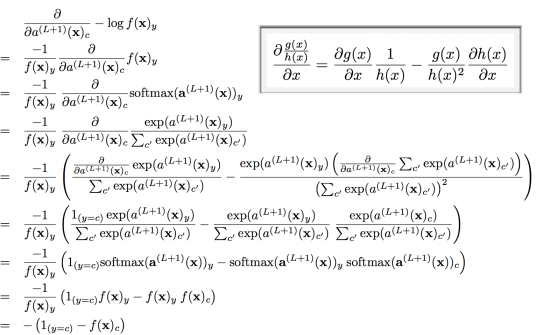     

## 은닉층 그래디언트(Hidden Layer Gradient)

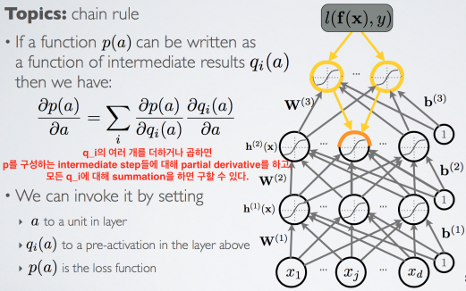    
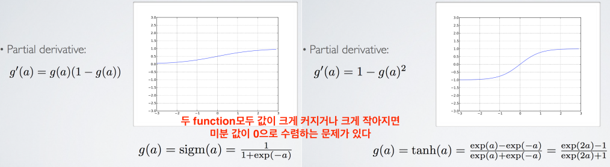    

Propagation 후 Backpropagation
