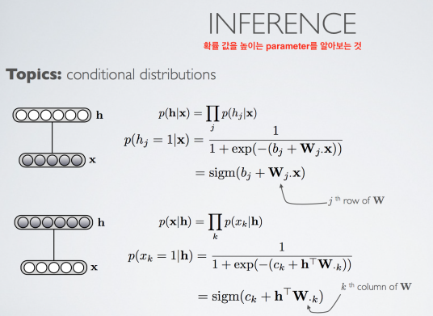

## 딥 러닝 소개 (Introduction to Deep Learning)

     

기존 이미지 인식에서는 하나하나가 어떤 것인지 feature를 만들고, 어떻게 계산을 해서 찾아내는 지 알고리즘을 적용해 줘야 했다.    
그런데 딥러닝에서는 네트워크에서 자동적으로 그것을 할 수 있다.

Machine Learning
- Supervised Learning
- Unsupervised Learning
- Reinforcement Learning

Deep Learning은 Supervised Learning과 Unsupervised Learning을 할 수 있고, Representation Learning을 한다(Representation을 자동으로 학습한다).

많은 분야에서 성과를 내고 있지만, 자연어 처리, 시계열 분석은 조금 부족한 상태

## 제한적 볼츠만 기계 (Restricted Boltzmann Machine)

https://deeplearning4j.org/kr/restrictedboltzmannmachine

RBM은 Unsupervised Learning을 할 수 있는 graphical model(정답이 주어지지 않고 input만 주어졌을 때 input에서 의미있는 feature들을 뽑아낸다)

graphical model : random variable들의 관계를 노드와 그 사이의 커넥션으로 나타내는 것. (Naive Bayes도 대표적인 graphical model)

     
     
     
   
k를 많이 반복할 수록 모델의 성능이 향상되긴 하지만, 적은 수를 하더라도 성능이 어느정도 좋은 결과를 낸다.

     

딥 러닝 역사상 중요한 모델이긴 하지만 현재에는 잘 쓰이지 않는다.

## 오토인코더 (Autoencoder)

오토인코더의 목적 : input과 똑같은 것을 ouput에서 reconstruct하는 것

     
    

    
- compression의 좋은 점 : 큰 dimension의 input을 작은 dimension으로 표현할 수 있다.(pca 처럼)      
- compression의 나쁜 점 : training input에서 보지 못한 랜덤한 다른 input이 들어왔을 때는 compression이 전혀 역할을 하지 않는다.

Overcomplete hidden layer : hidden layer가 input보다 큰 경우. 보통 오토인코더 모델에선 권장 되지 않는다.    
Denoising Autoencoder : Overcomplete hidden layer를 사용.     
        
노이즈를 추가해 좀 더 분류가 정확한 모델을 만들 수 있다.(노이즈 없이 깨끗한 데이터 보다 노이즈가 있는 데이터들로 학습해, 좀더 general한 feature를 찾아낼 수 있다. )

## 딥 뉴럴 네트워크 정규화 (Deep Neural Network Regularization)

딥 러닝에서 첫 번째 hidden layer는 가장 low level feature들을 표현, 그리고 hidden layer level이 위로 올라가면서 feature 들이 조금씩 higher level representation 을 가지게 된다.

딥 러닝 training 시 문제 점
- Underfitting : parameter optimization을 잘 못한다. (ex. 활성함수의 input값이 너무 크거나 작으면 0으로 수렴해 곱셈 시 무의미한 값이 나온다 : Vanishing gradient problem)
- Overfitting : parameter optimization을 너무 잘해서 general한 데이터에 대한 성능이 떨어진다.

Overfitting이 되지 않는 것을 parameter들의 값에 패널티를 주면서 Overfitting을 예방하는 것이 Regularization이다.
- Unsupervised pre-training : Hidden layer를 통해 input들을 abstraction 하는 의미 있는 feature들을 찾는 일(ex. Stacked Denoising Autoencoder)
- Drop out : 0.5를 주로 쓴다.     
      
