## 콘볼루션 신경망 - 1 (Covolutional Neural Network - 1)

Computer vision : 사람의 시각처럼 computer도 똑같이 할 수 있도록 하는 것
- 이미지 데이터는 dimension이 큰 데이터 set
- 이미지 데이터는 2D로 나타낸 그 픽셀들이 topological 패턴을 가지고 있다. (비디오의 경우 시간이 추가되어 3D)
- 이미지 데이터 내 사물의 위치에 따라 input이 달라지기 때문에 translation에 대해 invariant해야 한다.

Convolutional networks leverage these ideas
- local connectivity
  - 모든 hidden unit이 모든 input unit에 connection을 가지고 있으면 parameter들이 굉장히 많아지고 computation을 할 수 없다(Fully connected hidden layer). 따라서 하나의 hidden unit은 특정 local patch에 대한 값만을 가지고 있다.    
  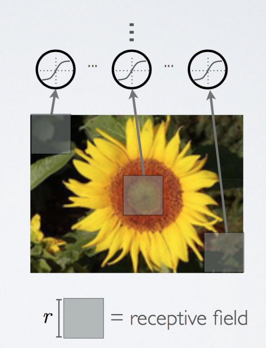    
- parameter sharing
  - 몇 개의 그룹으로 나눠진 hidden unit들은 같은 weight를 가진다. 하나의 feature map안에서 각각의 유닛들은 같은 weight를 가지고 있지만 receptive field는 다르다(가중치는 같지만 담당하고 있는 이미지의 영역은 다르다).    
  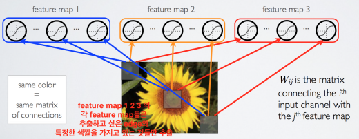    
- pooling / subsampling hidden units
  - dimension과 invariant 문제 해결을 위한 방법 (네트워크 크기를 감소 시킨다.)
  - convolution 이후, 일정 영역의 convolution unit의 max값만 취하고 나머지를 버린다.     
  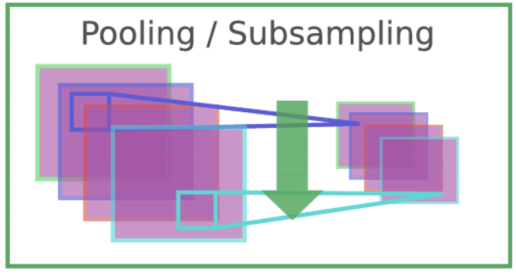    

## 콘볼루션 신경망 - 2 (Covolutional Neural Network - 2)

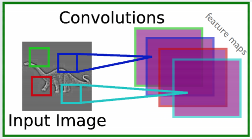    
feature map(필터 역할)들을 조합하고 계산해 이미지의 패턴을 찾아낸다. signal processing에서 하나의 input signal이 주어졌을 때, input signal이 가지고 있는 패턴들을 찾는다. 커널(필터)의 패턴을 이미지에서 찾아본다.

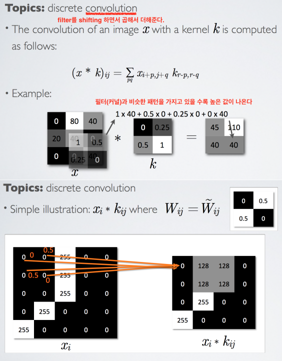    
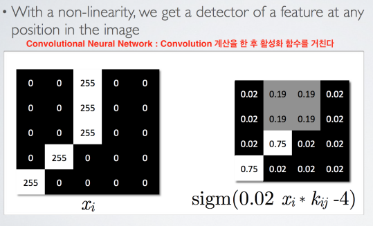    
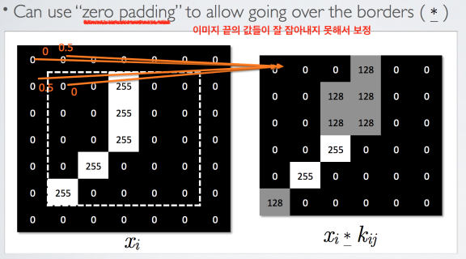    
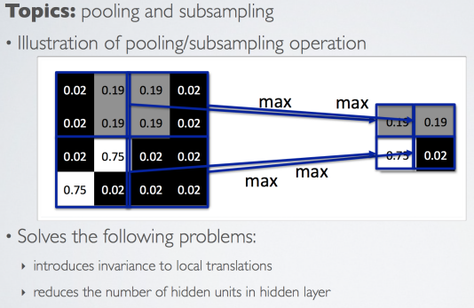  
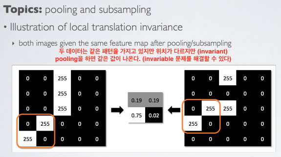      

기본적인 CNN 모델
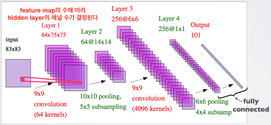   

성능 향상을 위한 방법
- rectification
  - 모든 layer의 값에 대해서 absolute value(절대값)를 씌운다  
  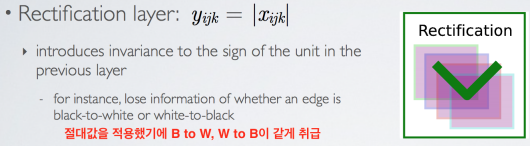   
- contrast normalization
  - 비슷한 neighbor local한 부분에 대해서 contrast에 대한 평균값을 빼고 standard deviation으로 나눈다. (통계, 표준화) - feature가 비슷한 부분보다 상대적으로 다른 부분이 더 도드라지게 된다.    
  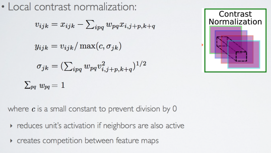   

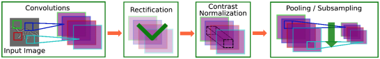   

## 신경망 언어 모델 (Neural Network Language Model)

Natural Language Processing : Written text에서 의미를 추출해내고 분석을 하는 것

- tokenization : 단어들을 추출 하는 것    
- lemmatization : 전처리. 대문자를 소문자로 바꾸고 숫자를 특정 토큰으로 일반화 등
- vocabulary : corpus(문서들이 이루고 있는 집합)가 가지고 있는 단어들을 모두 추출 해 내는 것. 너무 자주 나오거나(the, a ..), 너무 드물게 나오는 단어들은 빼준다.    
     
- vocabulary represent
  - one-hot encoding : 간편하지만 dimension이 너무 커진다
  - continuous word representation : 단어 수 별로 0, 1로 하는 것이 아니라, vector의 dimension은 제한이 되어 있고 0이나 1이 아닌 value를 가질 수 있다. 비슷한 값을 가진 벡터들은 비슷한 단어    
  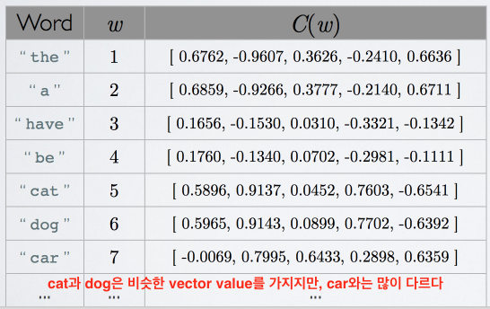      
  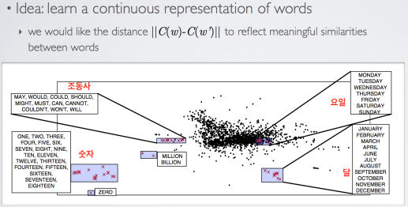    
  - continuous word representation에 대해서 gradient descent를 통해 update를 계속 한다.   

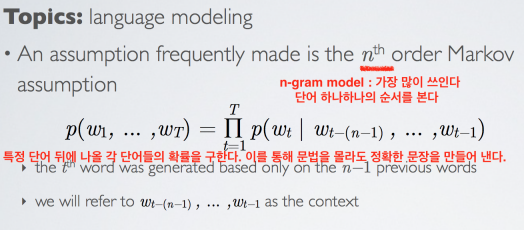     
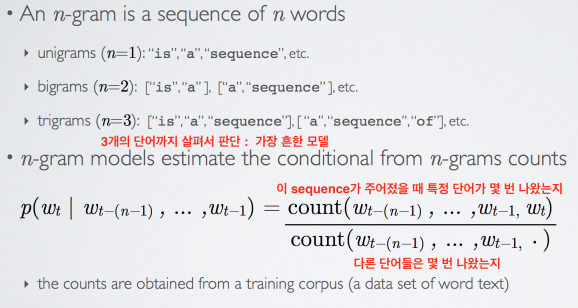     

n-gram의 가장 중요한 이슈 : sparsity. sequence가 한 번도 나오지 않은 경우의 확률?    
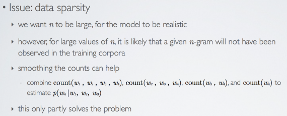     
n을 줄여가면서 답을 찾는다. 하지만 완전한 해결책이 아니기 때문에 딥 뉴런 네트워크를 적용

Neural Network Language Model    
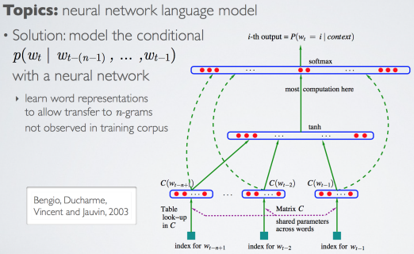     

## 강좌 종합 정리 (Course Summary)
