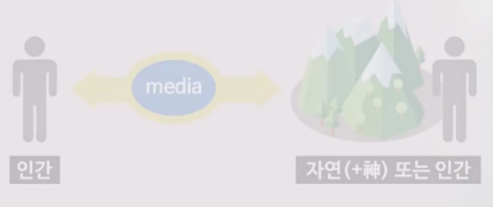

## 미디어의 이해

미디어 : medium의 복수형

미디어는 인간과 다른 사물을 연결한다.

**Understanding Media - Marshall McLuhan**
- 도구는 인간을 확장한다
- 형식이 내용을 지배한다
- 사람이 도구를 만들고, 도구가 사람을 만든다

ex) 인상파와 주석 물감 튜브 - 이전에는 유화물감이 빨리 마르기 때문에 풍경화를 그리기 힘들었다. 따라서 본 것을 기억해 작업실로 돌아와 구현하는 것이 일반적이었다. 하지만, 주석 튜브 물감이 발명된 이후 풍경화를 실외에서 바로 그릴 수 있게 되었고, 순간의 인상을 표현하는 인상파가 출현할 수 있는 토대가 되었다.

## 엔트로피의 증가

열역학 제 2 법칙

엔트로피의 증가 = 무질서의 증가 = 복잡함의 증가 = 권력과 명예의 분산

https://www.youtube.com/watch?v=LidRHQ2cdV0&list=PLdtEMw_Y0uKUBfDXKto9hD2ybBUvDgLY9

## 개념의 시대, 융합의 시대

중간단계가 사라지면서 콘셉트가 바로 가치로 연결된다.

John Henry - [위키백과](https://en.wikipedia.org/wiki/John_Henry_%28folklore%29)

융합(Convergence) : 두 형식의 경계선에서 나르시스의 감각마비상태에서 깨어난다.

가로는 폭, 세로는 지식의 깊이 https://goodgle.kr/977
- I형 인간 : 산업시대. 특정 분야에 대한 지식과 경험
- T형 인간 : 정보화 시대. 특정 분야에 대한 지식과 폭 넓은 교양
- π형 인간 : 현대. 2가지 이상의 전문 지식과 폭 넓은 교양

Silo Effect: 수직적 조직, 조직간 장벽과 부서이기주의를 조장    
vs. Synergy Effect
