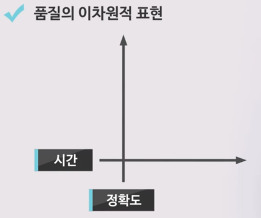
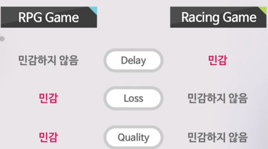
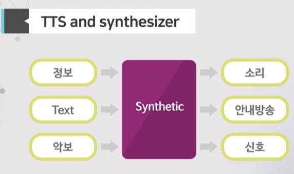
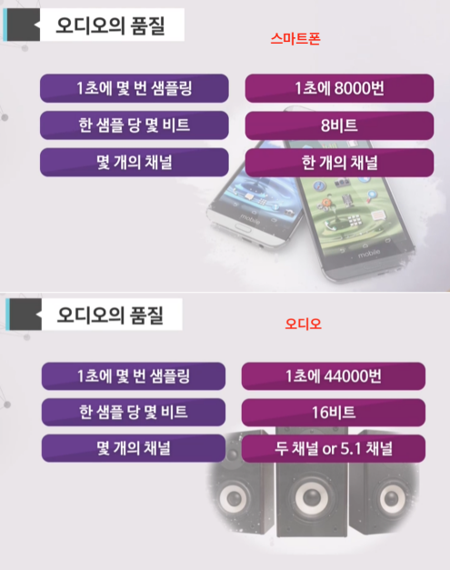
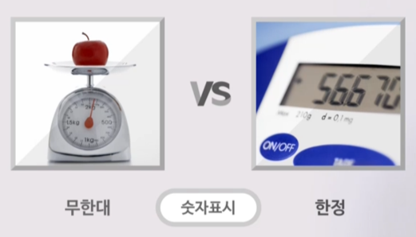
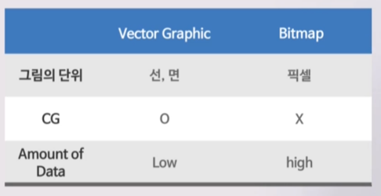
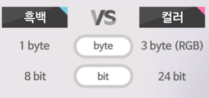
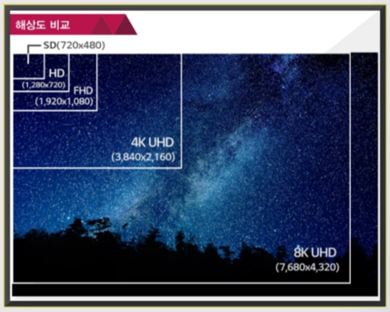
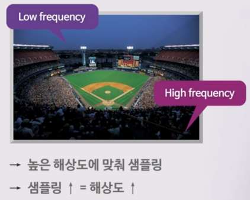
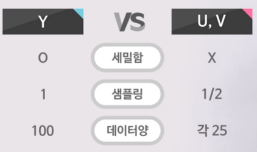

## AV데이터의 품질

컴퓨터게임의 기술
- 오디오 게임 : 귀, 청각
- 비디오 게임 : 눈, 시각
- 온라인 게임의 장르
  - 슈팅게임 : 영상의 품질 < 스피드
  - 도시건설 게임 : 시간의 지연 < 영상의 화질

사용자의 액션
- Interactive
  - 정확도, 위치
  - 시간, 데드라인

게임 장르별 품질 요구 사항
- 오디오 : 깨끗한 청음, 잡음 없음
- 비디오 : 해상도, 깨끗한 화면
- AV Quality
  - RTS(Real Time Strategy)
  - PRG(Role Playing Game)
- 지연(Latency)
  - FPS(First Person Shooter)
  - ~100ms
- 동기화(synchronization)
  - With other players
- 인터넷의 품질

만들기 편한 게임 = 재미없는 게임

미디어 서비스의 품질
- 미디어 품질(media QoS)
  - AV Quality
  - 반응성(Interactivity)
  - 연속성(Continuity)
- 네트워크 품질(Network QoS)
  - 대역폭(Bandwidth)
  - 지연과 지터(Delay, Jitter: 비디오 데이터를 한 화면씩 끊어서 전송하는데, 네트워크 품질에 따라 그 데이터의 도착시간이 빨랐다 늦어졌다 하는 것) : 데이터 도착 속도 지연, 가장 늦은 시간에 맞춤
  - 손실(Loss)
  - 우선순위(Priority) : 오디오 > 비디오
- 손실과 지연의 상관관계
  - 손실이 해결되는 동안 지연이 증가한다
  - 게임 별로 무엇을 우선시 해야 할지 결정

모바일과 비디오
- 3low, 1high
  - 대역폭, 배터리, CPU
- 1high
  - 통신비
- 모바일 망은 변화가 심하다.

## 오디오 데이터

인간과 소리
- 사람의 능력
  - 말 하는 소리 : ~3.2kHz
  - 가청 주파수 : ~20kHz
  - 박쥐 : ~50kHz
- 높은 주파수 = 심한 변화

공명 주파수
- 징 : 폐,  220Hz
- 꽹과리 : 방광, 355Hz

오디오 데이터 생성
- 스태틱 오디오(Synthetic Audio)
  - 합성한 소리
  - Text to Speech
  - 신디사이저
- Natural sound
  - 마이크로 들어오는 소리
- 증강현실 사운드
  - Natural Sound + Synthetic Sound

음색
- 음색(Timbre, Tone Color)
  - ex) '라' 음의 메인 주파수는 440Hz(1초에 440번 진동). 하지만 880Hz, 1320Hz도 같은 음을 나타낸다.
  - 신호 비율의 차이

오디오의 품질 : 1초에 몇 번 샘플링, 한 샘플 당 몇 비트, 몇 개의 채널
- Sample Rate : 주파수, 샘플링, 품질 모두 높여야 한다.
- Accuracy
  - 샘플의 정확도
  - 레벨의 개수
- Number of Channels
  - 스테레오 : 2 채널

Natural sound and ADC
- ADC(Analog-to-Digital Conversion)
  - 자연의 소리 - 마이크 녹음 - 디지털 데이터 - 컴퓨터 입력
- 샘플링을 많이 할 수록 신호는 보호되나, 기계의 가격, 저장용량, 대역폭이 높아질 수 밖에 없다.

Sampling and human-being
- 최소한의 샘플링 횟수
  - 가장 높은 주파수의 2배 이상

Quantization

- 디지털의 승
  - 목적에 따라 정확도 구분
  - 목적에 따라 비트 표현(체중을 재는 데에 매우 작은 단위까지 알 필요는 없다.)

오디오 데이터 압축
- CD 1장 = 1시간 : 현재의 CD는 압축해서 10시간
- 디지털 보다 아날로그가 더 좋은가?
  - 압축 과정에 정보를 잃음
  - 음향 심리학자가 못 듣는 신호 제거
  - 제거 후 압축
  - 하지만 아날로그는 변형이 잘 일어난다.

5.1 surround channels
- 스테레오
  - 2개 이상의 오디오 채널
  - ex) 이어폰
- 5.1 ~ 6 channels
  - 6개의 스피커
  - 5개 = 보통 주파수
  - 1개 = 우퍼(낮은 주파수)
  - 사람은 낮은 주파수의 방향성을 인식하기 어려워 우퍼는 하나면 충분하다.
- 16 ~ 25 channels
  - 현장감 Up
  - ex) 영화관

입체 음향
- 좌우 음성 도착 속도 차이
- 차이를 인공적으로 만듦
- 모노로도 제작 가능. 하나의 스피커 만으로도 현장감을 느낄 수 있도록 만들 수 있다.

## 비디오 데이터

Video sources
- 비디오 소스의 3가지 종류
  - Synthetic
    - Photoshop
    - 그림판
    - CG
  - Natural
    - 많은 데이터양
    - AD conversion을 거쳐 디지털화
  - Augmented Reality
    - Synthetic + Natural
    - ex) 포켓몬 고

Computer graphic
- 컴퓨터 그래픽(CG)
  - 정보 - CG - 이미지
- 벡터 & 비트맵
      
  - 비트맵의 경우 픽셀 단위로 색깔을 구별해 저장하기 때문에 크기가 커질수록 픽셀 수가 많아져 데이터 양이 커진다.
  - 벡터의 경우 면의 개수와 비례해서 데이터양이 커지지만, 화면 크기와는 관계가 없기 때문에 화면을 키우더라도 화면이 뚜렷하다.

Video의 품질
- 비디오 품질의 요소
  - 해상도 : 컴퓨터 : 약 400만 픽
  - 비트수 : 8비트, 24비트
  - 프레임 : 24프레임, 60프레임
  - View : 3D TV는 2개의 시점
- Resolution
  - Ultra High Definition TV : 1200만 픽셀
- Accuracy
  - 정확도 : 픽셀 당 몇 Bit
      
- Frame Rate
  - 영화 : 24 frames / sec
  - 방송 : 60 frames / sec
  - 패닝 : 카메라를 이동시키면서 촬영하는 기법
- View
  - mono = 1 view
  - stereoscopic = 2 views
  - multi = more than 2 views

      

Sampling and human-being    
    

Color representation
- RGB : 빛의 삼원색의 비율
  - Black (0, 0, 0)
  - White (255, 255, 255)
  - Red (255, 0, 0)
- YUV
  - Y: 밝기, UV: 컬러
  - 사람은 흑백은 잘 구분하지만, color의 각 색은 잘 구분하지 못한다. 따라서 흑백(밝기)을 구분하는 데이터에 더 신경쓰도록 만든 모델
  - 데이터 양 감소 가능
      

비디오 데이터 압축
- 시간적 중복성
  - 이전 화면을 참고해서 압축
  - ex) 연속적으로 촬영되어 이어진 프레임은 거의 비슷하다. 비슷한 프레임을 삭제함으로서 압축 가능
- 공간적 중복성
  - 기본적인 패턴에 매칭하여 압축
  - ex) 사람을 찍었을 경우 몸 부분의 색상은 비슷하다. 비슷한 색상, 패턴을 하나로 합쳐서 압축
- 압축의 문제
  - 화면이 연이어 깨짐(시간적 중복성을 삭제하면서 생기는 문제) - 복원화면을 넣음 - 화면이 늦게 뜸(디지털 TV에서 채널을 바꿀 때 화면이 아날로그보다 늦게 뜨는 이유) - 디지털TV의 한계

RGBD
- RGB + Depth(거리)

Stereoscopic Video
- 3차원적 입체감
  - 적청 안경
  - Oculus 방식
  - 편광 안경
  - 셔터 방식

Multi-view display
- 멀티 뷰
  - 어느 쪽에서든 입체적으로
  - 무안경
