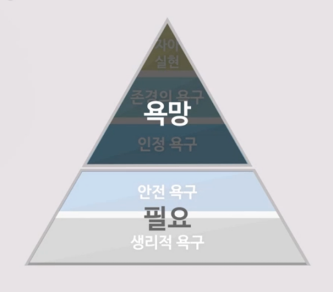
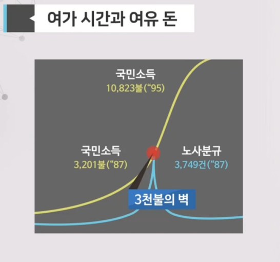
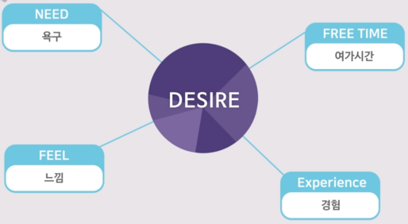

## 필요에서 욕망으로

- 욕망
  - 자아 실현
  - 존경의 욕구
  - 인정 욕구
- 필요
  - 안전 욕구
  - 생리적 욕구

**필요에서 욕구로**    
Homo-sapiens(생각하는 인간)에서 Homo-empathicus(공감하는 인간)으로.    
Homo-faber(일하는 인간)에서 Homo-ludens(놀이하는 인간)으로.    
Money(이익)에서 Meaning(의미)로.

- --직업(마이너스 마이너스 직업)
  - 나쁜 것을 줄여주는 역학
  - ex) 의사 : 병을 고쳐준다. 판사: 범죄를 줄여준다.
- ++직업(플러스 플러스 직업)
  - 좋은 것을 더 많이 하게 해주는 역할
  - ex) 선생님, 예술가 등

Survive, Feel, Experience
- Survive : Ford의 경제학
- Feel, Experience : Starbucks의 경제학, 서비스로 인한 욕구 충족, 자아실현의 욕구

행복할 수 있는 방법 (자존감, 만족감)
- 욕망을 줄인다.
- 욕망을 건드리는 제품을 만든다.
- 욕망을 건드리는 서비스를 만든다.

좌뇌형 우뇌형
- 좌뇌 : 수학, 과학 능력, Ford의 경제학
- 우뇌 : 예술, 문학 능력, Starbucks의 경제학

## 가상현실

1960년 미국 대선 : 라디오 토론까지 닉슨이 우세. 하지만 미국 역사상 최초의 TV토론. 그 이후 케네디가 우세.
- Nixon(공화당)
  - 2번의 부통령
  - 정치적 경력이 많음
- J.F.Kennedy(민주당)
  - 메사추세츠주 상원의원
  - 정치적으로 알려지지 않음

케네디는 최초의 앵글로색슨 백인 신교도(WASP)이 아닌 대통령 (아일랜드계, 가톨릭)

위장된 진정성 : Distressed Jean, 체게바라, 관광상품, 이중섭 등. 강렬함, 혁명, 전통문화, 예술 등의 이미지를 사실과는 다른 형태로 판매. 진정성의 상품화

한계효용(비용)제로의 시대 : 생산품을 더 만들어내는 데 큰 비용이 들지 않음. 복제의 비용이 제로에 가까움. ex) 음원을 한 개 더 생산하는 데 드는 비용은 없음.

기술 발전으로 상상이 현실을 지배하는 시대로 변화 : ex) 상상의 게임이 현실의 돈을 지배

Exposure therapy : 노출 치료. 노출 치료를 가상현실로 실행. 공포증 및 중독성 치료 극복 가능.

## 개입의 욕망

- 구세대 : Couch potato, 리모컨을 들고 텔레비전 보는 세대(수동적)
- 신세대 : Game mania, 방에서 게임하는 세대(능동적)

개입의 욕망(참여)
- 새로운 광고 전략 : 콘테스트 등을 활용한 광고
- Jasmin 혁명 : 소셜 미디어
- 방송국의 증가 : 개인 방송. 엔트로피의 증가
- 시청자가 개입하는 TV 프로그램 : 슈퍼스타 K
- 위키피디아
- 클라우드 펀딩
