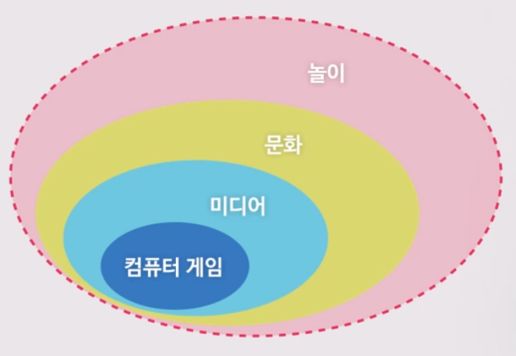
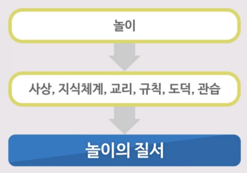
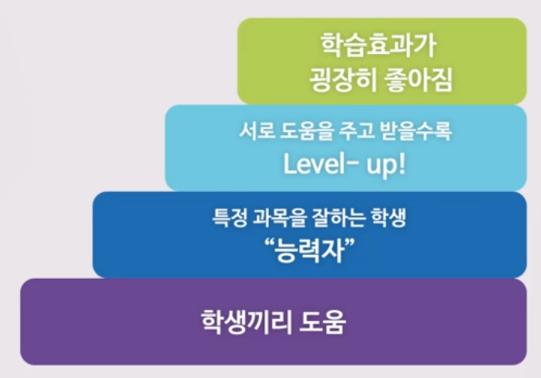

## 놀이하는 인간

- Homo-sapiens : wise man
  - 생각하는 인간
- Homo-erectus : upright man
  - 서서 다니는 인간
- Homo-ridens : laughing man
  - 웃는 인간
- Homo-faber : worker man, toolmaker man
  - 도구를 만드는 인간
- Homo-ludens : playing man
  - 놀이하는 인간

놀이 : 순수한 신체적, 생물적 반사운동 이상의 의미      
Game : Spontaneous + Pretending + Competition + Feedback    
놀이는 적극적(cf. TV시청) - 여러 가지 분야에 영향을 미치고 있다.

놀이의 특성 : 놀이의 비합리적인 특성으로 말미암아 우리는 합리적 존재이상의 존재가 되는 것이다.
- 자발적 행위
  - '자유시간'에 한가롭게 할 수 있는 행위
  - '본능'을 넘어서서 철학적 '자유'의 영역 : 합리적 존재 이상의 존재
- 일상에서 벗어난 행위(mimicry)
  - 정상적 사회생활 일시 중지
  - 상상력이 충만해짐
  - Pretending, 긴장과 이완으로 인생을 장식하고 풍요롭게
- 시간과 공간의 제약
  - 시간 : 적절한 순간 종료
  - 공간 : 특별한 규칙이 지배
  - 무의미함과 황홀함
- 특정한 규칙 속 경쟁(agon)
  - 이기는 것과 속이는 것은 다른 것
- 긴장을 요하며 진지하다(ilinx)
  - 불확실성, 우연성(Alea)
  - 용기, 지구력, 총명함, 공정함

    
     

놀이와 문화
- 인디안의 potlach
  - 인디안 부족의 대축제 potlach
    - 상대 추장에게 큰 규모의 선물
    - 상대보다 더 많은 재산을 파괴해야 승리
    - 허장성세, 우월해지기, 영광, 관대함, 위신
  - 공동체 생활을 지배하는 문화를 잉태
   - 탄생, 결혼, 성인식, 문신 새기기
   - 의례, 법률, 예술
  - 인간의 기본적 욕구
- 종교
  - 계절 대축제
  - 우주적 현상을 상상력 풍부하게 재현
  - 놀이의 요소 : 질서, 긴장, 운동, 엄숙, 변화, 리듬, 환희
- 법률
  - 원시시대 (아곤, 신의 판단, 인내 시합, 내기)
  - 현대(피고와 원리, 인간의 논리, 각자의 권리를 두고 내기)
- 전쟁
  - 경제적 팽창 < 자만, 허영, 우월성
  - 전쟁의 놀이적 요소
    - 정의감, 영웅화 - 기사도 정신
- 예술
  - 놀이, 춤, 가장 - 동시다발적으로 일어남
  - 건축의 아곤적 성격
    - 재주나 솜씨의 경쟁
    - 피렌체의 탑은 가문의 자존심
    - 허영심과 자만심은 신앙심보다 더 많은 성당과 병원을 지었다.

컴퓨터 게임의 4가지 요소
- 미미크리(mimicry)
  - ~인체 하기
  - 아바
  - 게임캐릭터
  - 코스튬 플레이
- 아곤(agon)
  - 규칙과 경쟁
- 알레아(Alea)
  - 우연성
  - 확률과 통계를 기반한 '밸런싱' 필요
  - 슬롯머신
  - 화투, 마작, 포커
- 일링크스(ilinx)
  - 진지함
  - 플레이어에게 끊임없이 도전
  - 서커스

## 컴퓨터 게임과 행복

Reality is broken: 제인 맥고니걸

리디아 왕국(from. 헤로도투스의 history(세계 최초의 역사책, 3~4천년 전의 기록))
- 18년 동안의 가뭄 - 게임에 몰입 - 밥 먹는 것을 줄임 - 18년을 견딤
- 주사위 놀이, 공기 놀이 등이 생김

게임의 4가지 요소
- 목표 : 몰입감 발생
- 규칙
- 피드백 시스템
- 자발적 참여

게임은 힘든 일이지만 Eu-stress(즐거운 스트레스)가 유발되어 피에르(fiero: 긍지)를 느끼게 된다.

게임에서의 행복감 = 보상
- 외적 보상
  - 소비, 소유 : 돈, 물건, 지위, 칭찬 등
  - 쾌락 적응 : 내성이 생겨서 장기적인 행복 불가능
- 내적 보상
  - 목적적 활동 : 활동 그 자체가 의미
  - 쾌락 탄성 : 재생 가능

게임과 유대감
- 게임에서의 행복감 - 유대감
- 행복은 접속사
  - 자기자신에만 집중 : 불안, 우울한 마음
- 행복한 수치심
  - 약 올리기는 서로에 대한 긍정적 감정을 강화
- 호의를 부르는 선순환
 - 서로 도움을 주고받는 행복감
 - 나쉐 : 지도한 사람이 성공할 때 느끼는 자부심
- 은근한 사교성
 - 직접적 사교성과 반대
 - 게임 참여만으로 사교성을 느낄 수 있음
 - 30%의 교류 시간만으로도 안도감 부여
- 장대한 어떤 것의 일부 : 거대한 일에 참여할 수 있다는 자부심

21세기의 게임
- 게임은 21세기형 협력방식
  - 젊은 층의 97%는 컴퓨터 게임을 즐긴다
  - 게이머의 40%는 여성이다
  - 게이머 4명 중 1명은 50세 이상이다
  - 게이머의 평균 나이 35세, 평균 경력 12년
- 게임 디자인은 21세기형 사고와 통솔 방식
  - 인간 능력 증대 및 세상의 변화
  - 책임감 있는 강력한 현실 몰입
  - 기능성 게임(serious game) : Quest-to-learn

## 세상을 바꾸는 컴퓨터 게임

Chore Wars
- 집안 일 먼저 하기 게임
- 집안일을 새롭게 정의 (ex. 반려견 목욕 시키기 - 견공처녀 구하기, 빨래 - 마술로 깨끗하게 옷 짓기)
- 시간 제한, 들키지 않고 하거나 노래하면서 하면 추가 점수 등의 요소 추가.
- 빨래, 쓰레기 버리기 - 집안일을 게임으로 한다 - level up, fiero - 게임을 함으로 집안일이 좋아진다

Quest-to-learn : 게임을 이용해서 교육하자
- 대체 현실 게임(Alternate Reality Game: ARG)
- Quest-to-learn
  - 뉴욕 빈민가 학교에 도입
  - 맥아더 재단, 빌&멀린다 재단 후원
  - 숙제를 Quest로 실행
  - 학점 대신 Level-up    
  
- 무엇이든 1만 시간을 하면 이룬다. (게임으로 인한 내적 보상)

Day in the cloud : 비행기 안에서 하는 게임
- 반대편 비행기 승객들이 같은 팀(NY to LA vs. LA to NY)
- 두 비행기 승객 간의 단체 게임
  - 퍼즐, 미로 찾기, 퀴즈 등
  - 반경 150km 내의 사람(지상)에게 도움 요청 가능
  - GPS, E-mail, twitter, 메신저를 이용하여 게임
- "즐기세요. 단 일어나지 마세요" : 모험, 명예감, 성취감, fiero
- 게임으로 얻을 수 있는 내적 보상
  - 최고의 플레이어에게 일등석 Up-grade
  - 게임을 통한 유대감으로 자리를 옮기지 않음
  - 승리 시, 도착 후 승무원들이 도열해서 박수
  - 게임을 통해 괴로운 시간이 즐거운 시간으로

Cloud sourcing
- 일종의 MMORPG, 자원을 합쳐 목적을 이룸
- 의원 세비 조사단 게임(영국)
  - 의원들이 사용한 영수증을 데이터베이스화
  - 문제가 있는 영수증을 찾는 사람이 이기는 게임
  - 의원 28명 사퇴
- Folding at home
  - 플레이스테이션 3D 그래픽 환경
  - 10만 개의 단백질 결합으로 인한 몸의 변화
  - 단백질 결합을 게임으로 전세계 사람이 참여
  - 게임으로 단백질 기능에 대해 연구
  - 미국 과학잡지 nature에 기재(5만 7천명의 참여자 모두 기재)
- SETI@Home
  - 외계로부터 들어오는 수많은 외계신호 분석 : 게임으로 나누어 분석
- Wikipedia
  - 1억 시간의 일 축적
  - 1천만 명 참여, 3억 600만개의 문서 생성
  - 초대형 백과사전 탄생
- 게임으로 Real한 것에 좋은 영향을 미칠 수 있다

'Real' save by 'virtual'
- 재미와 긍지를 느끼는 본능
- The Tragedy of the Commons(공유지의 비극) : 모든 현실기반 게임이 잘 되는 건 아니다. (개인의 파트가 있어야 한다)
- 게임이 잘 되려면?
  - 좋은 세계(게임 실행 후 확실한 결과, 유기적 게임 체계, 커뮤니티), 호기심, 탐구심, Ubuntu
  - Ubuntu : 어떤 선교사가 아프리카에 가서 애들이랑 게임하는데 사탕을 놓고 ‘너희 10명이 뛰어서 제일 먼저 갔다 온 사람 사탕 줄게’ 이렇게 했는데 얘네들이 10명이 같이 줄 맞춰 뛰더라는 거예요.왜 그러냐고 했더니 ‘내가 먹으면 쟤는 못 먹잖아요’ 이랬다는 거예요. - 협동하고 싶은 인간의 본성
- 지속 가능한 열중 경제
  - 공유경제 > 자본주의
  - 게임은 공유경제
  - 대가를 지불하면 의욕이 떨어질 수 있음
  - 대가를 지불하지 않고 이루는 긍정적 기분
  - 심리체계가 세계를 지배할 수 있다
- 4차 산업혁명
  - 기술
  - 경제적 심리 태도 감성의 흐름
- 1만 시간의 협력
  - 아웃라이어 : 1만 시간의 법칙
- IQ < EQ < PQ(Ping quotient : 사람들끼리 주고 받는.)
