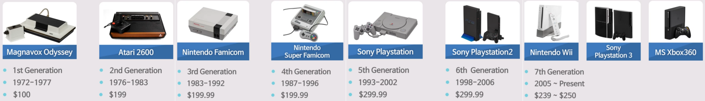
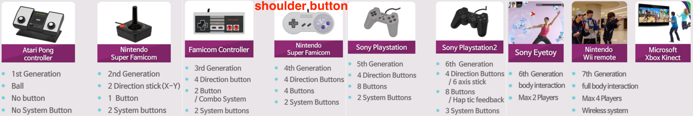
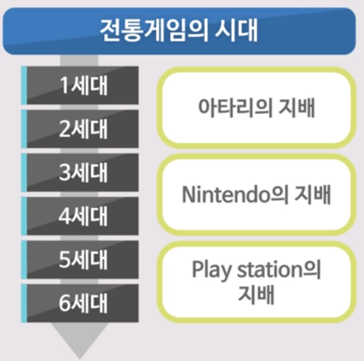

## 모듈소개

비디오 게임
- Define generation of video games
  - 1947년 전자 게임 최초 출현
  - space war(1961) : 널리 퍼진 계기
  - 7세대 2분기 : 2010 / 8세대 : 2015
  - 50~70년의 역사

    
    
    
     
1세대 ~ 5세대 : 비디오 게임의 시대.     
각 세대를 선도하는 기업들이 있었지만 어느 기업도 3세대 이상 지배하진 못함

    

## 잊혀진 게임의 역사

- 랄프 베어(Ralph Baer) : "이전의 비디오 게임과 현재의 비디오 게임은 **다르다.**" : 1968년 Interactive TV 콘솔타입 시현
  - 랄프 베어의 주장 : 1951년 Interactive TV에 대한 아이디어를 처음 가졌다. 1951년에 아이디어를 냈고, 콘솔을 먼저 만들었기 때문에 내가 비디오 게임을 맨 처음 만든 사람이다. - 비디오 게임의 모든 권한 주장
  - 샌더스사에서 투자
  - 1966년(? 기록마다 연도가 다름) Interactive TV 실현
  - 1972년 마그나복스 오디페이 발매
- 스티브 러셀(Steve Russell) : "이전의 비디오 게임과 현재의 비디오 게임은 **같다.**" : 1961년 Space War 게임 개발
  - 스티브 러셀의 주장 : 1961년 Space War를 처음 만들었다.
    - 많은 사람이 러셀이 원조라고 동조
    - 저작권을 주장한 적이 없음
- 윌리엄 히긴보덤(William Higinbotham) : 1958년 Interactive Contents를 먼저 만들었다.
  - Tennis for two 게임
  - 비디오 게임으로 볼 수 없다 : 보통 비디오 게임은 전자 신호를 Resterize 프로세스를 거친 후 디스플레이 하는 것이 정석이나 Tennis for Two는 음극관을 사용하기 때문에 별다른 Resterize 과정을 거치지 않았기 때문에 비디오게임으로 볼 수 없다는 논란이 있다.

해커(Hacker)들의 탄생
- Tech Model Railroad Club(in MIT) : 컴퓨터 해킹의 시작
- 1960년대 컴퓨터의 특징
  - 진공관 사용
  - 엄청난 크기
  - 소방시설 필요
  - 어마어마한 가격
- 스티브 러셀 Space War 개발

Home Console
- 집에서 즐기는 Interactive TV 개발 욕망
- 1966년 랄프 베어가 Interactive TV 콘솔타입 시현
- 1972년 Magnavox Odyssey 발매

## 1, 2세대 콘솔게임의 역사

1st generation(1972 ~ 1977)
- Magnavox Odyssey(1972)
- Atari Pong(1975)
- Coleco Telstar(1976)
- 주요 콘솔
  - Magnavox Odyssey
    - 텔레비전 부속품 사용 실험 정도
  - Atari Pong Home Console
    - 비디오 게임의 인기 몰이

2nd generation(1976 ~ 1984)    
   
- 주요 콘솔
  - Atari 2600 Commercial(1977)
  - Intellivision : Atari와 경쟁. 비교 마케팅
  - Atari 5200 : 게임 중지 기능
- 특징
  - 초기 8비트 게임
  - 비디오 게임의 최대 호황기
  - 비디오 게임 크래쉬 초래
  - 3세대와 매우 유사함
  - 미국 독점시장의 끝
  - ROM 미디어 사용
- ROM Cartridge
  - 복제가 어려움
  - 닌텐도가 뒤쳐지게 됨(ROM을 고수하다가 CD로 전환 늦어짐)

## 아타리 쇼크

아타리 쇼크 = 비디오 게임 크래쉬
- 진행
  - 비디오 게임 시장의 엄청난 호황
  - 무분별한 콘솔, 카트리지 생산
  - 1983년 크리스마스 시즌 이후 비디오 게임 시장의 붕괴
- 비디오 게임의 낮아진 Quality
  - 카트리지 대량 생산 : 1000만 정도의 아타리 2600 유저수. 그러나 아타리는 1200만 개의 팩맨 카트리지 생산. 200만 명 이상이 단지 팩맨을 플레이하기 위해 콘솔을 살 것이라 예측
  - 기대에 못 미치는 수요 : 500만 판매. 재고 700만 개
  - 낮은 퀄리티로 인한 환불 요청
- ET와 팩맨이 대표적
- 이미 시장이 붕괴되었기 때문에 제작 단가보다 판매 단가가 더 내려가는 현상. 이미 예약된 게임은 제작할 수 밖에 없었고, 이런 게임이 시장에 풀리면 상황이 더 악화되므로 초과분은 사막에 묻었다.(2014년 뉴멕시코 사막에서 미개봉 ET 카트리지 다수 발견)

디지털 게임의 역사
- 아타리 쇼크
  - 아타리의 자만심
  - 저비용, 낮은 퀄리티의 게임 생산
  - 모든 비디오 게임시장 추락
  - 게임 카트리지 가격 폭락
  - 비디오 게임이 사라짐
- 현재의 게임도 과연 질이 높은가?
