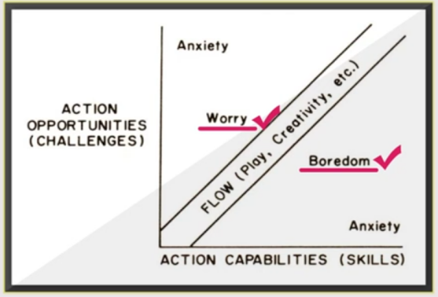
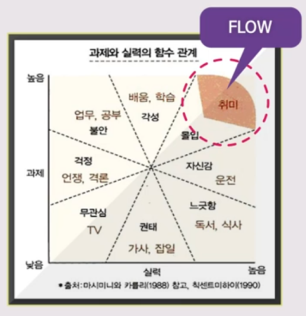

## 게임의 다양한 정의와 게임요소

게임구성의 요소 : 표현, 상호작용, 갈등, 안정성    
게임을 하는 이유 : 학습, 환상 탐험, 조롱, 자기과시, 사회적 윤활, 연습, 인정    

재미이론 : 재미있는 게임을 만들기 위한 기본적인 게임설계이론 또는 방법론
- 게임은 무엇으로 구성되어 있을까?
- 게임이 주는 재미란 무엇일까?
- 게임의 재미는 어떻게 측정할 수 있을까?
- 게임의 재미는 어떻게 만들어질까?
- 재미있는 게임은 어떻게 개발할까?

게임을 하는 다양한 이유들
- 학자들이 바라보는 관점
  - 요한 하우징아 "게임은 그 자체로써 가치가 있다. 생산을 위한 휴식이 아니다."
  - 라프 코스터 "인간의 두뇌는 낯선 자극에서 패턴을 찾아 학습할 때 쾌감을 느낀다."
  - 칙센트미하이 "적절한 조건이 주어지면 사람은 몰입상태에 빠진다. 몰입 경험은 인생을 가치 있게 만든다."
- 우리들이 바라보는 관점
  - 재미를 느끼기 위해서
  - 싫은 일, 어려운 일을 재미있게 하려고
  - 시간을 때우기 위해서
  - 아이템을 팔아 돈을 벌기 위해서
  - 높은 레벨이나 점수로 이목을 끌기 위해서
  - 남들 다 하니까 나도 따라서

크리스 크로포드(Chris Crawford) : Art of Computer Game Design의 작가    

게임의 4가지 요소
- 표현(Representation) : 게임은 현실의 부분을 주관적으로 표현하는 폐쇄된 형식적 시스템 : 인간의 환상을 통해 객관적으로 비현실적인 상황이 주관적으로 현실적인 상황으로 표현되는 것 ex)축구 게임 : 게임에선 손쉽게 누구나 축구를 할 수 있다.
  - 형식 : 형식으로 설명될 수 있는 게임의 명확한 규칙
  - 시스템 : 복잡한 방식으로 상호작용하는 부분들의 집합체
  - 주관적 표현 : 게임참여자들의 관점에서 사실로 표현    
- 상호작용(Interaction) : 선택지에 따라서 다양한 결과 도출
  - 탐구 가능한 상호적인 경험을 제공함
  - 수동적인 도전을 능동적, 적극적으로 변화
  - 상호작용의 감정적 의미가 중요
  - 게임을 평가하는 유효한 지표 제공
  - 비선형구조 또는 분기형 이야기 구조
- 갈등(Conflict) : 게임 참여자의 목적 방해 - 갈등 발생 - 갈등으로 인한 재미
- 안정성(Safety)
  - 안전한 방법을 제공하던 디지털 게임
  - 체감형 게임 발달로 위험요소에 노출

사람들은 게임을 왜 하는가?
- 학습
  - 게임의 본래 동기
  - 게임은 교육을 위한 오랜 수단
- 환상과 탐험
  - 환상에 대한 더 높은 동기를 가지게 됨
  - 현실도피의 문제 발생
- 조롱
  - 현실세계에선 할 수 없는 걸 할 수 있다.
  - 조롱은 하나의 콘텐츠
- 자기과시
  - 유저의 용맹함을 보여주는 수단
  - 사교적 분위기를 만드는 기능
  - 길드, 클랜, 혈맹
- 연습
  - 게임을 잘 하기 위한 연습
  - 연습 게임도 있음
- 인정의 필요
  - 상호작용으로 인한 인정과 관심
  - 게임 안에서의 높은 가치를 인정

## 재미이론

라프 코스터 : Theory of Fun

재미는 무엇일까?
- 기쁨의 원천
- 신체적 자극, 심리적 감상, 직접적 또는 화학적인 조작에 의해서 발생
- 엔도르핀 생성

게임이란 무엇일까?
- 게임은 인식에 대한 것이며, 패턴 분석을 배우는 것이다.
- 지루함
  - 게임의 반대개념
  - 더 이상 배울 것이 없을 때
  - 플레이어가 게임을 스스로 그만두기 전에 줄 수 있는 모든 것을 다 가르치는 게임이 좋은 게임이다.

Game can be art
- 좋은 게임을 하는 것은 창의적인 행위일 수 있다.
- 상호작용으로 게임의 예술성은 높아질 수 있다.
- 게임은 하나의 예술이 될 수 있다.
- 곤잘로 프라스카 September 12th : 테러리스트를 죽일수록 테러리스트가 더 많아져 게임 진행이 더 곤란해짐

To design good Game
- 해결책이 정해져 있지 않은 문제와 패턴을 제시
- 인간의 사고패턴에 미치는 영향을 인정
- 사회적 책임의 문제 직시
- 인간의 조건을 형식적인 측면으로 적용
- 중요한 용어 개발로 게임분야에 대한 이해
- 자신의 한계를 시험

## 몰입 매커니즘

몰입 매커니즘
- 명확한 목표
- 즉각적인 피드백
- 도전과 능력의 균형
- 실력과 과제의 균형

Finding the Flow : 칙센트 미하이

Flow
- 정신적 상태
- 힘들다는 것을 느끼지 못하고 능력 이상의 힘을 발휘
- 최상경험
  - 명확한 목표
  - 도전과 능력의 조화
  - 행동과 인식의 통합
  - 즉각적인 피드백
  - 과제에 집중
  - 통제력
  - 자의식
  - 시간감각의 변화
  - 내적보상 체험
- Condition of the flow experience
  - 명확한 목표가 있어야 한다.
  - 즉각적인 피드백이 와야 한다.
  - 도전과 능력의 균형이 이루어져야 한다.

    
    

## Flow와 Immersion

Flow
- Rule로 최적의 조건을 수행
- 도전 과제 = 나의 능력
- 정신적 상태의 몰입
- 능동적
- 높은 상호작용
- ex. 체스, 수술, 연주

Immersion
- 내가 무엇을 하는지 잊어버린 상태
- 시각적 자극의 몰입
- 수동적
- 낮은 상호작용
- ex. Virtual Reality, Game

하지만 게임은 Flow와 Immersion이 동시 발생
