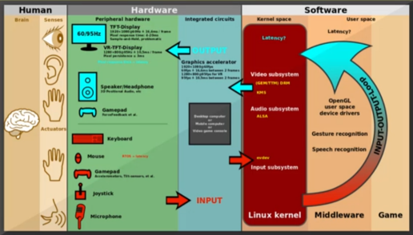
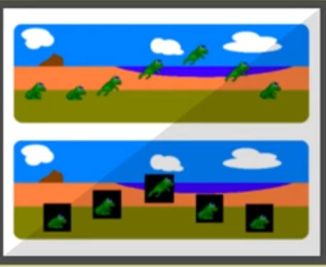
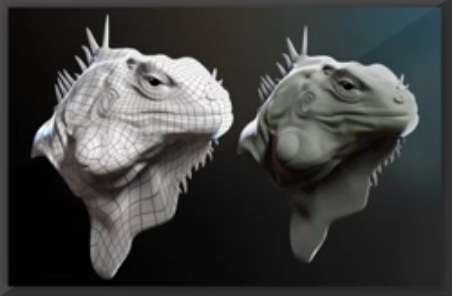

## 체험과 컴퓨터 게임

"하고 싶음"과 게임
- 컴퓨터 게임에 관한 근본적인 물음 : "우리는 컴퓨터 게임으로 무엇을 궁극적으로 얻으려고 하는 것일까?" - "나는 무언가를 하고 싶어!"
- 체스, 장기, 기원전 : "왕이 되어 전쟁을 하고 싶어!"
- 카드게임, 기원전 : "왕이 되고 싶은데 체스를 할 공간이 부족해!"
- 페르시아 왕자, 1989 : "던전가서 나쁜 놈들에게서 공주를 구하고 싶어!"
- 심시티, 1989 : "시장이 되어 나의 도시를 범죄에서 구하고 싶어!"
- F19 스텔스 파이터, 1988 : "비행기 조종하고 싶어!"
- 울펜슈타인 3D, 1992 : "총 쏘고 싶어!"
- 삼국지, 1985 : "제갈공명이 되어 조조를 무찌르고 싶어!"

간접체험으로써의 게임
- 간접체험의 욕구 : 가짜지만 비슷하게 만들어서 해보자
  - 인류는 항상 새로운 것을 추구
  - 새로운 경험은 위험 또는 제약이 있음
- 오랜 인류의 욕구 + 컴퓨터 기술 = 컴퓨터 게임
- 가상 현실
  - 컴퓨터로 어떻게 가상공간을 만들어 사람들이 가상공간에 있는 것처럼 만들까?
  - 실제로 할 수 없는 경험을 줄 수 있을까?
- 체험 : 오감의 정보 -> 머리로 프로세싱 -> 운동기관으로 반응
- 게임 체험의 경험을 어떻게 "잘" 줄까? : 사용자의 생각, 결정, 행동까지도 고려!
  - 유저에게 실제 대상과 최대한 비슷한 것을 보고, 듣고, 느끼게 하고
  - 유저가 최대한 그럴듯하면서 흥미를 유발하게 생각/결정하게 만들고
  - 유저가 실제와 최대한 비슷한 행동을 하게 함
  - 게임은 유저의 행동에 실제와 비슷하게 반응
  - 이왕이면 사람들과 함께 경험하게
- 게임의 기술적인 요소들
  - 비슷한 것을 보고, 듣고, 느끼게 : 출력 기술
  - 그럴 듯 하면서 흥미롭게 생각하게 : 게임 로직
  - 비슷한 행동을 하게 : 입력 기술
  - 실제와 비슷하게 반응 : 시뮬레이션, AI
  - 사람들과 함께 경험 : 네트워크
- 게임의 장르별 중요도
  - 슈팅게임 : 출력, 입력, 게임로직 중요
  - 전략게임 : 게임 로직, 네트워크 중요
  - 일인칭 시뮬레이션 게임 : 입력, 출력, 시뮬레이션 네트워크 중요
  - 스포츠 게임 : 입력, 출력 중요

## 게임을 위한 입출력 장치 1

컴퓨터의 입출력 장치
- 입력 장치 : 사람이 만들어낸 데이터가 컴퓨터 속으로 입력되어 들어가게 만들어주는 장치
  - 아날로그 -> 디지털
  - 키보드(-> 아스키 코드값), 마우스(-> 디지털 속도값), 빛(-> RGB값), 마이크
- 출력 장치 : 컴퓨터가 만들어낸 데이터를 사용자 쪽으로 출력해주는 장치
  - 디지털 -> 아날로그
  - 모니터(-> 빛), 스피커(-> 공기의 떨림)    
    

감각
- 인간의 오감
  - 물리신호의 종류, 특징
    - 시각 - 빛(입자/파동) : 반사된 빛의 주파수에 따라 색이 결정, 2 혹은 3차원 정보
    - 청각 - 소리(공기의 고주파 압력 변화) : 주파수/진폭을 사람이 인지, Time-Series 데이터
    - 촉감 - 피부(힘, 진동, 온도 등) : 다양한 종류의 센서들이 온 몸에 걸쳐져 있음
    - 후각 - 코(화학성분) : 만들기, 지우기 어려움    
- 컴퓨터의 입장
  - 입출력 HW
    - 시각(모니터, 프로젝터, HMD, 카메라, 컴퓨터 그래픽스, 3D TV, 컴퓨터 비전)
    - 청각(스피커, 헤드셋, 마이크, 음향 합성, 스테레오 사운드, 음성인식)
    - 촉감(진동자, Force Feedback 장치, 힘/압력/가속도 센서, 햅틱 렌더링, 제스처 입력)
    - 후각(Olfactory Display)
  - 입출력 SW
    - 시각 : 빛에 관련된 데이터 센싱 소프트웨어
    - 청각 : 음성합성 스테레오 사운드
    - 촉감, 후각 : 햅틱 렌더링, 머신 러닝

숫자의 나열을 어떻게 잘 배열하고 처리하느냐에 따라서 3차원 데이터가 될 수도 있고, 시각 데이터가 될 수도 청각 데이터가 될 수 있다.

시각 출력을 위한 SW기술
- 이미지가 움직이게 보이려면 - 대략 1초에 60번 바꿔치기 - 부드럽게 움직이는 그림을 보는 착각에 빠짐
- 영화와 게임의 차이점 : 게임은 실시간에 유저의 입력에 따라 보이는 것이 계속 바뀌어야 함 - 양질의 체험을 위해선 Interactivity가 중요
- 아주 빠른 시간 안에 유저에게 보여주는 그림을 그려내는 기술 : 실시간 그래픽스 기술

대표적 실시간 그래픽스 기술
- 2D 스프라이트 기술
    
  - 사물과 배경을 따로 그린다
  - 2D 스프라이트 기술의 문제점
    - 단순한 움직임
    - 보여지는 시점 변경의 어려움
    - 자유도가 떨어짐
- 3차원 그래픽스 기술
      
  - 3차원 폴리곤 모델을 입력으로 사진 같은 그림을 그려내는 기술
  - 빛 반사 시뮬레이션을 수행
  - 훨씬 자유도 높은 그림

시각 출력을 위한 HW기술
- RGB
  - LED, LCD
- 3D 스테레오코스픽 디스플레이 기술
  - 양쪽 눈에 시점이 차이나는 그림을 보여 주어 거리감을 느끼게 해 주는 기술
  - Head Mounted Display, 액티브 스테레오스코픽 디스플레이 기술

## 게임을 위한 입출력 장치 2

촉감
- 종류
  - 직접적 촉감 : 진동, 온도, 표면질감
  - 느끼는 촉감 : 팔의 무게, 미는 힘, 걸리는 힘
- 촉감 출력 장치
  - 힘 기반 햅틱 장치
  - Force Feedback 조이스틱
  - 게임 패드 진동
  - 4D 의자
  - 햅틱 컨트롤러

청각
- 사운드 출력 기술 : 라디오나 MP3같은 단순한 사운드가 아니라 적재 적소에서 매번 다른 소리가 실제처럼 들리게 하는 기술
- 사운드 합성 : 여러 정보를 가지고 새로운 소리를 만듦
- 3D 사운드 기술 : 양 귀에 들리는 소리가 달라야 주변 환경을 파악 할 수 있음 - 가상 시뮬레이션으로 사실적인 사운드 생성

입력 장치
- 백견이불여일행(百見而不如一行)
- 전통적인 방법들
  - 조이스틱, 버튼
    - 2차원적 속도제어
    - 이벤트 트리거를 위한 효과적인 방법
    - 직관적이고 구현, 일반화가 쉬움
  - 마우스, 키보드
    - 컴퓨터 입력장치 사용
    - 추가적인 지출이 없음
    - 2차원적 위치제어에 직관적
    - 터치스크린 등장

## 최적의 경험을 위한 HCI 원칙들

Human Computer Interaction 연구
- 인간의 컴퓨터 상호작용
  - Optimal User Experience : "어떻게 하면 최적의 경험을 제공할까?"
- Usefulness + Usability + Affection : 최종 사용자 경험의 질을 결정
- 경중의 상대성
  - 달 탐사선 조정실 : 기능성이 중요
  - 위드프로세서 제품 : 사용성이 중요

최적의 경험의 3가지 원칙
- 필요 기능을 잘 제공해야 한다
- 사용하기 편해야 한다
- 사용하기 즐거워야 한다

3가지 원칙
- Usefulness
  - 기능 제공의 유무(전화기는 전화가 잘 되야 한다, 자동차는 잘 움직여야 한다)
  - 가장 기초적인 부분
- Usability
  - 기능 사용의 효율성
  - 무어의 법칙 : 이제는 컴퓨터보다는 사람의 입출력 프로세스를 향상 시켜야 한다.
  - HCI의 가장 중요한 주제
- Affection
  - 의식/무의식 속의 호불호
    - 열심히 하는 자 < 머리 좋은 자 < 즐기는 자
    - 인간의 본성적인 측면
    - 후천적인 측면
    - 호불호는 경험의 질에 큰 영향
