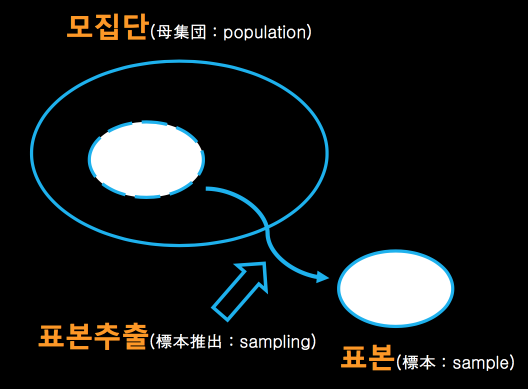

## 통계학이란 무엇인가

Statistics (Status: 라틴어로 state, 국가를 의미. ics: 학문이라는 뜻의 접미어) : 국가의 경영 또는 통치에 필요한 학문

## 모집단과 표본

모집단(population) : 분석하고자 하는 전체 대상
표본(sample) : 모집단의 부분 집합
표본 추출(sampling) : 모집단에서 표본을 추출하는 것
