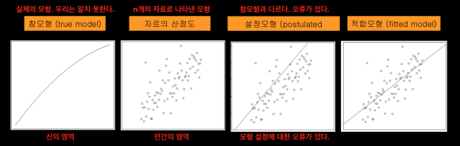
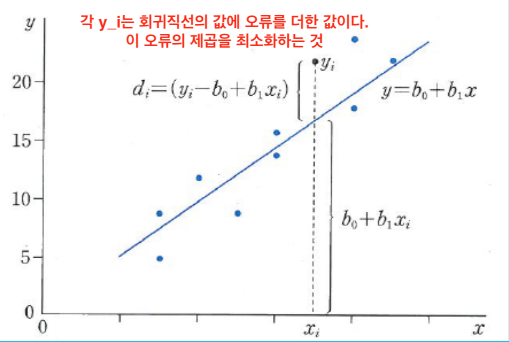
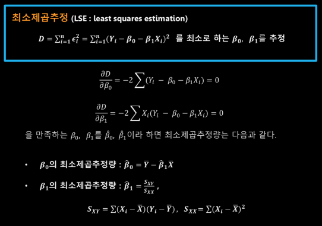
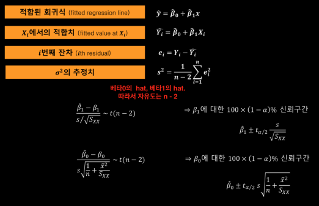
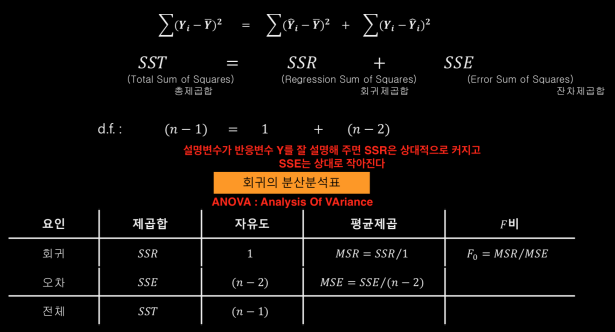
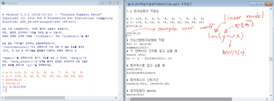
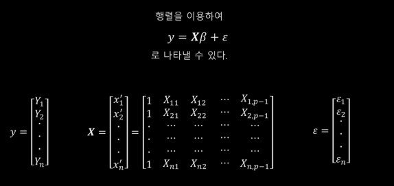
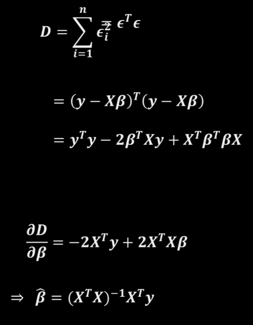
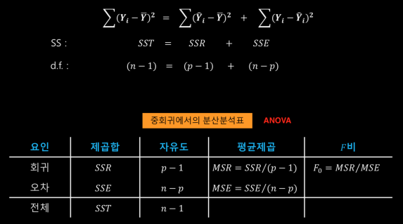

## 회귀모형이란 무엇인가?

#### 수학적 모형과 통계적 모형

두가지 형태의 모형
- 결정적 (수학적) 모형 : input과 output의 관계가 오차없이 명확
- 통계적 모형 : input과 output에 의해 영향을 받는 경향을 보이며 언제나 오차를 수반

#### 회귀의 어원과 역사

프란시스 갤턴(Sir Francis Galton, 1822 ~ 1911, 영국의 인류학자)1885년, 1078쌍의 아버지와 아들의 키를 분석     
"Regression toward mediocrity" : 평균으로 회귀한다. (키가 큰 아버지의 아들은 아버지보다 작아지는 경향이 있고, 키가 작은 아버지의 아들은 아버지보다 커지는 경향이 있다.)

#### 회귀모형의 종류
𝒀 = 𝒇(𝑿𝟏, ⋯, 𝑿𝒑) + 𝝐    
- 𝒀 : 반응변수(response variable), 종속변수(dependent variable)
- 𝑿𝟏, ⋯, 𝑿𝒑 : 공변량, 설명변수(covariates)
- 𝝐 : 오차항(error term)
- 𝒇() : 회귀함수(regression function)

회귀분석이란? : 반응변수와 설명변수를 관측하여 회귀함수를 추정하는 것.

회귀모형의 종류
- 모수회귀모형(parametric regression model) : 적절한 회귀함수를 추정하기 위해 함수의 형태를 고정시키는 방법
  - 단순선형회귀모형(simple linear regression model)
    - 공변량(설명변수)가 하나, 직선만 고려
    - 𝒇(𝑿) = β_0 + β_1 * 𝑿
  - 다중선형회귀모형(multiple linear regression model)
    - 공변량이 𝒑, β와 𝑿의 선형 결합
    - 𝒇(𝑿𝟏, ⋯, 𝑿𝒑) = β_0 + β_1 * 𝑿_1 + ⋯ + β_𝒑 * 𝑿_𝒑
  - 비선형회귀모형(non-linear regression model)
    - β와 𝑿의 비선형 결합
    - 𝒇(𝑿) = β_0 * 𝑿 / β_1 + 𝑿
  - k-차 다항회귀모형(k-th degree polynomial regression model)
    - 공변량은 하나
    - 𝒇(𝑿) = β_0 + β_1 * 𝑿 + β_2 * 𝑿^2 + ⋯ + β_𝒑 * 𝑿^𝒑
  - 로지스틱 회귀모형(logistic regression model)
    - 반응변수(Y)가 이항분포(성공의 횟수)를 따를 때
  - 로그선형모형(log-linear regression model)
    - 반응변수가 포아송 분포(사건의 발생 건수)를 따를 때
- 비모수회귀모형(nonparametric regression model)
  - 회귀함수 f의 형태를 구체적으로 명시하지 않고 함수의 추정치를 계산
  - 함수군에만 위치하면 된다.
  - 𝒀 = 𝒇(𝑿_1, ⋯, 𝑿_𝒑) + 𝝐

## 단순선형회귀모형

    

단순선형회귀모형(직선회귀모형) : 𝒀 = β_0 + β_1 * 𝑿 + 𝝐  
- 𝒀 : 반응변수
- 𝑿 : 설명변수(covariates)
- 𝝐 : 오차항, 흔히 𝝐 ~ N(0, σ^2)이라고 가정
- β_0, β_1 : 회귀계수(regression coefficients), 추정해야할 모수
- 단순 회귀모형의 목표 : 3개의 모수 β_0(절편), β_1(기울기), σ^2(분산)을 추정
  - 이를 위해 n개의 자료를 관측 : 𝒀_i = β_0 + β_1 * 𝑿_i + 𝝐_i (i = 1, 2, ⋯, n)

## 최소제곱추정량

      
      
      

## 회귀모형의 적합도

    
R^2 = SSR / SST = 1 - SSE/SST : 결정계수(Coefficient of determination) - 항상 0과 1사이의 값(1에 가까울 수록 설명변수가 반응변수를 잘 설명한다.)    
cf. 단순선형회귀의 경우 : 결정계수 = 표본상관계수의 제곱

    

## 다중선형회귀모형

다중선형회귀모형 : 단순선형회귀모형의 확장     
𝒀_i = β_0 + β_1 * 𝑿_i1 + ⋯ + β_𝒑-1 * 𝑿_i𝒑-1 + 𝝐_i         
     
    
    
