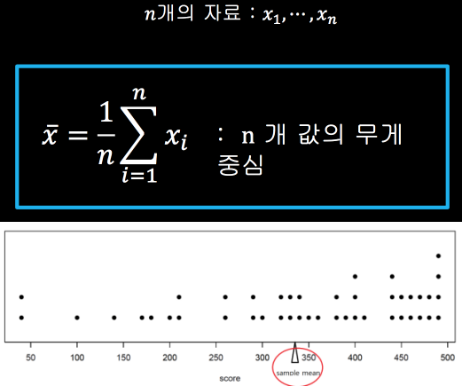
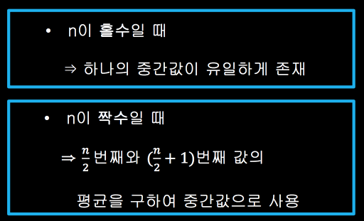
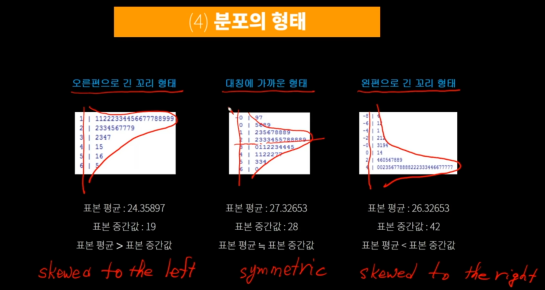
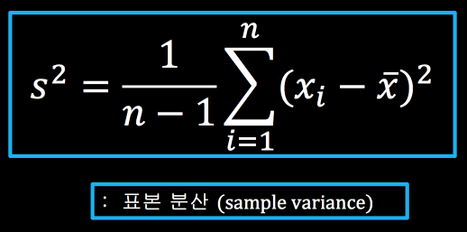
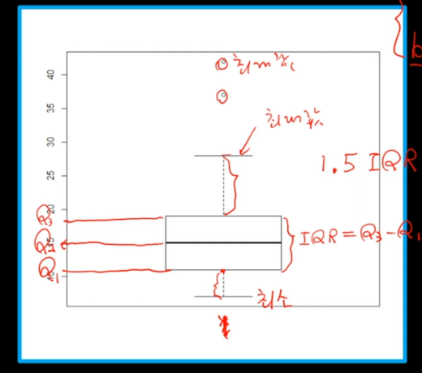
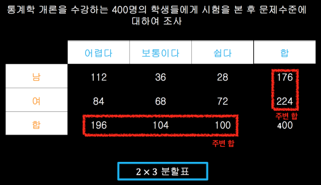
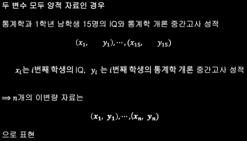
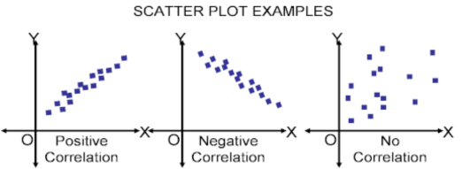
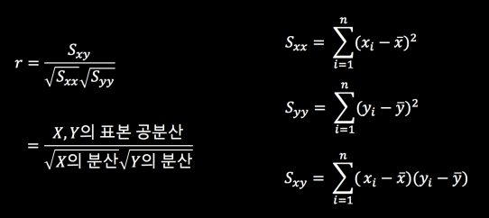

## 자료와 종류

Datum : 자료, 정보 등의 의미
Data : Datum의 복수형

자료
- 양적 자료(quantitative, numerical data) : 자료 그 자체가 숫자와 **일대일**로 **대응**
  - 연속형 자료(continuous data) : 일정구간의 실수 값을 모두 취할 수 있는 자료(ex. 혈압, 몸무게)
  - 이산형 자료(discrete data) : 정수 값을 취하는 자료(ex. 어느 학급의 여학생 수, 연간 결혼 건수)
- 질적 자료(qualitative data) : 자료 그 자체가 숫자의 개념을 가지는 것이 아닌 **구분하는 개념**을 가짐
  - 명목형 자료(nominal data) : 구분을 위해 숫자를 대응시킨 자료(ex. 성별, 피부색 : 남->1, 여->0. 남->-1, 여->+1)
  - 순서형 자료(ordinal data) : 범주들이 순서의 개념을 가지는 자료(ex. 상>중>하 : 1,2,3 또는 3,2,1 (o), 2,1,3 또는 3,1,2 (x))

## 표와 그래프

- 질적 자료(qualitative data)
  - 도수 분포표(frequency table)
  - 파이 차트(pie chart)
- 양적 자료(quantitative, numerical data)
  - 히스토그램(histogram)
  - 줄기-잎 그림(stem-and-leaf plot) : 자료 각각의 값과 분포의 형태를 모두 알 수 있다.

## 중심과 퍼짐 측도

#### 중심 측도(Measures of Center)
- 표본 평균(sample mean) : 기하학적으로는 무게중심으로 볼 수 있다.

- 표본 중간값(sample median) : n개의 자료를 작은것으로부터 크기 순으로 나열하였을 때 **가운데**에 있는 값

 > 표본 평균은 이상치(outlier)에 대해 민감(sensitive) 하지만 표본 중간값은 이상치에 거의 영향을 받지 않음(robust). 자료에 이상치가 있을 경우 자료의 중심을 나타내는 값으로 표본 평균보다 표본 중간값이 더 좋은 측도
- 표본 분위수(sample quartile) : 표본 100p 백분율(sample 100p-th percentile), 0 < p < 1 - 100p% 개의 자료는 그 값보다 작거나 같고 100(1-p)% 개의 자료는 그 값보다 크거나 같음
 > - p = 0.25 => 25% 백분율 = 제1분위수(1st quartile) = Q1
 - p = 0.50 => 50% 백분율 = 제2분위수(2nd quartile) = Q2(표본 중간값)
 - p = 0.75 => 75% 백분율 = 제3분위수(3nd quartile) = Q3    

분포의 형태
- 오른편으로 긴 꼬리 형태(skewed to the left)
- 대칭에 가까운 형태(symmetric)
- 왼편으로 긴 꼬리 형태(skewed to the right)

#### 퍼짐 측도(Measures of Dispersion)
- 표본 분산(sample) : n이 아닌 n-1로 나눈다.

- 표본 범위(sample range)
  - R = 최대값 - 최소값 : 표본 범위(sample range)    
  - IQR = Q3-Q1 : 표본 사분위수 범위(sample interquartile range)
- 상자 그림(box plot) : 1.5 * IQR 범위를 나타내면 box-whisker plot

## 이변량 자료와 상관계수

- 일변량 자료(univariate data) : **하나**의 변수에 대한 자료
- 이변량 자료(bivariate data) : **두 개**의 변수에 대한 자료
- 다변량 자료(multivariate data) : **여러 개**의 변수에 대한 자료

#### 질적 자료
이변량 자료
- 두 변수가 모두 질적 자료인 경우 : 첫 번째 자료는 r개의 범주, 두 번째 자료는 c개의 범주. 이러한 자료를 행렬의 형태로 요약한 표를 r * c 분할표(r x c contingency table)라 부른다.

### 양적자료
- 두 변수가 모두 양적 자료인 경우

  - 산점도(scatter plot) : 이차원 평면에 각 변수의 값에 해당되는 점을 찍은 그림. 흔히 산점도는 하나의 변수 값이 증가할 때, 다른 변수의 값이 증가(또는 감소)하는 추세에 있거나 별 다른 함수관계를 보이지 않는 경우도 있음

  
    - 허위상관과 잠복변수(spurious correlation and lurking) : 산점도의 상관관계를 잘못해석하는 경우. ex) 특정도시의 연간 강력범죄 발생 건수와 교회의 수는 매우 높은 양의 상관관계를 가진다. 하지만 교회 숫자를 줄이면 강력범죄를 줄일수 있다는 결과는 잘못된 결론이다. 이는 '인구'라는 잠복 변수로 인하여 강력범죄건수와 교회 수가 양의 상관관계를 가지는 것처럼 잘못 판단할 수 있다. 이를 **허위상관**이라 부른다.
  - 표본 상관계수(sample correlation) : 두 변수의 **선형적 함수 관계**를 나타내는 측도
  
