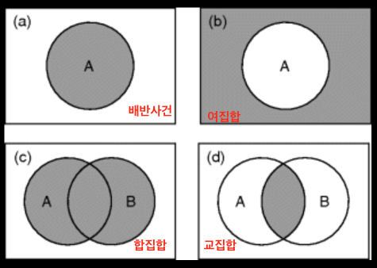
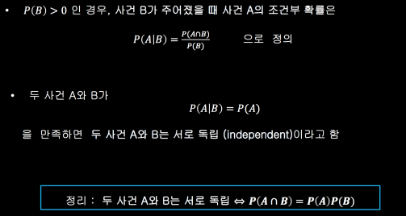

## 확률의 정의

미래에 일어날 사건
- 완전하게 예측 가능한 사건 ex) 자연 현상 중에서 과학적으로 증명이 된 사건(해가 뜨는 시간)
- 불확실성(uncertainty)을 가진 사건 ex) 현재로선 정확하게 알 수 없는 사건(주식 예측)

통계학의 역할 : 불확실한 사건에 대하여 자료를 근거로 가장 객관적이고 합리적으로 확률(Probability)을 제시

- 실험 (experiment) : 실행하기 전에는 그 결과를 알 수 없는 행위
- 표본공간 (sample space) : 실험을 하였을 때 나타날 수 있는 모든 결과를 모은 집합 (𝑆)
- 단순 (단위) 사건 (simple event, elementary event) : 표본공간의 원소 하나 하나 (𝑒1,⋯,𝑒𝑛)
- 사건 (event) : 표본공간의 부분집합 (A, B, C,⋯)

ex) 두 개의 주사위(흰색과 빨간색)를 동시에 던졌을때 두 주사위 눈의 합이 7이 되는 확률
- 실험 : 두 개의 주사위를 던지는 행위
- 표본공간 : 𝑆 = {(1,1), (1,2), ⋯, (6,6)}
- 단순사건 : 𝑒1 = {(1,1)}, ⋯, 𝑒36 = {(6,6)}
- 사건 : 𝐴 = {(1,6), (2,5), ⋯, (6,1)}
표본공간은 단순사건 36개로 구성되고    
각 단순사건이 일어날 확률이 같으며    
합이 7이 되는 사건은 6개의 단위 사건으로 구성    
⟹ 두 주사위 눈의 합이 7이 되는 확률은𝑃(𝐴) = 6/36

확률(Probability) : 표본공간에서 정의된 함수이며 0과 1사이의 값을 가짐
- 임의의 사건 𝐴에 대하여 0 ≤ 𝑃(𝐴) ≤ 1을 만족한다.
- 표본공간에 대한 확률은 언제나 𝑃(𝑆) = 1이다.

## 확률의 법칙

집합의 종류
- 합집합(union)
- 교집합(intersection)
- 여집합(complement)
- 배반사건(disjoint event) : 교집합이 없는 사건

확률의 법칙
- 여사건의 법칙(law of complement) : 𝑷(𝑨^c) = 𝟏 − 𝑷(𝑨)
- 합의 법칙(law of addition) : 𝑷(𝑨∪𝑩) = 𝑷(𝑨) + 𝑷(𝑩) − 𝑷(𝑨∩𝑩)
- 본페로니 부등식 : 0 ≤ 𝑷(𝑨∩𝑩) 이므로 𝑷(𝑨∪𝑩) ≤ 𝑷(𝑨) + 𝑷(𝑩)

## 조건부 확률과 독립

## 임의 표본

표본 𝑋, 𝑋, ⋯, 𝑋𝑛이 서로 독립(independent) 이고 같은 분포(identically distributed)를 가지면 임의 표본(random sample) 이라 한다.    
임의 표본은 흔히 iid (independent and identically distributed)
라고도 한다.

ex) 한 반의 학생들의 키를 조사한다고 할 때(같은 분포를 가진다: 같은 국적. 비슷한 나이 등 유사한 환경. 같은 모집단을 가진다), 각 학생들의 키는 다른 학생의 키에 영향을 주지 않는다(표본이 서로 독립). 
