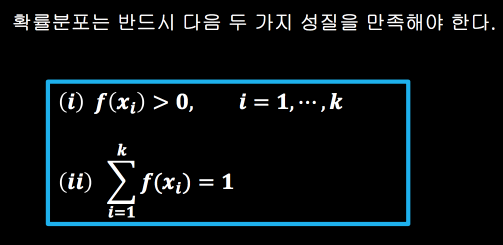
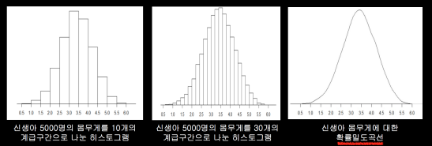
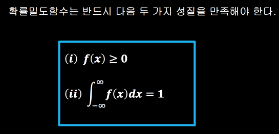
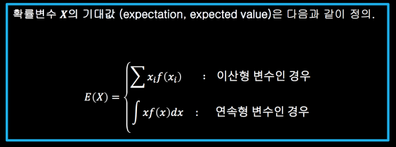
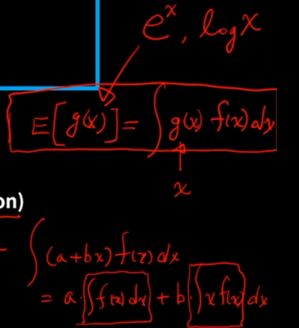
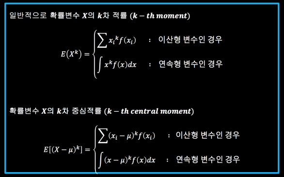
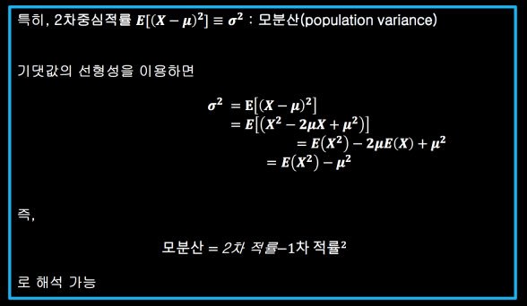
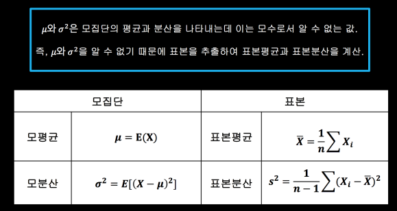
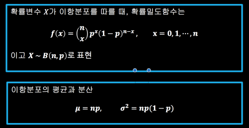
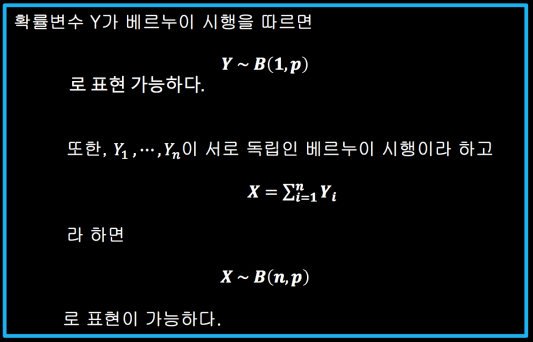

## 확률분포

확률변수(random variable) : 표본공간에서 정의된 함수    
확률변수 𝑿는 표본공간의 각 단위사건에 실수 값을 부여하는 함수    

- 이산확률변수 : 확률변수 𝑋가 취할 수 있는 값이 유한 개 또는 자연수와 일대일 대응이 되는 무한 개일 경우 확률변수 𝑋를 이산확률변수라 한다.
  - 확률변수𝑋가 취할 수 있는 값을 𝑥1, ⋯, 𝑥𝑘 라하면 𝑓(𝑥𝑖) =𝑃(𝑋=𝑥𝑖), 𝑖=1, ⋯, 𝑘 를 확률분포(probability distribution)라 한다.    
  ex) 주사위를 두 번 던져 나오는 눈의 합    
  𝑓(2) = 𝑃(𝑋=2) = 1/36,      
  𝑓(3) = 𝑃(𝑋=3) = 2/36,     
  ⋯      
  𝑓(12) = 𝑃(𝑋=12) = 1/36    
  이렇게 정리한 것이 확률분포이다.    
  

- 연속확률변수 :  확률변수 𝑋가 일정 구간의 모든 실수 값을 가질 수 있으면 이를 연속확률변수 (continuous random variable)라 한다. ex) 사람의 나이, 몸무게 등
  - 확률밀도함수(probability density function, PDF)    
      
  

## 기대값

𝑿의 기댓값 ≡ 𝝁 : 모평균(population mean)    
기댓값의 선형성(linearity property of expectation) : 상수𝑎 와 𝑏에 대하여 𝑬(𝒂 + 𝒃𝑿) = 𝒂 + 𝒃𝑬(𝑿)

## 베르누이 시행과 이항분포

베르누이 시행
- 시행의 결과는 두 가지 (성공과 실패) 중 하나로 나타난다.
- 각 시행에서 성공의 확률 𝒑 = 𝑷(𝑺) 은 동일해야 한다.
- 각 시행은 서로 독립이어야 한다. (이전 시행의 결과가 이후 시행에 영향을 끼치지 않아야 한다.)

𝑋 : 𝑛번의 베르누이 시행에서 성공의 횟수(0에서 n까지의 값을 가진다 : 이산확률 변수)     
𝑝 : 각 베르누이 시행에서 성공의 확률

(n x) : n개 중에서 x개를 뽑는 총 가지 수 (n choose x) = n!/x!(n-x)!    
X ~ B(n, p) : n은 시행횟수, p는 성공확률

이항분포는 서로 독립인 베르누이 시행의 합
