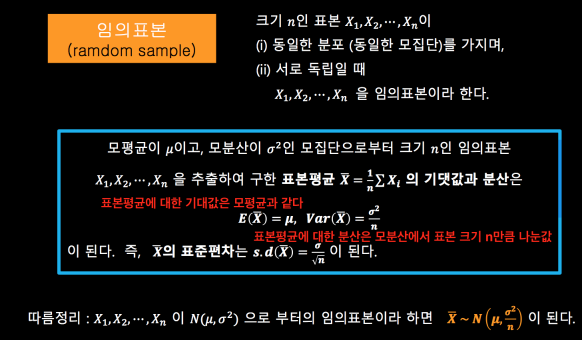

## 포아송 분포

#### 포아송 분포
    
모평균과 모분산이 평균 m과 같다.

포아송 분포를 따르기 위한 조건
- 독립성 (independence) : 단위시간 또는 단위공간에서 발생되는 사건의 수는 또 다른 단위시간 또는 단위공간에서 발생되는 사건의 수와 무관하다.
- 단일성 (lack of clustering) : 동시에 두 개 이상의 사건이 발생할 확률은 0에 가깝다.
- 등발성 (constant rate) : 사건의 수 평균 m은 모든 단위시간 또는 단위공간에서 일정하다.

#### 이항분포의 포아송 근사화    
이항분포에서 시행횟수 n이 매우 크고, 성공의 확률 p는 매우 작으며, np → m이 되면 이항분포는 포아송 분포와 매우 가까워진다. (n → ∞, p → 0, np → m : 사건 발생이 매우 드물다는 뜻)    
       

 n이 매우 크고 p가 매우 작다는 것은 사건의 발생이 매우 드물다(rare events)는 뜻이다.    
      

## 정규분포

#### 정규분포    
정규분포(正規分布 : normal distribution) = 가우스 분포(Gaussian distribution)

     
     
     
     

##### 표준정규분포
표준정규분포 : 평균이 0, 표준편차가 1인 정규분포    

     

#### 표준화    
      
이항분포인 경우에는 표준화를 시키면 Z는 더 이상 이항분포가 아니다. 하지만 **정규분포인 경우에는 표준화 하면 평균이 0이고 분산이 1인 정규분포(표준정규분포)를 따르게 된다. (정규분포는 표준화해도 정규분포를 따른다.)**   

#### 표준화의 활용    
수능 표준변환점수. 점수, 평균, 표준 편차로 표준점수(표준화 공식)를 구한 뒤, 일정 공식에 의해 표준변환점수를 계산한다.

표준화를 적용하면서 주의해야 할 점 ⇒ 표준화를 적용하는 집단의 크기가 적어도 20이상이어야 하며 각 집단은 동질적이라는 가정한다. (물리1을 선택하는 학생들과 생물1을 선택하는 학생들은 비슷한 학업수준을 가지고 있다고 가정해야 한다. 만약 공부를 잘하는 학생들은 물리1을 선택하고, 공부를 못하는 학생들이 생물1을 선택하는 경우에는 표준화한 점수가 집단을 제대로 표현하지 못한다.)

## 표본의 분포

#### 모수와 통계량
- 모수(parameter) : 모집단의 특성을 나타내는 값. 알 수 없는 상수인 모수의 값을 추정하기 위해 모집단으로부터 크기 n인 표본 𝑋_1, 𝑋_2, ⋯, 𝑋_𝑛을 추출 (표본은 추출하는 사람에 따라 값이 달라질 수 있다.)
- 통계량(statistic) : 표본들만의 함수로 표현     
      
즉, 통계량은 특정 모수를 추정하기 위해 표본을 이용하여 만든 함수
- 표본분포(sampling distribution) : 통계량이 갖는 분포 (표본들이 갖는 분포) - 우리가 가장 관심있게 보는 것

#### 표본평균의 분포
- 임의표본(random sample)

자 그렇다면 표본평균에 대한 기대값은 모평균과 같고 표본 평균에 대한 분산은 모분산에서 표본의 크기 n만큼 나눈값이 됩니다.
따라서 표준편차는 분산의 제곱근값이 됩니다.    
    
따름정리 : 모집단이 정규분포이면 정규분포로 뽑은 임의의 표본의 평균은 정확하게 다시 정규분포가 된다.

      

#### 중심극한정리
중심극한정리(Central limit theorem: CLT) : 어떠한 모집단이라도 성립한다.

      
표본의 크기가 클수록 표본의 분포는 더 정규분포에 가까이 수렴하며, 흔히 표본의 크기가 25보다 크면 중심극한정리를 이용할 수 있다.

이항분포의 정규근사화(normal approximation to the binomial)    
      
단, 근사화가 제대로 되려면 np > 15, n(1-p) > 15 두 가지 조건이 만족 되어야 한다는 사실이 알려져 있음. (중심극한정리에서 n이 충분히 커야 하는데, 그 경우에도 p가 0에 매우 가깝거나, p가 1에 매우 가까운 경우에는 중심극한 정리가 적용되지 않는다.) 베르누이 시행 : 성공/실패로 나누어지는 시행

연속수정(continuity correction) : 0.5만큼 더해서 계산
