## 통계적 가설검정

#### 가설 검정의 절차

가설(假說, hypothesis) : 아직 증명되지 않은 문제에 대하여 문장으로 설정한 것     
통계적가설이란? : 가설의 참과 거짓을 귀납법, 연역법 등으로 증명할 수 없고 관련된 통계 자료를 이용하여 가장 가능성이 높은 결론을 내리고자 하는 것(오류를 수반하고 있다.)

예제 :     
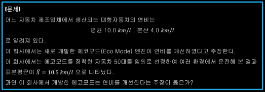    
- (1)귀무가설과 대립가설을 세운다.
  - 통계적 가설
    - 𝐻0: 부정하고 싶은 문장(귀무가설: null hypothesis) - 연비 개선이 없었다.
    - 𝐻1: 주장하고 싶은 문장(대립가설: alternative hypothesis) - 연비 개선이 있었다.    
    ⇒ 𝐻0: 𝜇=10 𝑣𝑠 𝐻1: 𝜇>10
- (2)검정통계량을 선택한다.
  - 검정통계량(test statistic) : 귀무가설의 기각 여부를 결정하는데 사용되는 통계량    
  ⇒ 연비의 참 값𝜇에 대한 점 추정치로 표본평균𝑋̅를 사용하는 것이 타당
- (3)기각역을 설정한다.
  - 기각역(rejection region) : 귀무가설이 기각되는 영역     
  ⇒ 어떤값 𝑐에 대하여 𝑋̅>𝑐 이면 𝐻0를 기각함. 여기서, 𝑐는 기각치(𝑐𝑟𝑖𝑡𝑖𝑐𝑎𝑙𝑣𝑎𝑙𝑢𝑒)라 한다.    

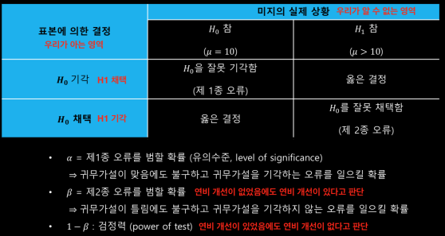    

최적의 가설검정 : 𝜶와 𝜷를 최소화 시키는 검정법   
만약, 자료의 크기𝑛이 정해져 있다면 𝛼와 𝛽모두를 최소화 하는 것은 불가능     
가능한 최적의 검정법 : 𝜶를 작은값(흔히0.01, 0.05, 또는 0.1 (신뢰구간))으로 고정시킨 후 검정력(𝟏−𝜷)을 최대화시킴

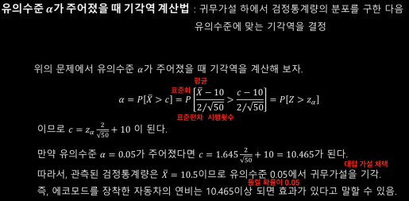    

통계적 가설검정과 판사의 판결(검사의 입장)
- 귀무가설 : 피고는 무죄 vs 대립가설: 피고는 유죄
- 검정통계량 : 증인, 증거물
- 기각역 : 법전, 판례
- 제1종 오류 : 실제로 무죄인 피고를 유죄로 판결함
- 제2종 오류 : 실제로 유죄인 피고를 무죄로 판결함

#### 단측검정과 양측검정

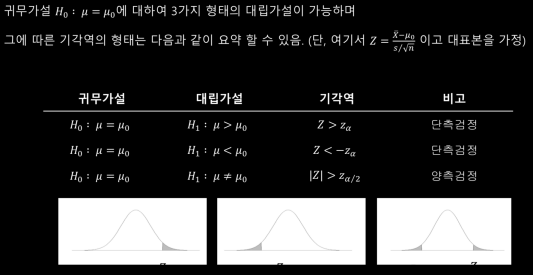   
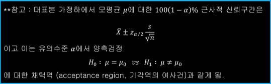   

#### 유의확률

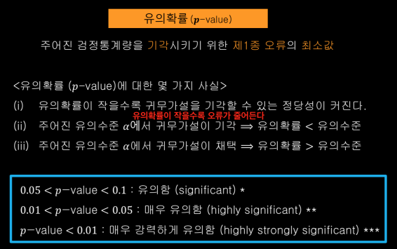    
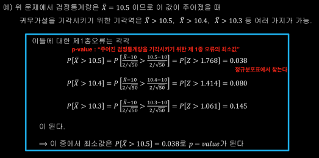    

## 분산의 추론

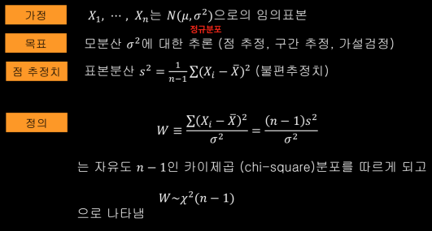    
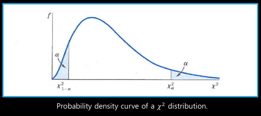   
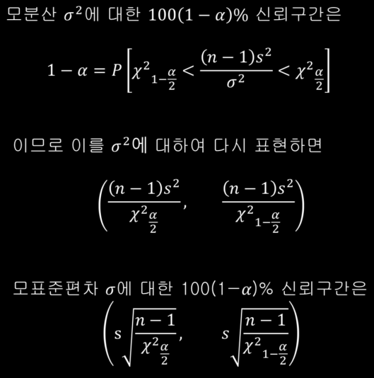   
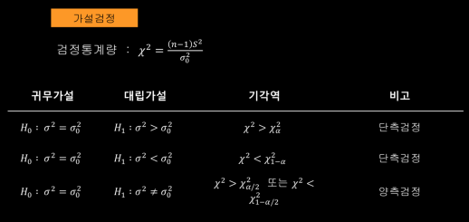    

## t-분포의 재조명

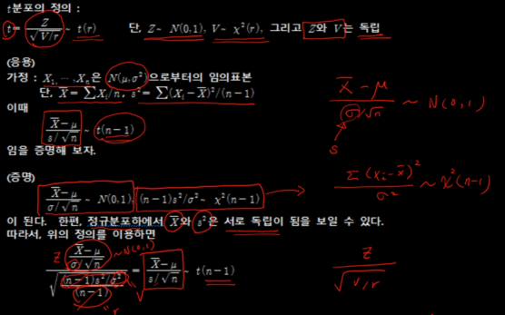   
