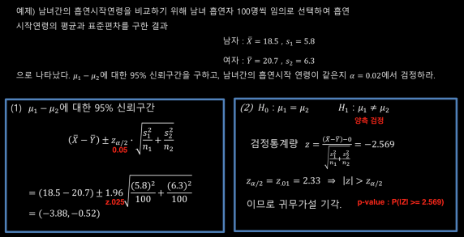
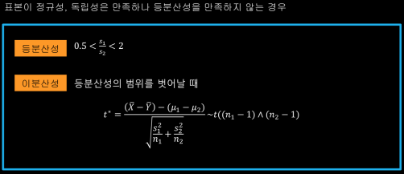
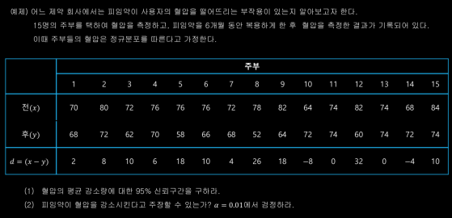
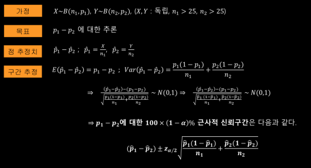

## 독립 이표본 검정 1 - 대표본

독립 이표본 : 두 집단이 표본의 크기가 크고, 두 집단이 서로 독립인 경우

## 독립 이표본 검정 2 - 정규모집단

소표본(n < 25)에서 통계적 추론 : 중심극한 정리를 사용할 수 없으므로 대표본에서 사용한 독립성 외에 더 추가적인 가정이 필요하다.
- 독립성 : 두 집단은 서로 독립
- 정규성 : 두 집단 모두 정규 분포를 따른다
- 등분산성 : 두 모집단의 분산이 같아야 한다.

합동분산(合同分散) : pooled variance    

## 쌍체 비교

자료가 집단이 아닌 쌍으로 나타나는 경우    
ex) 개인별로 왼쪽 눈과 오른쪽 눈의 시력 차이가 있는가?    
아스피린 복용 전과 후 혈압의 차이

    
R코드 참고

## 두 모비율의 비교

    
