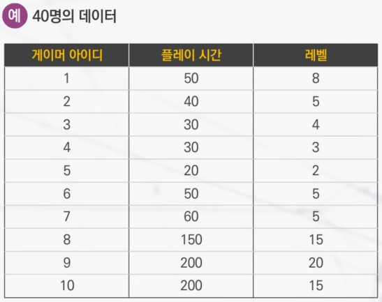
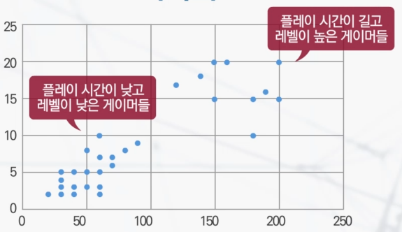
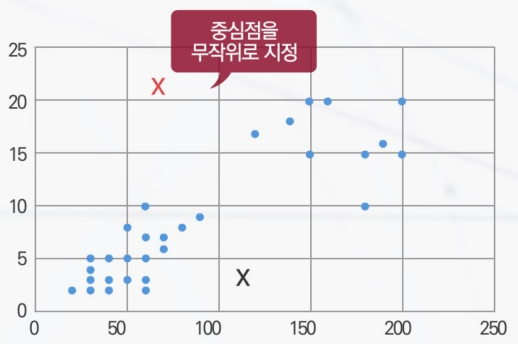
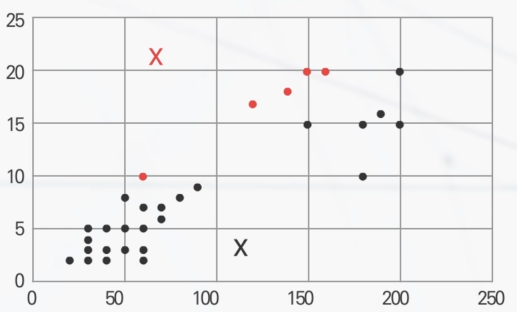
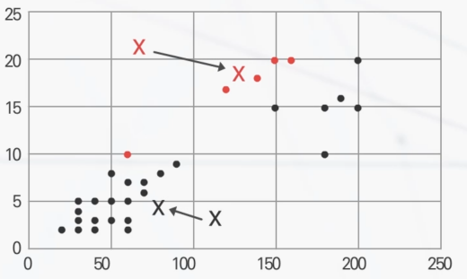
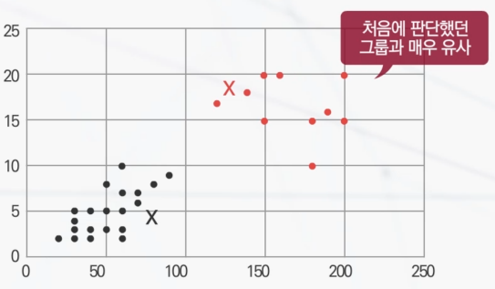
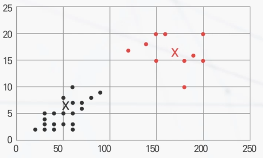
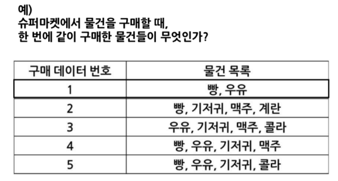

## 비교사학습

기계학습 : 데이터를 이용해서 유용한 것을 만들어내는 방법 - 좋은 인공지능을 만들어내기 위해서는 좋은 데이터를 확보하는 것이 가장 중요(데이터에 정답이 있다면 **교사학습**, 정답은 없지만 보상정보가 있다면 **강화학습**, 정답도 없고 보상정보도 없다면 **비교사학습**)

비교사학습(Unsupervised Learning)
- 데이터 속에 숨겨져 있는 무언가(패턴)를 데이터 자체로부터 끌어내려는 노력
- 무언가를 배울 때, 대부분 정답이나 보상이 명확하지 않음(특별히 보상이나 정답을 제공해 주지 않아도 많은 것을 배울 수 있음)
- 많은 경험을 쌓거나 많은 사례들을 봄 - 반복되거나 중요하거나 중요하지 않은 무언가를 익혀감 - 보다 고차원적이고 복잡한 개념을 이해해 나감

패턴 발견 능력
- 방대한 데이터와 경험이라고 해도 몇 가지 기준을 가지고 자동으로 데이터를 줄여서 이해하는 능력
- 군집화 : 비슷한 것끼리 서로 묶어냄
- 게이머를 하나하나 일일이 분석하는 작업은 불가능하지만, 그룹으로 묶어서, 해당 그룹의 대표적인 특징을 분석해 보는 것운 전체를 이해하는 데 큰 도움을 줄 수 있다.

## 인공지능 이야기

전문가 시스템
- 방대한 지식 체계를 규칙으로 표현
- 데이터를 입력하면 컴퓨터가 정해진 규칙에 따라 판단을 내리도록 함
- 비효율적으로 보이지만 룰의 종류가 많을수록 정확도 상승. 제한된 상황에서 제한된 특정 물건을 인식/행동할 때 사용 가능
- 규칙에 없는 상황 또는 물체에 대한 유연한 대응 불가능
- 상황에 따라 잘 활용하면 굉장히 유용하게 사용 가능한 시스템

## 군집화 방법

    
    

시각화의 한계
- 고려해야 하는 특징이 세 개 이상일 경우 시각화 불가능 (이차원, 삼차원 이상의 특징을 고려한다면 한 눈에 보여주는 일은 어려움)
- 이차원 혹은 삼차원 데이터만 사용한다고 해도 문제가 있음
- 일일이 사람이 보고서 판단을 해야 한다는 점도 쉬운 일이 아님

K-Means  
- 데이터를 몇 개의 군집으로 묶어보고 싶은지를 정해야 함(K: 군집의 개수).
- 군집이 몇 개가 될지를 사전에 정해 주어야 작동하는 방법
- 1. 군집의 중심을 초기화    
       
- 2. 게이머에 대해 두 개의 중심점(K=2) 중에서 가까운 곳에 배정    
       
- 3. 게이머들 데이터를 평균한 곳으로 군집의 중심을 이동    
       
- 4. 다시 2단계 진행    
       
- 5. 다시 3단계 진행    
  
- 초기에 군집의 중심점을 임의로 정해주고 반복적으로 군집배정과 중심점 이동을 하면서 변동이 없을 때까지 과정을 반복
- 처음에 군집의 위치를 어느 곳에 지정해 놓고 시작하는가에 따라 결과가 달라질 수 있는 방법(처음 시작위치가 나쁜 곳일 경우 좋은 결과를 못 얻을 수도 있음)
- 꼭 2차원이나 3차원 데이터가 아니더라도 얼마든지 군집화 가능(N차원의 데이터일지라도 거리만 계산해 낼 수 있으면, 군집화 가능)

## 빈발패턴 발견 기술

빈발패턴 발견 기술
- 장바구니 분석
- 빈발하는 패턴을 분석하는 기술
- 자주 함께 등장하는 아이템을 동시에 묶어서 처리해주면 시너지가 날 수 있음
- 동시에 구입하는 물건을 가까운 곳에 배치해주는 방식    
  
