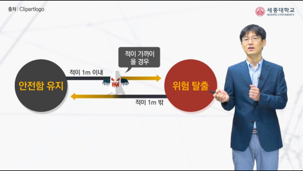
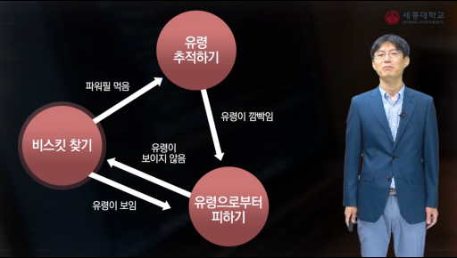
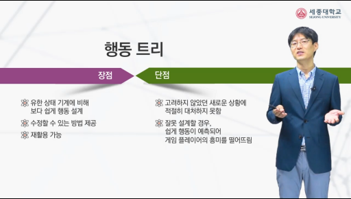
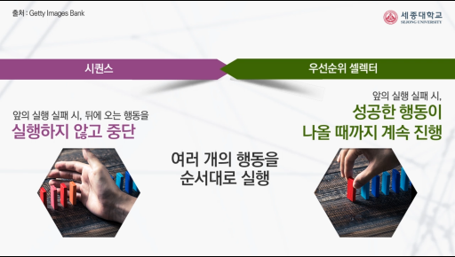
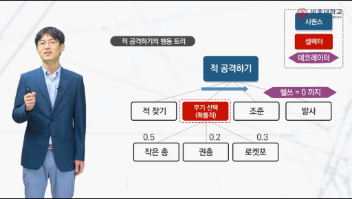

## 행동 설계

유한상태 기계와 행동트리가 있으며 둘 다 설계자의 지식에 따라 결과가 달라진다. 따라서 지식기반 기술이며, 변화에 취약해 융통성 있게 행동하지 못한다. 2000년 대 이후 부터는 행동트리가 더 대중적으로 이용된다.

## 유한상태 기계

- 그래프를 사용하여 **상태** 중심의 지식을 표현하는 방법
    * 게임을 플레이 하는 것을 몇 개의 상태로 구분
    * 한 상태가 다른 상태로 바뀔 때 : 어떤 조건을 만족하여야 하는지 정의
- 상태, 전환, 행동의 3가지 요소가 있다.
    * 상태
        - 게임에서 이루어야 하는 임무와 관련
        - 게임의 목표 달성위해 필요한 일들이 각각 하나의 상태가 될 수 있음
        - 보통 여러 개의 상태 존재
    * 전환 : 하나의 상태에서 다른 상태로 전환이 일어나게 될 때, 만족해야 하는 조건들
    * 행동 : 각 상태에서 실행해야 하는 하나 이상의 행동들을 포함

## 행동 트리

- **행동**을 중심으로 설계
- 작은 행동 여러 개를 묶어서 복잡한 행동을 생성
- 트리 형태로 표현
- 시퀀스, 셀렉터, 데코레이터의 3가지 요소가 있다.
    * 시퀀스
        - 연속적으로 자식 행동을 실행하는 것
        - 순서대로 실행하다 실패하는 행동이 생기면 종료
    * 셀렉터
        - 여러 개의 행동 중에서 선택하는 기능을 담당
        - 확률적인 셀렉터의 경우 : 설계자가 정해준 행동별 확률값을 기초로 선택
        - 우선순위 셀렉터의 경우 : 여러 개의 행동들을 우선순위 형태로 선택
        - 선택한 행동 실패 시, 그 다음 우선 순위의 행동 선택
    * 데코레이터
        - 행동을 보다 복잡하게 만들 때 붙여주도록 함(반복 횟수, 특정 조건 만족할 때까지 반복)

## 인공지능의 종류

- 강인공지능 : 지각력이 있고, 스스로 인식하는 것. 사람과 동일하게 행동하고 사고하는 컴퓨터 프로그램.
- 약인공지능 : 진짜 지능이나 지성을 갖추고 있지 못하지만, 기계적으로 지능적인 행동을 보임. 사람과 다른 형태의 지각과 사고 추론을 발전시키는 컴퓨터 프로그램.
