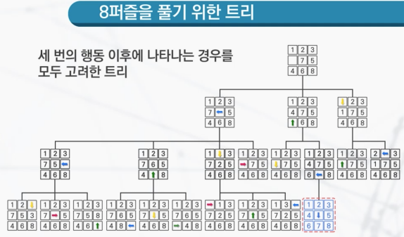
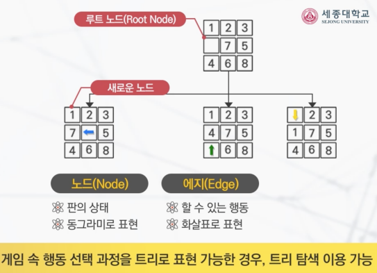
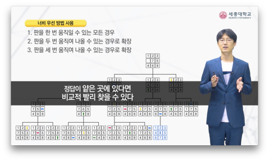
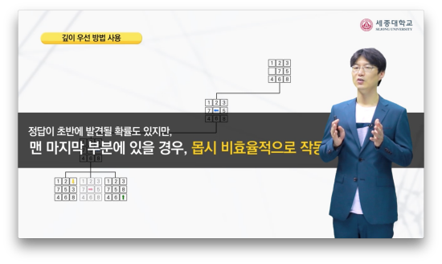
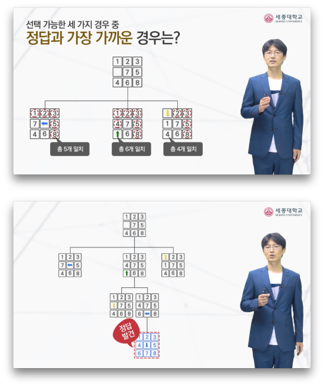
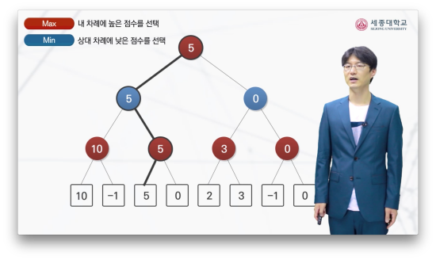

## 트리 탐색

인공지능에서 가장 중요한 것 : 탐색(Search)

루트 노드 : 트리의 최상위 노드    
노드 : 판의 상태, 동그라미로 표현    
에지 : 할 수 있는 행동, 화살표로 표현    

## 트리 탐색 방법
체스 : 평균 35 가지 중 하나 선택
바둑 : 평균 250 가지 중 하나 선택

- 게임에 주어진 지식이 **없는** 경우 : 주어진 게임에 대한 지식을 전혀 활용하지 않고, 탐색할 순서에 대해서만 정해 놓고 정답 찾기
  - 너비 우선 탐색(Breadth First Search, BFS) : 넓게 찾아보는 것을 우선시
  
  - 깊이 우선 탐색(Depth First Search, DFS) : 깊게 찾아보는 것을 우선시
  
- 게임에 주어진 지식이 **있는** 경우
  - A* : 문제의 정답을 찾아갈 때, 정답과 많이 일치하는 것을 우선적으로 찾기.
  
- 두 사람이 플레이하는 게임
  - Minimax : 게임 트리를 끝까지 확장하는 것은 불가능 하기 때문에 두 선수 모두 최선을 다할 것이라는 가정하에 탐색. 평가 함수를 두어 게임이 끝나지 않더라도 좋고 나쁨을 매기는 점수를 구함
  
    - 첫 번째 확장 기준(Max) : 내 행동
    - 두 번째 확장 기준(Min) : 상대 행동
