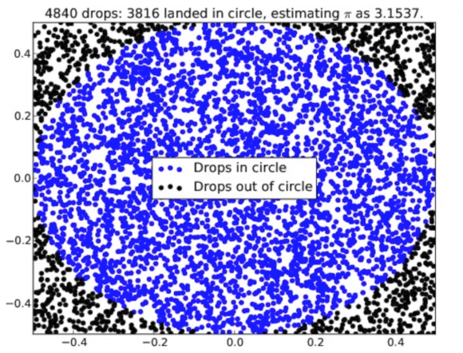

## 몬테카를로 트리 탐색

몬테카를로 트리 탐색(MCTS) = 몬테카를로 방법(무작위 시뮬레이션) + 트리 탐색
- 미래 신규 기술의 기반
- 게임을 모르는 사람이 활용할 경우에도 효과적인 인공지능 구현 가능

몬테카를로(Monte Carlo) : 카지노로 유명한 모나코의 도시    
몬테카를로 방법(Monte Carlo Method) : 일반적인 해결법이 없는 문제에 적용하여 정답에 가까운 답을 찾아내는 방법. 일반적인 방법으로는 정해진 시간 안에 답을 찾아내기 불가능 한 경우 사용한다. 즉, 정해진 시간을 뛰어 넘어 답을 찾아야 할 경우 사용한다.   

- 1940년 중반 : 핵폭탄 개발 연구진에 의해 개발 - 중성자와 원자핵의 충돌 과정에 대한 수학적 예측 방법이 없었다. 이에 정확한 답을 찾기 보다, 현상에 대한 컴퓨터 시뮬레이션을 반복하고 그 실험에 대한 결과값을 예측한다.
- ex) 원의 넓이 : 컴퓨터가 무수히 많은 점을 무작위로 찍는다. 원의 안에 찍히면 파란색. 밖에 찍히면 검은 색. 파란색 부분을 모아 정리하면 원의 넓이를 구할 수 있다. (원의 넓이에 대한 아무런 지식이 없더라도, 결과를 토대로 역으로 수학적 수식을 유도해 낼 수 있다.)

바둑에 적용하는 몬테카를로 방법     
흑과 백의 무작위 게임 진행 (이길 경우 1, 질 경우 0, 비길 경우 0.5의 보상). 수 많은 게임을 진행하면 정확도를 높일 수 있다.

**몬테카를로 트리 탐색(MCTS)**    
몬테카를로 방법 + 트리 탐색    

게임 트리는 수가 늘어날 수록 일반적인 컴퓨터에서 다루기 어려운 상태로 변화하므로 현재 부터 몇 수 또는 최대 몇 십 수에 대한 트리를 결정한다. 몇 수 앞을 측정할 수 있는 방법은 평가함수로 정의한다. 보통 평가함수는 그 분야의 전문가들이 높은 보상을 얻을 수 있는 쪽으로 설계하지만 바둑에서는 그 평가함수를 정의하기가 어렵다. 몬테카를로 트리 탐색은 평가함수가 없더라도 작동할 수 있다(무작위 시뮬레이션으로 좋고 나쁨을 판단할 수 있다). 몬테카를로 트리 탐색은 가능성이 높은 것을 위주로 효율적 탐색을 진행한다.

몬테카를로 트리 탐색의 과정, 주어진 시간 내에서 4단계를 한 사이클로 실행한다.
- 선택(Selection)
  - 어떤 노드를 살펴볼 지 결정
  - 기준 : UCB(Upper Confidence Bound)
- 확장(Expansion)  
  - 새로운 노드를 트리에 추가
  - 기존에 없던 새로운 길을 만드는 단계
- 시뮬레이션(Simulation)  
  - 두 선수가 무작위로 게임을 끝까지 진행
- 역전파(Backpropagation)
  - 승패에 대한 정보를 거꾸로 전파
  - 아래에서 가장 높은 꼭대기 루트노드까지 전파

UCB(Upper Confidence Bound)
- 함수로 표현
- 트리 노드 중 많이 이긴 쪽으로 이동(승률에 따름)
- 현재의 승률이 끝까지 일치하지 않음
- 잘 가보지 않은 곳도 내려가봐야 함

MCTS의 단점
- 시간이 제한된 실시간 전략 게임에서의 활용도 낮음
- 시뮬레이터를 만들 수 있는 게임에서만 사용 가능
