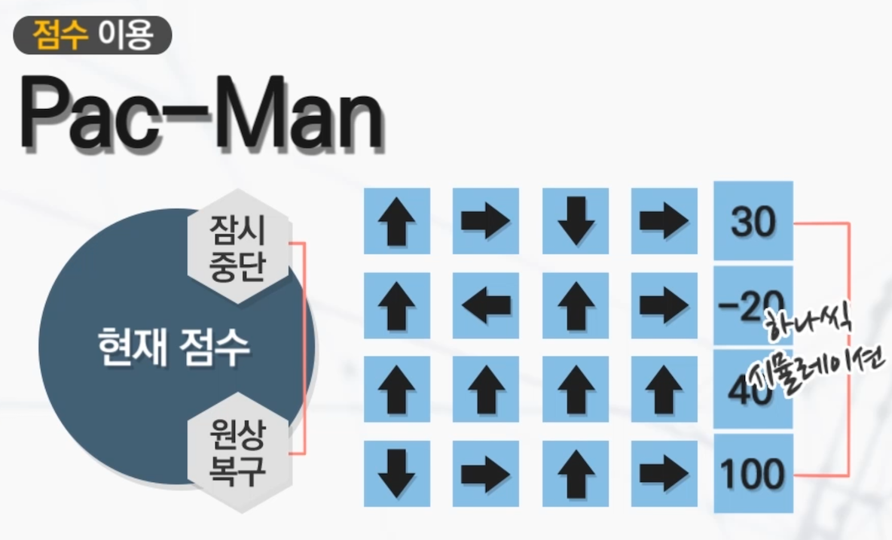
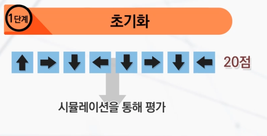
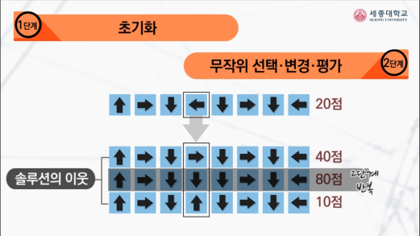
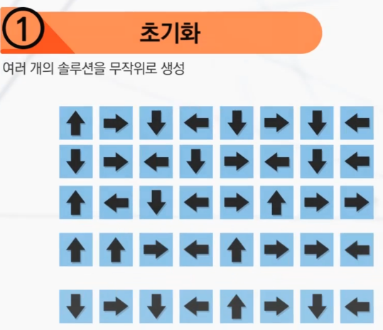
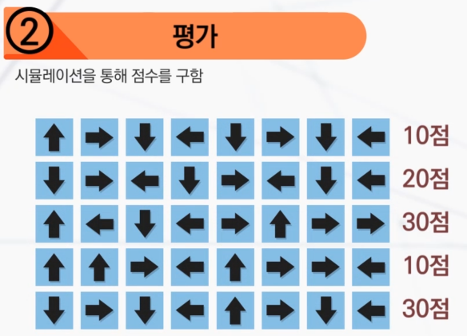
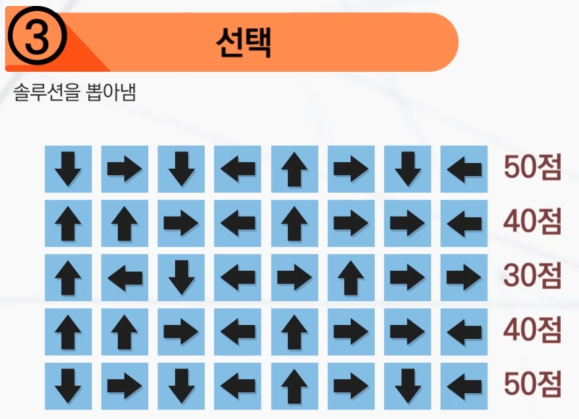
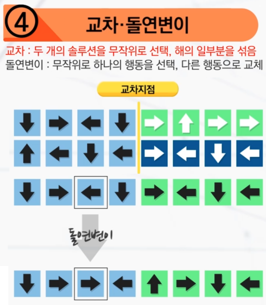
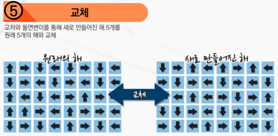

## 최적화의 개념
최적화(Optimization) : 무언가를 주어진 목적에 맞추어 조정하는 것

미적 요소
- 정확하고, 객관적 측정이 어려움
- 디자이너의 의견 중요
- 상대적인 평가

공학적 요소
- 객관적 측정 가능
- 예) 무게, 연비, 안전도, 제작 소요시간 등

## 게임에서의 최적화

인공지능 기술 중의 하나인 최적화 기술을 이용해서 게임에 필요한 요소들을 컴퓨터가 최적으로 조정해 주는 것

Game Balancing : 매우 복잡한 최적화 과정 : 사람이 하는 섬세한 조정 + 자동으로 일부 요소 조정

## 최적화 방법

최적화 하려는 목적을 어떻게 정의? 평가함수(목적함수) 정의    
ex) 팩맨의 경우 현재 점수와 N번의 행동을 하고 난 후의 점수를 차이를 구해서 그 수가 가장 큰 것을 선택

    
시뮬레이션에 많은 시간이 소요되므로 적은 수의 시뮬레이션으로 좋은 결과를 얻도록 해야 한다.

- 지역탐색(Local Search) - Hill Climbing(언덕 등반 방법) : 하나의 솔루션을 무작위로 선택한 후, 그것을 새로운 솔루션으로 선택/변경하면서 좋은 결과를 찾는 방법. 어디가 가장 좋은 곳인지 알 수 없는 상태에서 계속 높은 곳으로만 올라가는 방법(속도가 빠르지만, 좋은 해를 놓칠 가능성이 있다.)
  - 초기화 : 행동을 무작위로 선택후 시뮬레이션을 통해 평가    
      
  - 무작위 선택, 변경, 평가 : 선택된 행동을 무작위로 선택해 변경하고 평가. 평가함수의 점수가 더 나아진 솔루션이 있으면 그것을 선택해 초기화 부터 다시 반복. 없다면 그것으로 종료.     
      
- 진화탐색(Evolutionary Search) : 여러 개의 해를 만들어 내고, 이 해들을 서로 섞고 변화시켜서 더 좋은 해를 찾아가는 방법(계산 시간이 오래 걸리지만 좋은 해를 찾을 확률이 높다.)
  - 초기화 : 여러 개의 솔루션을 무작위로 생성    
    
  - 평가 : 시뮬레이션을 통해 점수를 구함    
    
  - 선택 : 솔루션을 뽑아냄    
  
  - 교차, 돌연변이 : 솔루션을 섞고, 교체    
  
  - 교체 : 교차와 돌연변이를 통해 새로 만들어진 해를 원래 해와 교체. 그리고 2단계부터 다시 반복
  
