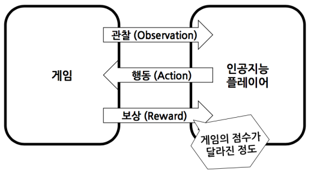
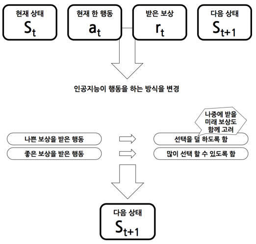
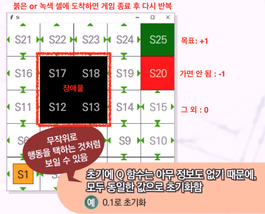
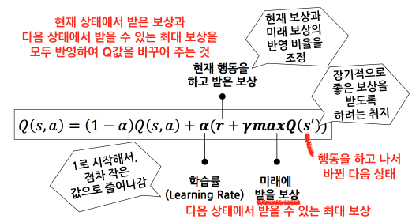
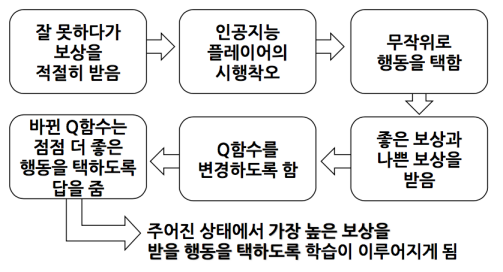

## 강화학습

강화학습 : 정답이 없는 상태에서 보상이라고 불리는 피드백을 이용하여 학습 (사람이 일일이 대해 주지 않아도, 컴퓨터 스스로 학습 가능) - 지식이 없는 상황에서도 시행착오를 통해 습득한 경험을 이용하여 학습을 수행할 수 있는 기술. (인공지능 플레이어가 보상에 해당하는 것만 정의해 주면 지속적으로 게임을 플레이하면서 행동 선택 방법을 교정)

바둑같은 보드 게임 뿐아니라 비디오 게임에도 적용 가능 : Atari 게임을 인간 수준에서 플레이.
- 컴퓨터 스스로 게임을 하면서 어떻게 하는지를 익힘
- 비디오 게임에는 기보가 없음
- 인공지능이 기존의 게임 기록 없이 혼자 플레이만으로 높은 수준에 오름

## 게임에서의 강화학습

게임에서는 게이머와 게임 사이의 상호작용이 매우 중요. 게이머의 반응에 따라 게임의 결과가 달라질 수 있다. (게임 플레이어의 게임이 매우 중요한 요소)

- 행동(Action) : 게임은 행동 선택의 문제
  - 행동의 수는 무한할 수도 있고, 제한되어 있을 수 있음
  - 할 수 있는 행동들 중에서 하나 혹은 여럿을 택하여 실행
  - 랜덤(무작위) 플레이어 : 인공지능 플레이어 중에서 가장 성능이 낮은 것이 무엇인지 지칭
- 상태(State) : 현재 게임의 상태와 해당 상태에서 어떤 행동을 하는 것이 좋은가?

    
강화학습 : 각 상태별로 어떤 행동이 좋은지에 대한 수치 값을 찾아나가는 방법     
    

## 인공지능 이야기

초기 AI 프로그램 : 동일한 기본 알고리즘 사용    
1950년대 후반 ~ 1960년대 : 성공적인 프로그램, 새로운 발전 방향 등장 - 탐색 추리, 자연어 처리, 마이크로 월드, AI 연구자들의 낙관론

## Q-learning 소개

Q-learning
- Q = 가치함수(Value Function)
  - 어떤 입력을 넣으면 값이 나오는 함수
  - Q함수(Q Function)
  - 입력은 게임 상태와 행동
  - 주어진 게임 상태에서 이 행동을 하는 것이 얼마나 좋은지를 숫자로 출력하는 함수

    
- 1단계
  - 현재 상태 s에서 할 수 있는 모든 행동 중에서 Q값이 가장 큰 것을 택하여 실행
  - 보상 r을 전달받고 상태는 s에서 s'으로 바뀜
- 2단계
  - Q값을 수식을 사용하여 변경
  -         
    - 𝜶가 0이면, Q값은 절대 안 바뀜
    - 𝜶가 1이면, Q값은 매우 크게 변동이 이루어짐
- 3단계
  - 1단계로 돌아가서 과정 반복

    

## 강화학습 사례

ex1) 알파고

알파고 = 교사학습 + 강화학습 + 몬테 카를로 트리 탐색     
알파고에서 강화학습은 게임을 지속적으로 반복하는 과정을 통해 실력 향상

- 상태 : 바둑판에 놓여있는 돌
  - 19 x 19 바둑판의 경우 총 381개의 돌을 둘 수 있는 자리가 있음
  - 각 자리에는 흰 돌, 검은 돌, 돌이 놓여 있지 않음의 총 세 가지 경우가 있음
  - 총 3^381에 해당하는 엄청난 수의 서로 다른 상태가 있을 수 있음
- 행동 : 바둑판에 돌을 놓는 것
  - 381개의 자리 중에 하나를 놓는 것
  - 행동의 수는 총 381개에 해당함
- 보상
  - 승/패/무승부로 나누어 볼 수 있음
  - 각각에 대해 +1, -1, 0을 부여할 수 있음

Q러닝 테이블을 어떻게 표현할 것인가? 테이블로는 한계. (행의 상태 3^381, 열의 상태 381을 모두 표현하는 것은 불가능) -> 인공 신경망 사용(Deep Q learning)

ex2) 100×100 해상도를 가지는 흑백 팩맥 게임
- 상태 : 게임 화면을 사용
  - 총 10000개의 픽셀이 0~255 사이의 값을 가지는 것으로 게임을 표현
  - 0을 검은색, 255를 하얀색이라고 하고, 사이 값은 그 중간의 회색으로 정의할 수 있음
  - RGB라고 불리는 붉은색, 녹색, 파란색 정보가 모두 저장되어야 해서, 정보량이 3배가 늘어남
- 행동 : 게임에서 플레이어가 조작할 수 있는 버튼이 가질 수 있는 경우의 수
  - 팩맨의 경우 : 네 가지 방향키를 조작하기 때문에, 행동은 4가지로 정의할 수 있음
- 보상 : 게임화면에 나와 있는 점수

지속적으로 오랫동안 경험하면, 점점 Q함수는 정확한 평가를 할 것이고 실제로 게임을 사람보다 더 잘하는 수준에 이르게 된다.
