## 통계학이란 무엇인가

'인간의 합리성' 가정을 검증하기 위한 실험
- 의사집단 1 - A : 수술환자 100명 중에서 10명은 수술 도중에 죽고, 32명은 1년 이내에 죽으며, 66명은 5년 이내에 죽는다. 방사선 치료를 받는 100명의 환자 중에서는 아무도 치료 도중에 죽지 않고, 23명이 1년 이내에 죽으며, 78명이 5년 이내에 죽는다.
- 의사집단 2 - B : 수술환자 100명 중에서 90명은 살아서 수술 기간을 넘기고, 68명은 일년 이상 살아남으며, 34명은 5년 이상 살아남는다. 방사선 치료를 받는 100명의 환자 중에서는 모두 다 살아서 치료기간을 넘기고, 77명이 1년 이상 살며, 22명이 5년 이상 산다.

서식을 읽은 후 의사들은 각자 폐암 환자에게 추천할 치료법을 제시.
- 의사집단 1: 80명중 40명(50%)이 수술을 추천
- 의사집단 2: 87명중 73명(84%)이 수술을 추천

기술 통계학(descriptive statistics) : 자료를 변수 별로 따로따로 또는 관계되는 변수끼리 묶어서 요약    
추론 통계학(inferential statistics) : 정리된 자료에 담긴 의미를 해석하여 미지의 세계에 대해 추론

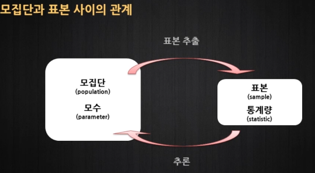

횡단면 자료(cross-sectional data) : 한 시점에서 여러 개체를 관측한 자료    
시계열 자료(time-series data) : 한 개체를 여러 시점에 걸쳐 관측한 자료    
패널 자료(panel data) 또는 종적자료(longitudinal data) : 횡단면과 시계열의 특성을 결합하여 여러 개체를 여러 시점에 걸쳐 관측한 자료    
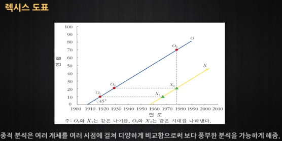

## 통계학과 자료
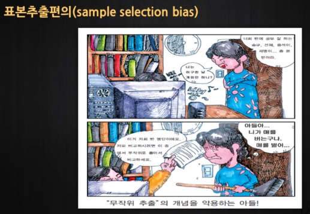
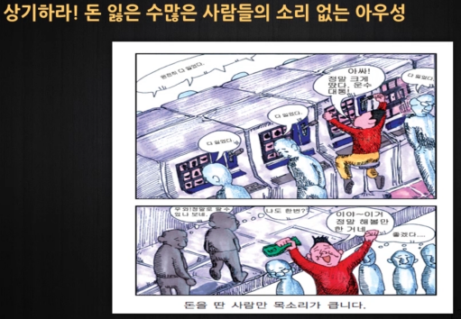

무조건 많은 표본을 모은다고 해서 모집단을 제대로 반영하는 것이 아니다.

1993년 LA 시장 선거: 여론조사와 실제 경과의 비교
- among all registered voters: 민주당 Michael Woo 후보가 공화당 Richard Riordan 후보에 6% 포인트 앞서는 것으로 나타남
- among the likely voters: 공화당 Richard Riordan 후보가 민주당 Michael Woo 후보에 7% 포인트 앞서는 것으로 나타남
- 1993년 6월 8일의 실제 선거결과: 공화당 Richard Riordan 후보가 민주당 Michael Woo 후보에 8% 포인트 앞선 승리
- 전체 등록된 유권자의 44%만이 투표. Likely voters가 all registered voters보다 모집단을 더 잘 대표함

1936년 미국 대통령 선거 결과의 예측
- 실제 선거 결과 : 루즈벨트 62% 득표. 루즈벨트 승리
- 다이제스트사의 예측 : 루즈벨트 43% 득표. 랜던 승리 예측
- 다이제스트사의 예측에 대한 갤럽의 예측 : 갤럽은 다이제스트사가 루즈벨트 44% 득표, 랜던 승리를 예측할 것으로 예측
- 갤럽의 예측 : 루즈벨트 56% 득표. 루즈벨트 승리 예측

다이제스트사의 표본추출은 전화번호부와 클럽의 회원 명부 기반(고소득자). 갤럽은 대표성을 나타내도록 표본 추출

생존 편의 : 살아있는 기업은 죽은 기업을 대표할 수 없다. (주식의 평균 수익률)
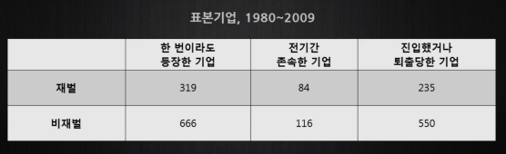
존속한 기업은 상대적으로 소수인데, 이를 가지고만 80년부터 주식에 투자했으면 얼마를 벌었다고 간단히 통계내는 것은 옳지 않다.

일반적인 잘못된 분석 : 1980년부터 현재까지 남아 있는 기업들만 1/n로 분산 투자후 수익률 비교

제대로 된 분석 : 1980년부터 시가총액을 비교해서 분산투자. 3개월 주기별로 새로 상장된 기업을 추가해(상장폐지 되었으면 그대로 손실), 시가총액에 따라 자산을 재분배한다.

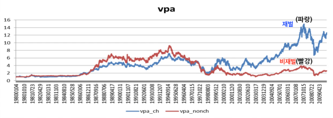
1원을 분산투자 했다고 가정했을 때 제대로 계산한 수익률

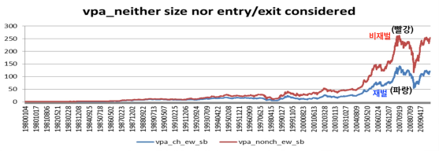
1원을 분산투자 했다고 가정했을 때 잘못 계산한 수익률

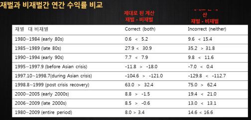
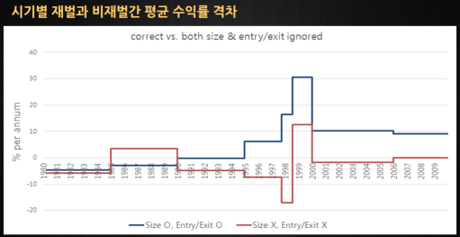

척도의 종류
- 명목 척도(nominal scale) : 척도의 명칭만 있음.
  - ex) 결혼 상태에 대한 코드 : {미혼=1, 기혼=2, 이혼=3, 사별=4}
- 순서 척도(ordinal scale) : 명칭 및 순서가 의미를 지님.
 - ex) 성적 등급 : {poor=1, fair=2, good=3, very good=4, excellent=5} - fair과 poor의 차(2-1=1)가 의미를 지니는 것은 아니다.
- 간격 척도(interval scale) : 명칭, 순서 및 간격이 의미를 지님.
  - ex) 온도 - 20도와 15도의 차(20-15=5)도 의미를 지닌다. 하지만 20도가 1도보다 20배 더운 상태는 아니다.
- 비율 척도(ratio scale) : 명칭, 순서, 간격 및 배율 모두 의미를 지님. - 이들 척도의 경우 이른바 "절대적 원점(absolute zero point)"이 정의 됨.
  - ex) 키, 몸무게, 재산 등 - 배율이 의미있기 때문에 0은 nothing의 의미를 가진다. (온도는 0이 nothing이 아니다.)

실험 연구의 집단 배정 원리
- 무작위 배정(randomized control)
  - 처리집단(treatment)과 통제집단(control)으로 구분.
  - 확률에 의존한 무작위 배정(예컨대, 동전 던지기에 의한 배정)
- 이중 눈가림(double blindness)
  - 피험자가 본인이 처리를 받았는지 안 받았는지 모르게 조치하여 피험자의 심리적 효과 내지 위약효과(placebo effect)를 통제.
  - 실험자가 피험자의 소속집단을 모르게 조치하여 실험자가 피험자의 반응을 해석할 때 자의성이 개입되지 않도록 함.
- 이상적인 실험
 - 무작위로 통제된 이중 눈가림 실험.

심슨의 역설(Simpson's paradox) : 하위집단에서 관찰된 관계는 하위집단이 결합되었을 때 그 관계가 바뀌어 나타날 수 있다는 역설     

ex1) 버클리 대학원에 8442명의 남성과 4321명의 여성이 지원. 남성 지원자의 약 44%가 합격. 여성 지원자의 약 35%가 합격.    
But) 만약 여학생은 합격률이 낮은 학과에 몰리고 남학생은 상대적으로 들어가기 쉬운 학과에 몰렸으면 여학생의 전반적 합격률은 남학생에 비해 낮게 됨. 학과별로 남녀 차별이 없었음에도 불구하고 전체적으로 볼 때는 남녀 합격률에 차이가 날 수 있음.
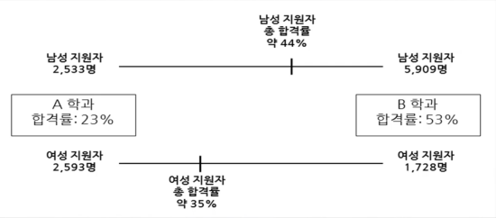

ex2) 아파트 단지별로 따로따로 비교해 보면 새 아파트가 오래된 아파트 보다 비쌈. 하지만 단지를 종합하여 보면 이전에 지어진 아파트가 최근에 지어진 아파트보다 더 비싼 것으로 드러남. 이는 이전에 지어진 아파트가 대규모 단지에 위치해 있어 편의시설의 혜택을 보기 때문임. - 하위 집단에서 관찰된 관계는 하위집단들이 결합되었을 그 관계가 바뀌어 나타날 수 있는 데 이를 심슨의 역설이라고 부른다.

심슨의 역설은 경험적 연구에서 적절한 통제의 중요성을 강조함.

경험적 연구는 통제된 실험과 달리 관측자료에 의존한다. 연구자는 개체의 행동이 가져오는 결과를 지켜볼 뿐이다. ex) 흡연의 효과 연구 시 흡연자와 비흡연자의 행동이 가져오는 결과를 지켜볼 뿐. 어느 누구도 연구자를 기쁘게 하기 위해 억지로 담배를 피거나 끊지 않는다.

## 그림을 이용한 자료의 정리

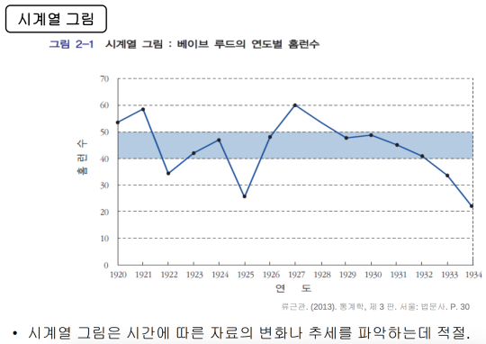
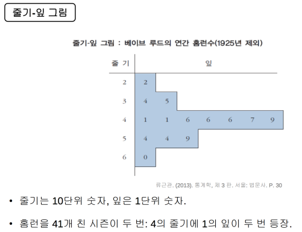
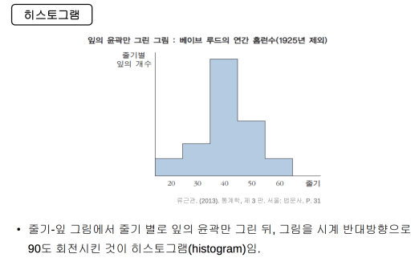
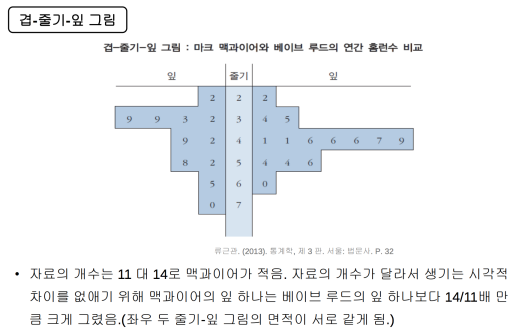
맥과이어의 최대 - 최소 편차가 더 크고, 루드의 평균적인 산도가 더 높은 쪽에 몰려있으므로 리스크 관리 측면에서는 루드가 더 나은 타자라고 판단할 수 있다.

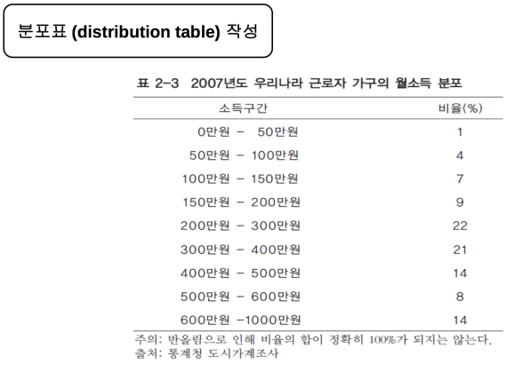
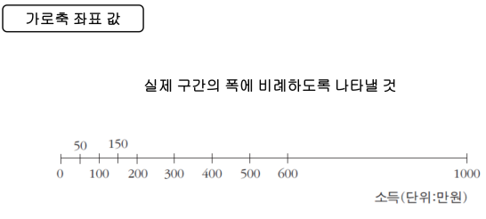
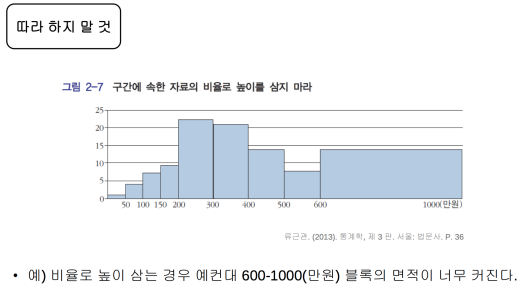
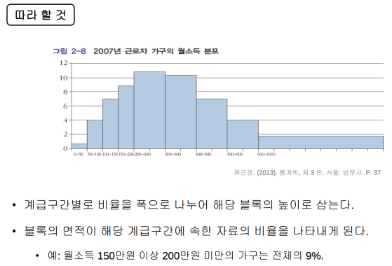

혼동요인으로 인한 결과의 왜곡을 막으려면 이에 대한 통제가 필요
- 자료를 혼동요인에 따라 세부집단으로 분류하고 세부집단 별로 따로따로 분석.
- 세부집단이 많을 경우 회귀분석을 이용.

ex)경구 피임약의 복용이 해당 여성의 혈압을 높이는가?
- 연령이 혼동 요인으로 작용: 연령이 높아지면 혈압 올라감. 피임약 덜 복용함
- 연령집단 별로 복용자와 비복용자의 혈압을 따로따로 비교

## 통계 자료를 이용한 예시

R 스퀘어 : 회귀 직선의 방정식이 얼마나 원래의 자료를 잘 설명하는지 나타내는 수치
