## 평균과 중앙값

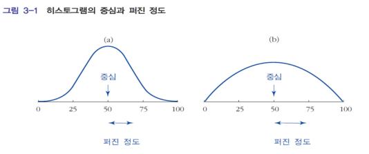

히스토그램에서 자료를 요약할 때 중심(평균, 중앙값)과 중심 주위로 퍼진 정도(표준편차, 사분위수 범위)를 주로 사용

- 평균(mean)
  - 관측치의 총합을 관측치의 개수로 나누어 구한다.
- 중앙값(median)
  - 절반 이상의 숫자들이 이 값보다 크거나 같고 동시에 절반이상의 숫자들이 이 값보다 작거나 같은 수
  - 히스토그램은 중앙값에서 그 면적이 양분됨
  - 중앙값은 n 이 홀수이면 (n+1)/2번째로 크거나 작은 숫자임
  - 중앙값은 n이 짝수이면 n/2번째 숫자와 (n+1)/2번째 숫자의 평균으로 정의
  - median voter theorem: 중앙값이 LAD의 해로 얻어진다는 것과 수학적으로 같은 내용임. 선호의 비대칭분포 이용하여 후보자의 location choice 문제 설명.
- 최빈치(mode)
  - 가장 많이 관찰되는 값
  - 히스토그램은 최빈치에서 그 높이가 제일 높음

Median Voter Theorem : 다수결에 의한 투표는 중앙값 투표자(median voter)가 선호하는 결과를 선택 하게 된다. 이는 유권자의 선호를 일차원 실직선상에서 표현할 수 있을 때 성립한다. 유권자의 선호가 다차원적이면 성립하지 않는다. 비즈니스맨이나 정치인 모두 공통적으로 “다수 투표자”의 표심을 얻고자 함.   
ex) 각 후보가 세율 10%와 90%를 공약한다 하면, 각 후보들은 표를 더 얻기 위해 중간인 50%로 공약이 수렴한다.

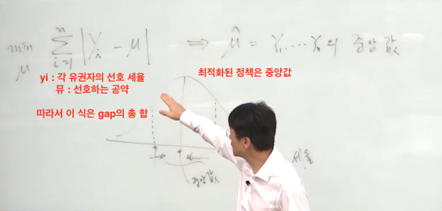

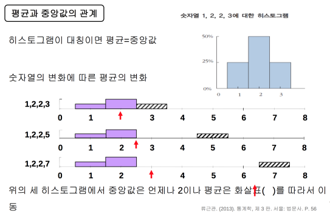
1. 극단적인 값이 존재할 때 평균은 극단적인 값에 큰 영향을 받고 중앙값은 영향을 덜 받음
2. 히스토그램이 좌우대칭이면 평균=중앙값
3. 히스토그램이 비대칭이면 중심의 측도(measure)로 평균보다 중앙값이 더 적절할 수 있음

히스토그램의 세 가지 꼬리 유형    
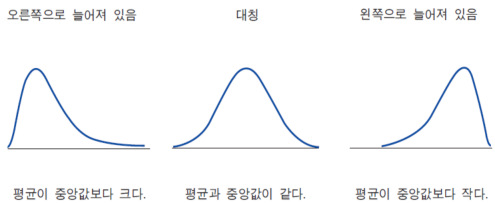
- 평균은 극단적인 값의 영향을 받음
- 중앙값은 극단적인 값의 영향을 받지 않음
- 극단적인 값이 존재하는 경우 평균보다 중앙값이 중심을 더 잘 나타냄

희생번트의 득실    
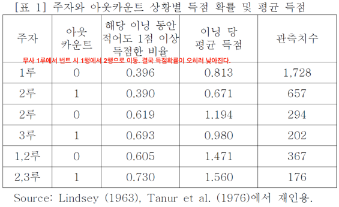

## 표준편차와 자유도

제곱근-평균-제곱 (Root Mean Square)    
계산은 표현의 역순(제곱 후 평균, 최종적으로 제곱근)
1. 제곱 (S) : 모든 수를 제곱하여 부호를 없앤다.
2. 평균 (M) : 제곱된 값들의 평균을 구한다.
3. 제곱근 (R) : 제곱-평균된 값에 제곱근을 취한다.

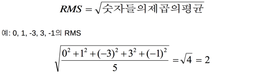

표준편차(SD)는 “평균으로부터의 편차들”의 RMS와 “대략” 비슷. (편차들에 적용한 RMS)    
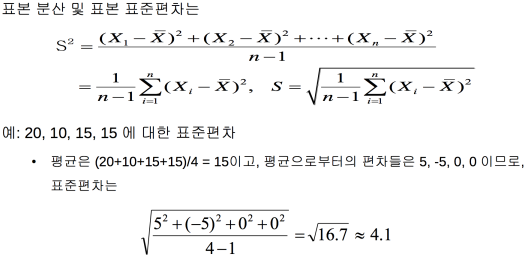

하지만 표준편차를 구할 때 1/n을 곱하는 것이 아니라 1/(n-1)을 곱한다. 이와 관계된 것이 자유도(degrees of freedom)이다.

표준편차 : 관측치들이 평균으로부터 얼마나 떨어져 있는지 알려줌

68-95법칙
- 관측치들의 약 68% 정도가 평균으로부터 1 표준편차 이내로 떨어져 있다.
- 관측치들의 약 95% 정도가 평균으로부터 2 표준편차 이내로 떨어져 있다.    

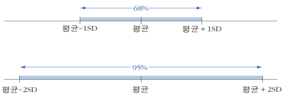
전제조건 (정규분포)
1. 히스토그램의 모양이 봉우리가 하나
2. 히스토그램이 좌우대칭
3. 양쪽으로 갈수록 감소하는 종모양

자유도(degrees of freedom) : 주어진 조건 하에서 자유롭게 변화할 수 있는 개수
- 자유도는 합쳐진 값들 중에서 실질적으로 독립인 값들의 개수
- 표준편차 계산하는 경우의 자유도는 ”자료의 개수 - 1”
- 표준편차 계산의 대상이 되는 편차들의 합은 0이됨. 편차들의 합이 0이 된다는 하나의 제약조건이 자유도를 1만큼 감소시킨 것임 (편차의 합은 0이므로 n-1개의 값을 변화시키더라도 마지막 한 개의 값만 맞춰주면 편차를 0으로 만들 수 있다)

ex) 극단적으로 자료의 개수가 하나인 경우
- 편차는 단 하나뿐이고 그 값은 0임
- 0에 대해 제곱의 평균, 즉 MS(mean square)를 구할 때 자유도 고려치 않으면 0/1=0이고 자유도를 고려하면 0/(1-1)=0/0으로 부정형(indefinite form)이 됨
- 단 하나의 자료만을 가지고는 퍼진정도를 알 수 없음. 이 때 퍼진정도는 0이 아니라 ‘알 수 없다(부정형)’가 정답임. 즉, 자유도를 고려해야 함

## 정규분포로의 근사

표준화(standardization) : 평균을 빼주고 표준편차로 나누어 주는 변환.

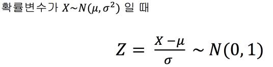
표준화 이후 평균이 0이고 표준편차가 1인 정규분포를 따르게 된다.
1. 분포의 전반적인 모습은 단위변환에 의해서 변하지 않는다.
2. 평균을 빼주었기 때문에 새로운 평균은 0
3. 표준편차로 나누었기 때문에 새로운 편차는 1

정규분포곡선
하나의 이상적인 히스토그램. 하나의 수학적 모형. 개념상 모집단의 분포.

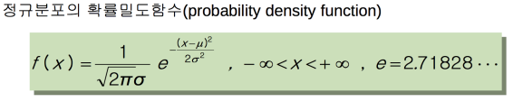

• 𝜇를 모평균, 𝜎를 모표준편차라고 부름.    
• 모집단: 모평균과 모표준편차    
• 표본: 표본평균과 표본표준편차    

위 식으로 표현된 그래프는 다음과 같은 분포를 보인다.       
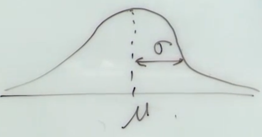

표준편차 만큼 떨어진 곳이 변곡점이 된다.(기울기의 부호가 전환)

함수 f(x)에서 x는 e의 마이너스 제곱에만 사용되는데, 지수 함수의 마이너스 제곱이므로 봉우리는 하나만 나타나게 된다. 또한 x가 𝜇일 때 e의 지수가 최소가 되므로 f(x)는 최대값을 가진다. 제곱을 곱해주므로 대칭을 이룬다.

정규분포곡선의 모양
- 평균을 중심으로 좌우 대칭(symmetric)
- 종 모양(bell-shaped)
- 봉우리가 하나(single-peaked)

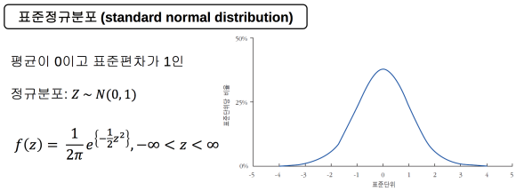    
표준화시킨 정규분포곡선(위의 정규분포곡선 함수에 𝜇를 0, 𝜎를 1로 대입한 함수) = 표준 정규 분포

정규분포곡선의 68-95-99.7 규칙    
- 표준단위로 -1부터 1까지 영역의 넓이: 약 68%
- 표준단위로 -2부터 2까지 영역의 넓이: 약 95%
- 표준단위로 -3부터 3까지 영역의 넓이 : 약 99.7%

백분위수
- 백분위수(percentile)는 하나의 히스토그램을 100개의 균등한 영역으로 나누 는 99개의 경계점 값들.
- 제p백분위수는 그 값보다 작은 값이 p%, 큰 값이 (100-p)%가 되는 경계값.
- 많은 히스토그램은 정규분포곡선과 다름.(평균과 표준편차만으로는 부족)
- 이러한 히스토그램을 요약할 때는 백분위수 개념이 유용.

사분위수
- 백분위수 가운데 25번째, 50번째, 75번째 백분위수를 특별히 제1사분위수 (first quartile), 제2사분위수(second quartile), 제3사분위수(third quartile)라 부름.
- 50번째 백분위수는 제2사분위수이면서 중앙값(median)임.
- 사분위수 범위(interquartile range) = (제3사분위수)-(제1사분위수)
- 다섯 숫자 요약(five number summary): 최소값, 제1사분위수, 제2사분위수, 제3사분위수, 최대값

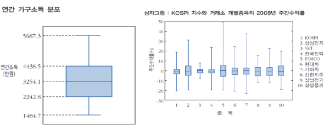

[위키백과](https://ko.wikipedia.org/wiki/%EC%83%81%EC%9E%90_%EC%88%98%EC%97%BC_%EA%B7%B8%EB%A6%BC)
