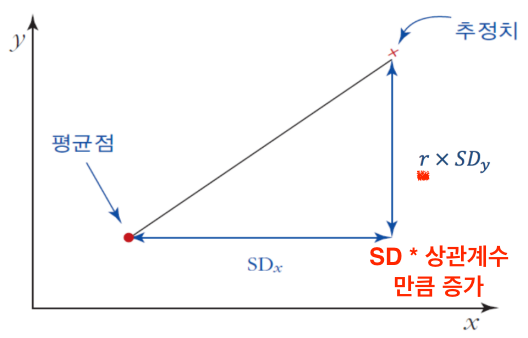

## 상관관계

결합분포(joint distribution): 두 변수간의 관계 전모를 보여줌

산포도 (scatter plot) : 두 변수 사이의 관계를 살펴보기 위해 산포도를 이용한다.
- 설명변수는 x로 표기하고 가로축에 표시
- 피설명변수는 y로 표기하고 세로축에 표시

산포도의 요약
- 가로로 보면 대략 95%의 점들이 x평균점을 기준으로 2SDx 이내에 위치함
- 세로로 보면 대략 95%의 점들이 y평균점을 기준으로 2SDy 이내에 위치함
- x의 평균과 표준편차, y의 평균과 표준편차는 x와 y의 분포를 따로따로 요약

상관계수
- 선형관계 : 상관계수는 선형관계만 잴 수 있다.
- 방향 : +/-. +이면 양의 증가, -이면 음의 증감
- 강도 : 0 ~ 1. 상관관계의 강도

상관계수의 필요성
- 가로든 세로든 평균과 표준편차가 동일해도 두 변수의 관계는 상이    
      
  (위의 두 그래프는 각각, x의 평균과 표준편차(점들을 모두 x축으로 평행이동한다고 했을 때), y의 평균과 표준편차(점들을 모두 y축으로 평행이동한다고 했을 때)가 동일하지만, 두 변수 관계는 다르다.)
- 위의 두 산포도는 가로든 세로든 중심과 퍼진 정도가 동일하지만 (a)가 (b)보다 더 강한 선형관계를 보임
- 두 변수간 선형관계의 방향과 강도가 얼마나 되는지 측정할 필요성 대두
- 상관계수는 두 변수간 선형관계의 방향과 강도 측정

이변량 자료의 요약 통계량
- x의 평균과 표준편차
- y의 평균과 표준편차
- x와 y간 상관계수(correlation coefficient) : r로 표기

    

상관계수의 범위, 부호
- 범위:-1≤r≤1
- 상관계수 = 1 또는 –1 이면 완전상관(perfect correlation)
  - 모든 점들이 정확히 하나의 선 위에 위치
- 양의 상관관계이면 점의 분포가 우상향
- 음의 상관관계이면 점의 분포가 우하향
- 두 변수의 표준편차가 모두 0이면 상관계수를 정의할 수 없음
- 두 변수 중 어느 한 변수만의 표준편차가 0 이면 상관계수는 0

상관계수 공식    
      
- 1) 각 변수를 평균으로부터의 편차로 바꾼다.
- 2) 두 편차를 서로 곱한 뒤 합친다.
- 3) 각 편차를 제곱하여 합치고, 다시 제곱근을 취한다. 두 제곱근을 곱한다.
- 4) 위 2)에서 얻은 값을 위 3)에서 얻은 값으로 나눈다.

      
- 1) 각 변수를 평균으로부터의 편차로 변환한다.
- 2) 두 편차를 서로 곱하여 합친 뒤 자유도 𝑛 − 1로 나누어 공분산을 구한다.
- 3) 두 표준편차를 곱한다.
- 4) 위 2)에서 구한 값을 위 3)에서 구한 값으로 나눈다.

      
1, 3 상한을 관통하는 직선에 의해 양의 상관계수.    
2, 4 상한을 관통하는 직선에 의해 음의 상관계수.

공분산(Covariance)의 부호가 상관계수의 부호가 된다. 따라서 공분산도 상관관계를 나타낼 수 있다. 하지만, 상관계수는 분모와 분자에서 단위가 상쇄되므로 단위와 관계없이 독립적으로 정의할 수 있다. (예를 들어, 키와 몸무게 관계에서 공분산은 각 키와 몸무게의 단위(cm, m, feet : kg, 파운드 등)에 따라 다른 단위를 가지게 된다.)

상관계수의 해석
- ‘상관계수=0.8’은 산포도 상에서 80%의 점들이 하나의 선 주위에 빽빽하게 밀집해 있다는 것을 의미하지 않는다.
- ‘상관계수=0.8’은 상관계수가 0.4일 때보다 선형관계의 강도가 강하기는 하지만 정확히 두 배로 강하다는 것을 의미하지도 않는다.    
- '상관게수=0'은 두 변수 사이에 선형관계는 존재하지 않는다는 의미이다. (아무런 관계도 존재하지 않는다는 의미가 아니다.)
  

상관계수가 유용하지 않은 경우 : 상관계수는 직선의 관계만 구할 수 있다.
- 이탈값(outlier)이 존재하는 경우
- 두 변수간 관계가 비선형인 경우 (ex. 방의 온도와 사람이 느끼는 쾌적함, 한계효용)   
   

## 상관관계와 회귀곡선

변수 변환 (자료의 선형근사) : 적절한 변수변환을 통하여 비선형 관계를 선형관계로 근사시킴    
ex) 예: (x, y)간 존재하는 원래의 비선형 관계가 (x, ln(Y))간 선형관계로 바뀐 경우 (곱으로 늘어나는 관계를 선형으로 바꾸는 데에 자연 로그 변환을 주로 쓴다. - 물가상승률, 임금상승률, 금융상품 수익률 : 따라서, 임금(비선형)과 교육(선형) 간의 상관계수를 구할 때, 자연로그 변환한 임금과 교육 연수의 관계를 분석한다. **비례관계에선 로그 변환!!!**        
    

    

  

마지막 그림은 중회귀 분석(multiple regression analysis) : 설명변수가 여러 개 있는 회귀분석으로 볼 수 있다.

상관관계가 실제의 관계를 경우
- 비율이나 평균의 자료로부터 구한 상관관계는 종종 실제의 관계를 과장
- 지역이나 국가 등 집단의 자료로부터 구한 상관계수는 개개인에게 적용되는 선형관계를 과장할 가능성이 있음.     

심슨의 패러독스(국가별로 통제되지 않은 요인(문화, 역사, 제도 등)이 있으므로 국가별로 따로따로 조사해야 한다.)

**상관계수가 곧바로 인과관계는 아니다(Correlation does not mean causation)**
- 자유무역과 경제성장
  - 많은 연구에서 자유무역과 경제성장 간에는 양의 상관관계가 존재하는 것으로 나
타났다. 과연 자유무역이 경제 성장의 원동력이라고 말할 수 있을까?
  - 후진국: 낙후된 지역, 잘못된 거시정책 (제3의 혼동요인 존재)
- 자본유입과 경제성장
  - 중국 내 12개 성(省)을 대상으로 조사한 결과 해외자본을 많이 유치한 성일수록 경 제성장률이 높았다. 이 결과로부터 해외자본이 경제성장을 촉진시켰다고 말할 수 있을까?
  - 해외투자자: 성장잠재력이 큰 성에 투자할 것임 (역인과 관계 가능성)

    
    
    

테일러 근사

ex) 노동조합 멤버면 1, 아니면 0. 회귀분석 계수(b)가 0.10. 해석하면 비노동조합원 대비 노동조합원은 10% 정도 임금이 높다. 노동조합 프리미엄은 임금을 10% 정도 상승시키는 효과가 있다.

## 회귀분석

회귀분석(regression analysis)은 집단별 평균을 분석하는 통계적 방법으로 집단을 구분하는 분류지표가 한 개인지, 둘 또는 그 이상인지에 따라 단순회귀분석과 중회귀분석으로 나누어짐    
    

표준편차선 : 평균점으로부터 키의 표준편차 단위로 한 단위 더 키 큰 위치에 몸무게의 표준편차 단위로 몸무게가 한 단위 평균보다 더 높은 그러한 점. 즉, 평균점과 키의 표준편차 단위로 키가 더 컸을 때 몸무게도 몸무게의 표준편차 단위로 평균 몸무게보다 한 단위 더 큰 그 두 점을 연결한 직선. 다르게 이야기 하면, 키와 몸무게의 표준편차 값들이 배수로써 다 같은 그러한 점들을 연결한 선이 표준편차선이 된다. (만약에 키와 몸무게의 관계가 완벽하다한다면, 모든 점들은 표준편차선 위에 있어야 된다.) - 두 변수(여기서는 키와 몸무게)의 표준화된 변수 값이 같은 점들을 이은 직선    
ex) 키가 상위 1%, 몸무게 또한 상위 1%로 완전히 똑같은 사람의 데이터는 표준편차선 위에 있을 것이다. 상관관계가 1이 아니기 때문에 보통 회귀직선이 표준편차선보다 기울기가 낮다.

y의 x에 대한 회귀직선은 각각의 x값에 대응하는 y의 평균값을 추정    
        
회귀직선은 평균점을 지나고, x값이 x평균값에서 1SDx 증가할 때 y값은 y평균값에서 r*SDy 증가    

평균의 그래프와 회귀직선    
      
- 회귀직선은 평균의 그래프를 하나의 직선으로 근사 시킨 것
- 평균의 그래프가 비선형이면 회귀직선으로의 선형 근사는 부적절

회귀분석 방법    
      

예제)
경제학부 10학번 학생 100명을 대상으로 조사한 결과     
경제원론 평균 = 3.0 표준편차(SDx) = 0.70    
경제통계학 평균 = 3.0 표준편차(SDy) = 0.60     
상관계수= 0.5    

경제원론 학점이 3.70인 지희의 경제통계학 학점은?  

1. 경제원론 점수가 평균보다 (3.7-3)/0.7=1SDx 높으므로
2. 경제통계학 학점은 평균보다 r * SDy ,즉, 0.5*0.60=0.30 만큼 높을 것으로 예측
3. 따라서 경제통계학 학점의 예측치는 3.0+0.3=3.3 (B+) 이다.

      
평범으로의 회귀(regression to mediocrity) : 하지만 이 의미는 시험이 계속되면 평균으로 수렴한다는 개념이 아니다. 단순히, 중간고사의 1등이 기말고사의 1등이 같은 사람이 아니다 정도의 분석.

회귀오류(regression fallacy) : 회귀효과를 무언가 중요한 효과로 착각하는 것    

ex)(관찰된 점수) = (실제 실력) + (확률오차)    
실제 실력은 평균 120, 표준편차 15의 정규분포를 따라 분포한다고 가정하자.
- 또 관측치에 든 확률오차는 각각 0.5의 확률로 ±5라고 가정하자.
- 실제 실력이 135인 사람의 관찰된 점수는 각각 1/2의 확률로 130 또는 140
- 실제 실력이 145인 사람의 관찰된 점수는 각각 1/2의 확률로 140 또는 150
- 관찰된 점수로 140점 받은 사람의 경우 실제 실력은 135인 데 확률오차가 +5인 경우가 실제 실력은 145인데 확률오차 가 -5인 경우보다 더 가능성 높음
- 따라서 첫 번째 시험점수가 평균보다 높으면, 아마도 실제 실력은 관찰된 점수보다 낮을 가능성이 큼    

