## 회귀직선의 오차

제곱근-평균-제곱 오차 (RMSE)
- 실제값과 예측치의 차이가 어느 정도 될 지 알려줌
- 추정의 표준오차(standard error of estimate) 또는 회귀의 표준오차 (standard error of regression)라고도 불림
- RMSE(Root Mean Square Error) : 잔차 제곱의 합을 표본크기 - 2 (자유도)로 나누어 제곱근을 씌운 값 (잔차 제곱의 표준편차) cf. MSE는 잔차 제곱의 평균. 분산에 해당.

추정오차
- 잔차(residual) : 실제값과 추정치의 차이. 추정오차    
- 전반적인 크기는 제곱근-평균-제곱(RMS) 방식으로 측정한다.

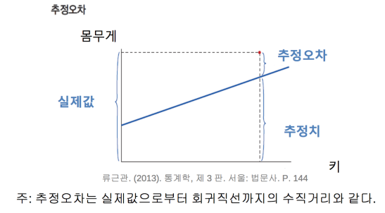    

RMSE 구하는 방법    
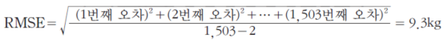    
- 산포도에서 전형적인 점(typical point)은 회귀직선으로부터 위 또는 아래로 9.3kg 정도 떨어져 있다. 실제 몸무게는 추정된 몸무게와 약 9.3kg 정도 다르다.
- 분모에 표본크기가 아닌 자유도가 사용되었다.
- 자유도 = 1503-2 = 표본크기-2
- 추정오차 계산의 기준은 회귀직선인데 이는 절편과 기울기의 두 추정치에 의해 결 정되므로 자유도는 2만큼 감소.

회귀직선과 RMSE     
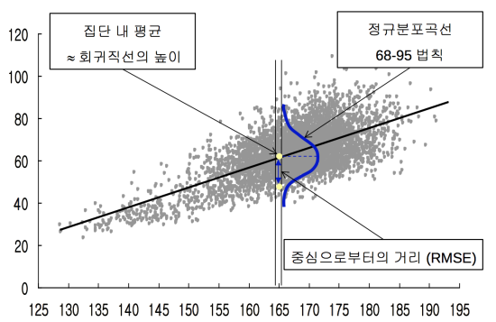      
- 회귀직선은 x값에 따라 분류된 부분집단 별로 자료의 중심을 알려준다.
- RMSE는 개별 관측치가 그가 속한 준거집단의 평균으로부터 떨어진 정도를 대략적으로 알려준다.
- 회귀직선과 RMSE를 알면 평균과 표준편차를 알 때처럼 68-95 법칙을 활용해 볼 수 있다.     
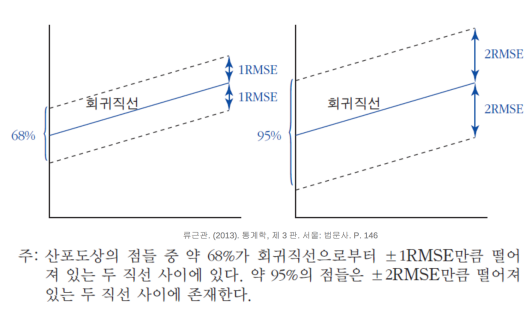    

초보적인 추정방법의 RMSE
- 초보적인 추정방법: x값은 무시한 채 y값의 전반적인 평균으로 개별 y값을 추 정 → (x, y) 그래프 상에서 y값 추정치들이 수평선을 이룬다.
- 초보적인 추정방법의 RMSE는 y의 표준편차(SDy)가 된다.    
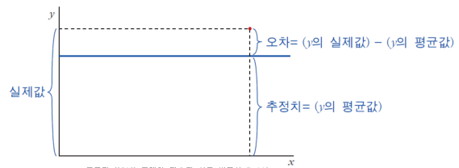    

회귀직선의 RMSE와 y의 표준편차    
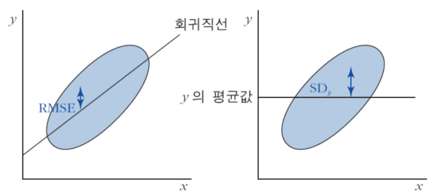    
- 일반적으로 ‘회귀직선의 RMSE < y의 표준편차.’ 이는 수평선보다 회귀직선이 산포도 상의 점들에 보다 가까이 위치하기 때문이다.
- 회귀직선의 RMSE는 대략 sqrt(1−𝑟^2)×𝑆𝐷𝑦와 같다.(단,𝑟은 𝑥와 𝑦의 상관계수)

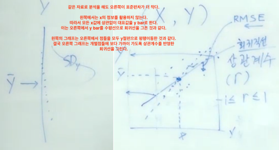    
회귀직선의 RMSE와 y의 표준편차 : 일반적으로 회귀직선의 RMSE는 y의 표준편차보다 작다. 이는 수평선 보다 회귀직선이 산포도상의 점들에 보다 가까이 위치하기 때문이다.

상관계수를 이용한 RMSE의 계산    
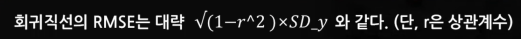    
결국 sqrt(1-r^2)만큼 오차가 줄어든다.(위의 그림의 왼쪽에서 오른쪽으로)    
- 𝑟 = 1경우
  - 산포도상의 모든 점들이 하나의 우상향하는 직선 위에 놓임
  - 추정오차는 모두 0. RMSE=0.
- 𝑟 = −1경우
  - 산포도상의 모든 점들이 하나의 우하향하는 직선 위에 놓임
  - 추정오차는 모두 0. RMSE=0.
- 𝑟 = 0경우
  - 회귀 직선 자체가 수평선
  - 두변수 x와 y간에 선형관계가 전혀없음
  - 회귀직선은 x값으로 부터 y값을 추정하는 데 전혀 도움이 안됨
  - RMSE는 SDy와 대략 같은 값을 갖게 된다.
- 결국 상관계수의 절대값이 클수록 오차가 더 많이 줄어든다.

ex) 동일한 사이즈의 기성복에서 소비자 느끼는 불편함의 정도가 오차로 생각하면, 그 정도를 표준편차로 나타낼 수 있다(SDy). 그리고 키를 감안해서(x) 옷을 맞춤형 제작하면 불편함이 줄어든다. (y의 표준편차보다 작아진다.) 그 정도는 키가 몸을 얼마나 잘 대표하느냐, 잘 설명하느냐에 따라서 달라진다. (r 스퀘어)

잔차도    
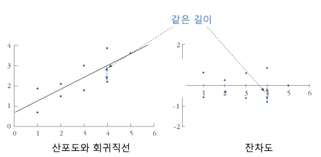    
- 잔차들의 합도 0이고 잔차들의 평균도 0
- 잔차도 상의 점들은 우상향하거나 우하향하는 등의 체계적인 선형패턴 (linear pattern)을 보이지 않음. 산포도 상에서 관찰된 두 변수간 선형패턴은 이미 회귀직선에 흡수되어 버렸기 때문임
- 비선형의 패턴을 보이는 잔차도    
  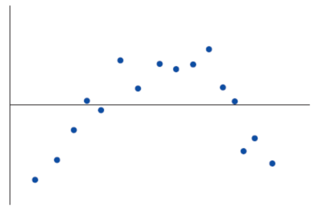      
  - 잔차도가 어떤 체계적인 패턴을 보이는 경우 회귀분석 모형에 무언가 문제가 있다고 보아야 함
  - 잔차도에 남아 있는 뚜렷한 비선형의 패턴은 직선의 회귀분석 모형이 체계적인 비선형의 관계를 포착하지 못하고 누락시켰다는 점을 시사함

산포도와 세로띠 내의 히스토그램    
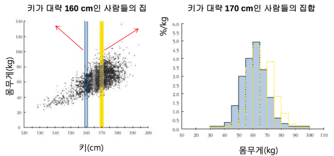      
- 좌측의 두 세로띠에 해당되는 우측의 두 히스토그램을 비교해보면, 중심은 다르지만 퍼진 정도는 거의 같다.

등분산성과 이분산성
- 등분산성 (等分散性, homoscedasticity)    
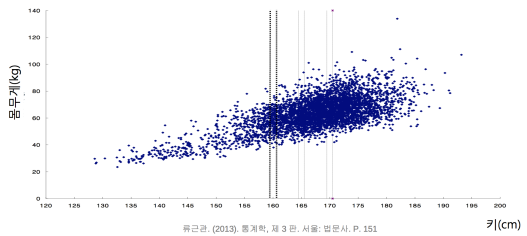    
  - 회귀직선을 중심으로 점들이 위 아래로 퍼진 정도가 세로띠(수직선) 별로 같음 (분산이 같은 성질)
- 이분산성(異分散性, heteroscedasticity)    
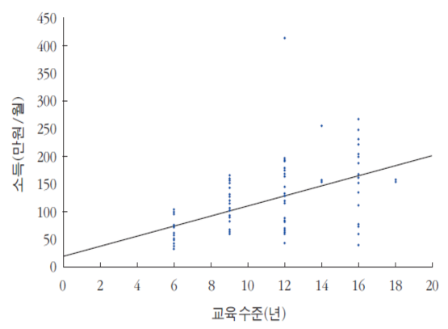     
  - 산포도가 이분산성을 보일 때, 실제 의 y값이 회귀직선에 의한 y값 추정 치로부터 벗어나는 정도는 x값 별로 즉 세로띠 별로 달라짐.
  - 이분산성 존재 시, 회귀직선의 RMSE는 서로 다른 x값에 대응하는 추정오차들의 전반적인 크기를 나타낼 뿐이다.

세로띠 별 분포를 정규분포로 근사시키기
- 중심을 함수로 일반화(회귀직선), 퍼져 있는 거리(표준편차)를 RMSE로 일반화 = 정규분포를 적용할 수 있다. 세로띠(수직선) 별로 적용한다. (중간고사 점수가 같은 학생들을 상대로 기말고사 점수를 정규분포화할 수 있다. - 그러면 중심은 수직선과 회귀직선이 만나는 점이 되고, 표준편차는 RMSE가 된다.) 1차원에서 2차원으로 확장된 것으로 생각하면 된다.
- 근사시킬 수 없는 경우
  - 잔차도가 비선형인 경우 : 회귀직선으로 구한 y값 추정치가 부적절    
        
  - 이분산성을 띠는 경우 : 공통의 RMSE가 부적절    
    

----
예제) 지난 30년간 관찰 된 통화증가율과 인플레이션율 자료를 이용하여 다음의 통계치를 얻었다. 평균 통화증가율을 18%, 통화증가율의 표준편차는 3%, 평균 인플레이션율은 20%, 인플레이션의 표준편차는 6%, 그리고 둘 간의 상관계수는 0.6임을 알았다.    

(1) 통화당국이 내년도 통화증가율을 15%로 설정하는 경우, 내년도 인플레이션율은 얼마가 될지 추정하라.

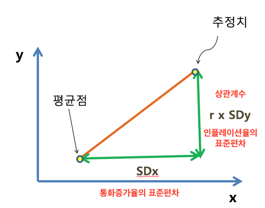    
(15 - 18) / 3(SDx) = -1 (-1 x SDx만큼 높아진다)    
내년 통화 증가율 - 연평균 통화 증가율 = SDx x X

0.6(r) x -1(SDx) x 6(SDy) + 20(bar y) = 16.4 (평균보다 3.6 낮다)

(2) 과거의 자료 가운데 통화증가율이 10% 근처였던 해의 인플레이션율 자료만 추려서 다시 표준편차를 계산하면 어떤 값이 되겠는가?    

RMSE = sqrt(1 - r^2) x SDx = 0.8 x 6 = 4.8

## 회귀직선

기울기 : x가 한 단위 증가할 때 y가 증가하는 단위.
- x와 y 모두 본래 변수 값 : x 한 단위 증가할 때, y 몇 단위 증가하는가. 즉, y에 미치는 절대적인 영향.
- x, y 모두 로그 변환을 한 경우 : 탄력성. x 1% 변화가 y의 몇 % 변화를 가져오느냐.
- y는 로그 변환. x는 본래 변수 : x 한 단위가 y의 몇 % 변화를 가져 오느냐.

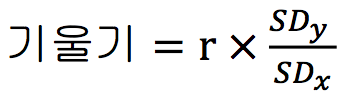     
기울기 = 상관계수 x SDy/SDx

최소자승법 : 모든 직선 가운데 수직거리의 전반적 크기를 최소화 해주는 직선을 구하는 방법    
최소자승직선: 모든 직선 중에서 x를 통해 y를 추정할 때 발생하는 추정오차 들의 “제곱의 합”으로 측정한 전반적 크기를 가장 작게 만들어주는 직선
- 산포도상의 각각의 점으로부터 하나의 직선까지의 수직거리를 정의
- 수직거리의 “제곱 합”이 최소화 되는 직선을 회귀직선으로 선택
- 수직거리의 제곱합을 최소화하는 것이나 RMS로 측정한 수직거리의 전반적 크기 를 최소화하는 것이나 수학적으로 동일한 최적화 문제임
- 즉, 최소자승법(method of least squares)은 모든 직선 가운데 수직거리의 전반적 크기를 최소화 해주는 직선을 구하는 방법임
- a = bar Y - b x bar X (절편)
- b = r x SDy/SDx (기울기)

회귀직선은 선형관계만을 측정한다.

중회귀분석 : 둘 이상의 설명변수(x)로 독립 변수(y)를 설명하는 회쉬분석. 종종 제3의 변수가 두 변수 x와 y 각각에 영향을 미쳐, 관심의 대상인 두 변수 상호간의 순수한 관계를 왜곡시키게 됨. 제3의 변수를 통제할 필요성 대두

----
예제. y의 x에 대한 회귀방정식과 x의 y에 대한 회귀방정식이 각각 다음과 같이 주어져 있다.     
Y= 1+ 0.5X , X= -0.5 + 0.5Y    
또 ,y의 x에 대한 회귀직선의 RMSE가 √(0.75)라고 하자.다음을 대략적으로 구하라.    

기울기    
0.5 = r x  SDy / SDx
0.5 = r x  SDx / SDy

절편    
bar Y - 0.5 x bar X = 1
bar X - 0.5 x bar Y = -0.5

두식 연립 x의 평균=0 , y의 평균 = 1

RMSE = √(1 − 𝑟^2) x SDy = √0.75    
SDx/SDy = SDy/SDx    
SDx^2 = SDy^2    
SDy^2 = 0.75 / 1 -r^2    
r = 0.5

## 중회귀분석의 응용

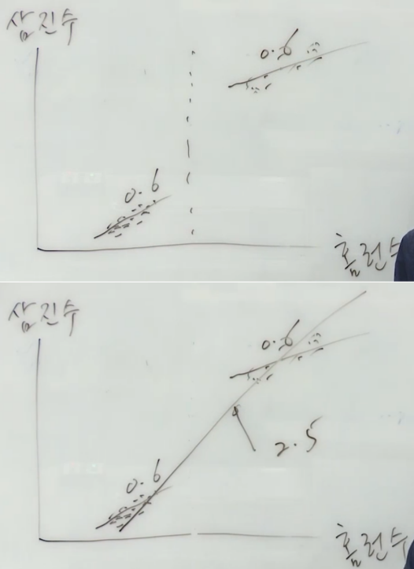     

홈런당 삼진수를 평균 내 보면 2.5정도의 기울기가 나온다. (홈런 하나당 삼진 2.5). 하지만 이는 타석수라는 다른 요인을 무시하고 단순히 비교한 것이다. 따라서 타석수가 적은 타자, 많은 타자를 따로 분석하거나 타석수를 고려해 중회귀분석을 해야 한다.

통계적으로 통제도 못해준 상태에서 동질적이라고 생각해서 관계를 봐서 관계가 확대 돼서 나타난 심슨의 패러독스

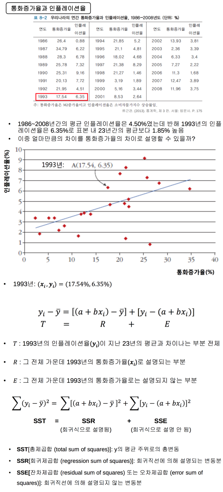    

SSR은 평균과 회귀직선의 차이의 제곱 합    
SSE는 실제값과 회귀직선의 차이의 제곱 합    

https://github.com/WooRaZil-Boy/ComputerScience/blob/master/KMOOC/SJKMOOC05k-BigDataAnalysisWithPython/Week5_LinearRegression.ipynb

결정계수(R2) = 총변동에서 차지하는 설명되는 변동분의 비율
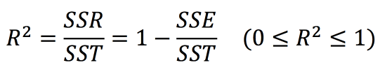    
- 결정계수의 값이 1에 가까울수록 회귀직선의 설명력은 높다.
- 단순회귀분석의 경우 결정계수인 R2 값은 두 변수간 상관계수인r의 제곱과 같게 된다. (단순회귀분석의 경우에는 R2 = r 제곱)

조정된 결정계수(adjusted R2)  
- 설명변수를 추가하면 추가할수록 R2는 언제나 증가함
  - R2 = 1 - SSE/SST 인데 SST는 고정된 반면 SSE는 설명변수 추가될수록 감소한다.
- 이 문제를 해결하기 위해 조정된 결정계수를 정의한다.    
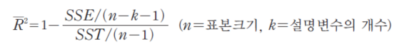      
  - SSE와 SST가 각각의 자유도로 나누어진 형태로 등장
  - SST의 자유도=(n-1): 표준편차 구할 때의 자유도와 동일
  - SSE의 자유도=(n-k-1): n개 자료 이용 총 (k+1)개의 계수 추정한 결과
  - 조정된 결정계수는 설명변수가 추가된다고 해서 반드시 늘지는 않음
    - SST는 평균으로부터 편차. 평균은 계산한 단 하나의 값이기 때문에 이 편차들에 있는 자유도는 n-1.    
    - SSE는 오차 계산의 기준이 되는 것이 회귀직선인데, 회귀직선은 데이터로부터 계산한 절편과 기울기, 두 가지 값에 의해서 규정 되기 때문에 자유도를 두 개 잃어버린다.    
    - (bar y은 하나의 포인트인데, a와 b에서 결정되는 리그레션 라인은 하나의 직선)
- 조정을 하지 않으면 설명변수는 아무거나 집어넣어도 오차가 줄어든다. 조정된 결정계수는 설명변수에 따라 R스퀘어 값이 떨어 질수 있도록 보정을 해 준 것.
