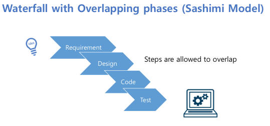

## 강좌 소개

1943 : ENIAC
1956 : Fortran
1959 : COBOL
1965 : Bell System
1968 : NATO 콘퍼런스 - Software Engineering

Software Engineering : 주어진 시간 비용 안에 양질의 소프트웨어를 만들기 위한 접근 방법

## 개발 프로세스 모델

Planning - Executing - Refining    
Software Process Model : Requirement - Design - Code - Test

## 전통적 모델 소개

#### Waterfall Model    
    
- 각 단계 순차전 단계의 결과가 다음 단계에 입력이 된다.
- 현재 소프트웨어의 진행 정도를 파악하기 쉽다.
- Requirement가 첫 번째 단계에서 명세 되어야 한다(모든 요구사항을 첫 단계에서 예측하기 쉽지 않다).
- 소프트웨어가 패키징 되어 배포되기 전에 모든 단계가 끝나야 한다(시간이 오래 걸린다).

#### Sashimi Model    
    
- 각 단계가 서로 겹칠 수 있게 Waterfall Model을 변형한 것
- 한 단계가 끝나려면 다음 단계가 시작되어 어느정도 진행되어 있어야 한다.
- 이전 단계에서 생각지 못한 문제가 발생해도 수정이 용이
- 분석 중에 특정 부분을 설계하고 분석해 프로토타입을 만들어 요구 사항 개선이 가능
- 프로젝트를 유연하게 진행할 수 있다.
- 프로젝트를 트래킹하기는 힘들어 진다.
- 의사 소통이 복잡해 진다.

#### Incremental waterfall
    
- 모든 요구사항을 결정해야 하는 Waterfall Model의 단점 개선
- 작은 부분을 먼저 개발하고 점차적으로 기능을 추가
- 작은 waterfall이 연결된 모양
- 각각의 작은 폭포들은 하나의 동작가능한 소프트웨어를 만들어낸다 = increment
- 이전 버전에 기능이 추가되면서 점진적으로 전체 프로그램을 만들어 간다.
- 요구분석이 끝난 일부분만을 목표로 increment를 시작할 수 있다.
- Core 기능의 increment를 먼저 릴리즈하고 다음 increment를 업데이트할 수 있다.

#### Spiral Model    
    
- 소프트웨어 개발에 위험요소 제거에 초점(잘못 이해된 요구사항, 잘못 선택된 아키텍처 모델, 느린 시스템 성능 등)
- 작게 시작해서 위험요소를 찾고 프로토타입으로 평가하고 개선하는 것을 반복
- 위험 분석을 강조하여 프로젝트 성공을 보장
- 개발 중 생길 수 있는 위험요소에 유연하게 대응 가능
- 모델이 복잡하다.
- 성공여부가 위험을 얼마나 잘 파악하느냐에 달려있다.

#### Unified Process
    
- 개발 프레임워크
- Inception : 프로젝트의 아이디어를 논의하는 초기의 짧은 단계
- Elaboration : 프로젝트의 요구분석이 정의, 아키텍처의 설계
- Construction : 시스템 개발, 테스트
- Transition : 릴리즈
- Inception - Elaboration - Construction - Transition의 사이클을 거치면서

#### Process Assessment Models
    
- 조직의 프로세스 성숙도
- Level1 - 정해진 프로세스가 없고, 성공여부는 프로젝트 리더나 개인에 좌우되며 성공이 되풀이될 가능성이 낮은 단계
- Level2 - 성공이 반복될 수 있는 조직 수준. 비용, 일정, 품질 관리
- Level3 - 프로세스 명분화. 모든 프로젝트는 조직의 명문화되고 승인된 조직 프로세스를 거쳐 개발
- Level4 - 프로세스와 소프트웨어의 품질에 대한 측정이 이루어 진다.
- Level5 - 지속적인 프로세스 개선에 초점
