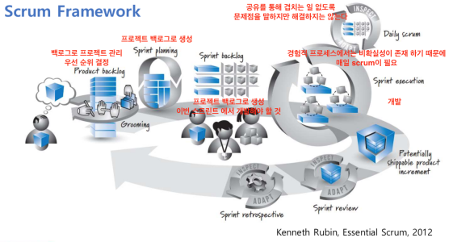
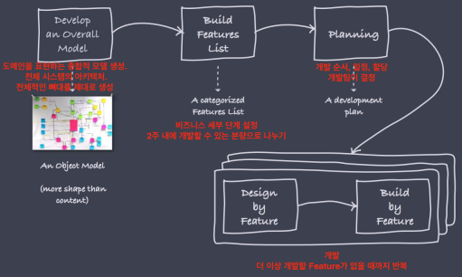
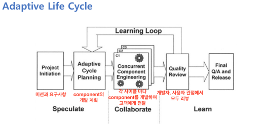

## 애자일 방법론1

Linear sequential model : 한 사이클을 통해 소프트웨이가 완성된다.
Evolutionary model : 반복되는 사이클을 통해서 복잡한 소프트웨어가 점진적으로 개발된다.
Agile Methods : 사이클을 짧게 하여 좀 더 가볍게 만든 프로세스 모델
- Scrum : Sprint라는 짧은(2주 정도) 반복을 거듭하는 모델
- Crystal : 하나의 방법론이 모든 프로젝트에 적용될 수 없다고 생각하고 프로젝트에 따라 변경할 수 있도록 한 모델
- XP : 99년에 소개. 개발자에게 충분한 시간이 주어진다면 어떠한 일이 벌어질까에 대한 답 - 새로운 것을 배워 기존 코드를 개선, 상식적인 원칙과 실제를 심각하게 받아들인다는 의미에서 Extreme

Extreme Programming (XP)
- If code reviews are good, do all the time!
- If testing is good, do all the time!
- If integration testing is important, continuously integrate!
- If design is good, do everyday!
- If simplicity is good, always make it simple!
- If architecture is important, do all the time!
- If short iterations are good, make it really, really short!

Agile Manifesto(애자일 개발 선언)
- 툴보다는 개발자와의 상호작용이 더 중요하다.
- 문서 작성보다 작동하는 프로그램이 더 중요하다.
- 계약 협상보다는 고객과의 협업이 더 중요하다.
- 계획보다 변화하는 상황에 대처하는 것이 더 중요하다.

Scrum process
- 1. Sprint Planning meeting : 목표 설정, 할당량 결정
- 2. Daily Scrum : 진행 사항 공유
- 3. Sprint review : 하나의 스프린트 이후 데모와 피드백
- 4. Sprint retrospective : 회고. 개선 방안 협의

Lean
- Lean Manufacturing : 자동차 제조 방법론. 낭비를 줄이고 끊임없이 품질을 높인다.
- Lean Manufacturing과 Agile을 소프트웨어 개발에 적용한 것이 Lean Software Development
- 2008, Eric Ries의 The Lean Start Up에 영향을 줌.
  - Waste를 줄여야 한다는 Lean의 가치와 Experiment를 통해 마켓을 관찰해야 한다는 Customer Development Methodology를 합친 것
  - Waste는 Customer를 이해하지 않는 모든 행위
  - Lean Movement의 시초가 됨
- Lean Loop
  - 1. Idea / Hypothesize : 실험하고 싶은 아이디어와 가설을 정한다. 측정 계획 설립
  - 2. Build MVP : 앞 단계의 가설을 검증할 수 있는 최소 기능 제품을 가능한 빨리 만들어 실험
  - 3. Measure : 두 번째 단계에서 첫 단계의 가설이 맞았는지 검증
  - 4. Learn : 세 번째 단계의 결과를 바탕으로 제품의 방향에 맞춘 새로운 Loop 시작

Kanban
- New Agile Methods
- 일의 흐름을 보여주는 게시판. 다음 단계로 넘어가기 위해 대기하고 있는 작업을 찾아서 Waste 최소화
- 서로 depedency가 있는 component들 간의 개발 일정 조정하여 전체적인 생산성 향상

애자일의 장점
- Low process complexity
- Low cost and overhead
- Efficient handling of changes
- Fast result & usable systems

애자일의 단점
- Possibly not scalable
- Heavy reliance on teamwork
- Reliance on frequent access to customer

애자일이 어떻게 개발할 것인가에 대한 방법이라면 린 스타트 업은 무엇을 개발할 것인가에 대한 방법

## 애자일 방법론2

Scrum
- 1996년
- 잘 정의된 프로세스를 따르는 것이 옳지 않다. 물리 법칙과 달리 같은 input에서 같은 output을 기대할 수 없기 때문. 따라서 정의된 프로세스(Defined process)가 아닌 경험적 프로세스(Empirical process)가 더 중요하다.
- 관찰과 적응을 통해 지속적으로 개선
- XP가 개발에서의 좋은 습관을 강조한다면 Scrum은 프로젝트 관리에 보다 중점

Feature-Driven Development (FDD)
- 싱가포르 은행 대출 시스템 구출에서 시작 : 2년간 개발하던 업체가 너무 복잡해 포기 - 간결하고 가벼운 프로세스로
- Agile을 큰 프로젝트에 적용할 때 참고할 수 있는 모델

Adaptive Software Development(ASD)
- 변화하는 비즈니스 요구에 개발팀이 어떻게 대응해야 할지
- Waterfall Life Cycle : 계획에만 충실 해서 변화가 어려움
- Evolutionary Life Cycle : 계획에 많은 시간을 쏟게 된다.
- Adaptive Cycle : 비결정론에 바탕을 두어 변환의 원인을 찾으려 하지 않고, 대강의 방향을 정하고 변화에 적응할 수 있는 매커니즘

