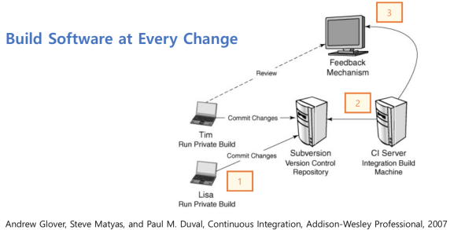
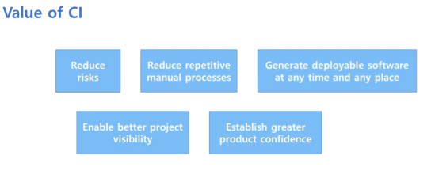

## Deployment Pipeline

Integration risk
- 각각으로는 완전한 코드이지만 통합하면 오류가 나는 경우가 있을 수 있다.
- Integration은 마지막 단계에서 진행되기 때문에 전체 개발일정의 차질을 불러온다.

Build - Test - Release가 모두 자동화 되어야 한다.

    
    

Deployment Pipeline
- 문제가 된 빌드의 릴리즈를 방지할 수 있다.
- 모든 것이 자동화 되어, 더 쉽고 자주 릴리즈할 수 있고, 이전 단계로 돌아갈 수 있다.
