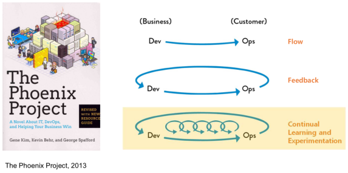

## Monitoring

Monitoring : 시스템과 컴포넌트들이 시간이 지남에 따라 어떻게 변화되어 가는 지 확인해 가는 과정
- 종류
  - Frontend Monitoring
    - 페이지가 얼마나 빨리 로딩되는지
    - 자바 스크립트 exception이 있는지
  - Application Performance Monitoring
    - 작성 중인 어플리케이션 자체에 대한 모니터링
    - 로그 등 작성
  - Server Monitoring
    - 서버 자체의 퍼포먼스 모니터링
    - CPU, Memory 등
  - Network Monitoring
  - Security Monitoring
- 사용자의 관점에서 최종 결과물을 모니터링하는 데에서 부터 시작

## DevOps

DevOps : 개발자가 자동화 프로세스를 사용하여 최종 사용자에게 가치를 전달하는 행위    

DevOps Myths
- DevOps replaces Agile
- DevOps replaces ITIL
- DevOps means NoOps
- DevOps is Just “Infrastructure As Code” or Automation
- DevOps is only for Startups and Unicorns

## Site Reliability Engineering

사이트가 다운되지 않고 유지되도록 하는 엔지니어링    
혁신과 안정성간의 균형. 개발팀은 혁신을 원하고, 운영팀은 안정을 원함

일반 Availability = Uptime / Uptime + Downtime  
구글 Availability = Successful requests / Total requests

2.5M의 requests가 있을 시 99.99%의 Availability 타겟으로 할 경우    
-> 250 errors가 Error Budget이 된다. 이 이하로 에러가 있어야 개발팀의 요구에 따라 릴리즈 가능
