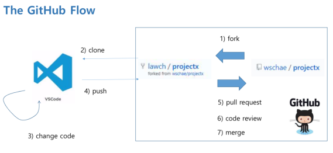

## 오픈소스개발

개발 모델
- Bristol Cathedral : 메인 개발자가 있어서 프로젝트를 총괄
- Hyderabad bazaar market : 누구나 참여하는 모델

Linus's Law : Given enough eyeballs, all bugs are shallow : 일찍, 자주 발표한다.

Common practices
- Small releases
- Informal communication
- Customer availability
- Continuous integration
- Shared vision

[성당과 시장](http://www.hanbit.co.kr/store/books/look.php?p_code=E8095481781)     
[Revolution OS, Youtube](https://www.youtube.com/watch?v=jw8K460vx1c)    
[Halloween Documents](http://www.catb.org/esr/halloween/)    

## GitHub Flow

    

